# ScubaConfigApp Control JSON Reference

This document describes every top-level key in `ScubaConfigApp_Control_en-US.json`.
The file is loaded into `$syncHash.UIConfigs` at application startup and is the
single source of truth for all runtime behavior, locale strings, and UI structure.

---

## Version

```json
"Version": "2.6.1 (build 0900)"
```

The current config schema version. Follows the app versioning convention:
- First number: year of the app (2 = second year in service)
- Second number: month of release
- Third number: day of release
- Build: time of release in 24-hour format (HHMM)

---

## Feature Flags

These boolean fields toggle top-level app capabilities at startup.

| Key | Type | Purpose |
|-----|------|---------|
| `DebugMode` | bool | Enables the debug output panel and verbose internal logging |
| `AutoSaveProgress` | bool | Automatically saves session state after each change |
| `EnableSearchAndFilter` | bool | Shows the policy search and criticality filter controls |
| `EnableScubaRun` | bool | Shows the ScubaRun tab and execution controls |
| `AllowScubaRunInteractive` | bool | Allows ScubaGear to run in interactive (non-app-auth) mode |
| `EnableResultReader` | bool | Shows the results reader tab for reviewing past ScubaGear output |
| `PullOnlineBaselines` | bool | When `true`, baselines are loaded from `OnlineBaselineSchemaURL` instead of the local schema file. When `false` (default), baselines are loaded from the local `schemas\ScubaBaselines.json`. It is one or the other — not both. The `-Online` parameter is independent and controls only Microsoft Graph tenant connectivity, not baseline loading. |
| `EnablePolicyViewer` | bool | Enables the baseline policy viewer panel |

---

## Limits and Paths

| Key | Type | Purpose |
|-----|------|---------|
| `MinimumProductsRequired` | int | Minimum number of products that must be selected before a config is valid |
| `MaximumResults` | int | Maximum number of past ScubaGear result folders to surface in the results reader |
| `OnlineBaselineSchemaURL` | string | Raw URL to the published `ScubaBaselines.json` file in the ScubaGear schemas folder. Used exclusively when `PullOnlineBaselines` is `true`. |
| `PolicyMigrationsCSVPath` | string | Relative path to the CSV file that defines legacy-to-current policy ID mappings |

---

## policyMigration

Controls how legacy policy IDs in imported YAML files are detected, translated, and reported to the user.

### cacheFileName

```json
"cacheFileName": "ScubaConfigApp_PolicyMigrationMap.json"
```

Name of the cache file written to `$env:TEMP` after the CSV is parsed. The cache avoids re-parsing
the CSV on every import. It is invalidated when the CSV is newer than the cache file.

### csvColumns

```json
"csvColumns": {
  "oldId":     "Old ID",
  "newId":     "New ID",
  "rationale": "Removal Rationale"
}
```

Maps internal property names to the actual column headers in the policy migrations CSV.
These values are passed to `Import-Csv` column lookups so column header changes in the CSV
only require a change here -- not in code.

### migrationTypes

```json
"migrationTypes": {
  "removed":    "Removed",
  "decoupled":  "Decoupled",
  "direct":     "Direct",
  "versionBump":"VersionBump"
}
```

The recognized values in the CSV's `Removal Rationale` column. Used during CSV parsing to
classify each entry into a migration category:

- `Removed` -- the old policy was dropped with no replacement. Settings are discarded.
- `Decoupled` -- the old policy was split into multiple new policies. Settings are applied to
  the first listed target; remaining targets require manual review.
- `Direct` -- a straightforward one-to-one rename. Settings are moved as-is.
- `VersionBump` -- the policy ID incremented its version suffix (e.g. `v1` to `v2`). Settings
  are moved as-is; the stem is preserved.

### versionBumpPattern

```json
"versionBumpPattern": "^(?<stem>MS\\.[A-Z]+\\.\\d+\\.\\d+)v(?<ver>\\d+)$"
```

Regex with named capture groups used to decompose a policy ID into its stem and version number.
Used when processing `VersionBump` entries to reconstruct the new ID with the updated version.

### reportMaxLinesPerSection

```json
"reportMaxLinesPerSection": 15
```

Maximum number of bullet lines shown in the MIGRATED section of the migration report popup.
If more entries exist they are collapsed to a `... and N more` line. The DROPPED and NEEDS REVIEW
sections are not capped and always show all entries.

### localeReportWindow

The full text content for the migration report popup shown after a YAML import that contained
legacy policy IDs.

```json
"localeReportWindow": {
  "title":  "Legacy Policy Migration Applied",
  "intro":  "This configuration file contained {0} legacy policy setting(s).",
  "outro":  "Please review the updated settings before saving.",
  "sections": { ... }
}
```

| Field | Purpose |
|-------|---------|
| `title` | Popup window title bar text |
| `intro` | First line of the popup body. `{0}` is replaced with the total count of migrated entries. |
| `outro` | Last line of the popup body, shown after all sections. |
| `sections` | One entry per log category. Each section drives both the log prefix written during migration and the popup section display. |

#### sections

Each section entry has a `prefix` (the token prepended to every `MigrationLog` entry of that type)
and, for displayed sections, a `heading` and optional `body`.

| Section | prefix | Shown in popup | Notes |
|---------|--------|----------------|-------|
| `migrated` | `MIGRATED` | Yes | Auto-migrated settings. Subject to `reportMaxLinesPerSection` cap. |
| `decoupled` | `DECOUPLED` | Yes | Policies split into multiple targets. Always shown in full with the `body` guidance text. |
| `dropped` | `DROPPED` | Yes | Removed policies with no replacement. Always shown in full. |
| `skipped` | `SKIPPED` | No | Entries where the migration target was already configured. Written to the log only; never appears in the popup. |

The `prefix` values are the single source of truth for log token strings. The writer
(`Invoke-PolicyMigration`) and the reader (popup builder in `Invoke-YamlImportWithProgress`)
both reference `sections.*.prefix` so the tokens only need to be defined here.

---

## localeContext

UI label strings for static TextBlocks throughout the application.

```json
"localeContext": {
  "Title_TextBlock": "SCuBAGear Configuration Editor",
  ...
}
```

Each key matches a named WPF TextBlock control. The values are bound at load time. Changing a
value here updates the displayed label without touching XAML or code.

---

## localePlaceholder

Placeholder (watermark) text for TextBox and ComboBox controls.

```json
"localePlaceholder": {
  "Organization_TextBox": "Enter tenant name (e.g., example.onmicrosoft.com)",
  ...
}
```

Each key matches a named WPF input control. The values appear as grayed hint text when the
control is empty.

---

## localeTitles

Short title strings used as popup dialog titles and confirmation dialog headers.

```json
"localeTitles": {
  "DuplicateEntry": "Duplicate Entry",
  "Error": "Error",
  ...
}
```

Referenced from code by key so the same title string is used consistently across all
dialogs of the same type.

---

## localeInfoMessages

Informational message templates written to the debug log during normal operations.

```json
"localeInfoMessages": {
  "PolicySaving": "Saving {0} for policy: {1}",
  ...
}
```

`{0}`, `{1}` etc. are replaced at runtime with context-specific values using the PowerShell
`-f` format operator. These messages are not shown to the user -- they appear only in the
debug panel.

---

## localeErrorMessages

Error message templates surfaced to the user or written to the debug log on failure conditions.

```json
"localeErrorMessages": {
  "OrganizationValidation": "Organization Name is required...",
  ...
}
```

Used by validation logic and error handlers. Format tokens are substituted at the call site.

---

## localePopupMessages

Full message strings for confirmation dialogs, success notifications, and warning popups shown
directly to the user via `ShowMessageBox`.

```json
"localePopupMessages": {
  "NewSessionConfirmation": "Are you sure you want to reset the session?...",
  ...
}
```

---

## localeStatusMessages

Short status bar and status label strings that reflect the current application state.

```json
"localeStatusMessages": {
  "GraphConnected": "Graph Connected",
  "GraphDisconnected": "Graph Disconnected",
  ...
}
```

---

## localeYamlComments

Comment strings written into generated YAML output files as header annotations.

```json
"localeYamlComments": {
  "ConfigurationFile": "# ScubaGear Configuration File",
  "GeneratedOn": "# Generated on: {0}",
  ...
}
```

---

## localeProgressMessages

Longer multi-line message strings shown in progress or completion dialogs.

```json
"localeProgressMessages": {
  "SessionRestoreSuccess": "Previous session restored successfully!...",
  ...
}
```

Distinct from `localePopupMessages` in that these may span multiple lines and are typically
shown after an operation finishes rather than before it starts.

---

## localeHelpTips

Structured tooltip definitions for help labels throughout the UI. Each entry defines what appears
when the user hovers or clicks a help icon next to a field.

```json
"localeHelpTips": {
  "Organization_HelpLabel": {
    "Title": "Organization Domain",
    "Content": "...",
    "AdditionalSections": { "Example": "...", "Required": "...", "Note": "..." },
    "Placement": "Right"
  }
}
```

| Field | Purpose |
|-------|---------|
| `Title` | Bold heading in the tooltip popup |
| `Content` | Main description text |
| `AdditionalSections` | Key-value pairs rendered as labeled sub-sections below the main content |
| `Placement` | Which side of the control the tooltip appears on (`Right`, `Left`, `Top`, `Bottom`) |

---

## defaultAdvancedSettings

Default values pre-populated in the Advanced tab controls when the app starts with no prior session.

```json
"defaultAdvancedSettings": {
  "OutPath_TextBox": ".",
  "OpaPath_TextBox": ".",
  ...
}
```

Each key matches a named WPF control. The values are applied only if the control has no
restored session value.

---

## products

The list of M365 products available for selection. Drives the product checkboxes on the Main tab,
the exclusions tab visibility, and the policy viewer product filter.

```json
{
  "id": "Aad",
  "name": "Microsoft Entra ID",
  "displayName": "Microsoft Entra ID (aad)",
  "supportsExclusions": true,
  "showInApp": true,
  "showInViewer": true
}
```

| Field | Purpose |
|-------|---------|
| `id` | Internal identifier. Used as the YAML key and as the basis for the runtime product code map in policy migration. |
| `name` | Display name shown in the product list. |
| `displayName` | Longer label shown in dropdowns and section headers. |
| `supportsExclusions` | When true, the Exclusions tab shows this product and accepts exclusion entries for it. |
| `showInApp` | When false, the product is hidden from all app controls. Used to soft-disable a product without removing its config. |
| `showInViewer` | When false, the product is excluded from the policy viewer. |

The `id` values are also used at runtime to derive the policy migration product code map
(`$product.id.ToUpper()` maps to `$product.id`), so adding a product here automatically
covers migration lookup with no code changes required.

---

## M365Environment

The list of Microsoft 365 deployment environments the user can select on the Main tab.

```json
{
  "id": "commercial",
  "name": "commercial",
  "displayName": "Commercial",
  "rationale": "Production environment for public tenants."
}
```

| Field | Purpose |
|-------|---------|
| `id` | Value written to the YAML `M365Environment` key |
| `name` | Internal reference name |
| `displayName` | Label shown in the environment dropdown |
| `rationale` | Tooltip or help text describing when to use this environment |

---

## requiredFields

Defines which fields are required for config validity and what validation pattern applies to each.

```json
"requiredFields": {
  "Organization": {
    "fieldName": "Organization_TextBox",
    "validationPatternName": "tenantDomain",
    "toggleTrigger": "OnClick"
  }
}
```

| Field | Purpose |
|-------|---------|
| `fieldName` | The WPF control name to validate |
| `validationPatternName` | References a named regex pattern in the validation engine |
| `toggleTrigger` | The event or toggle control that activates this field's required status. `OnClick` means always required; a toggle name means required only when that toggle is on. |

---

## settingsControl

Describes the tab structure and which data output keys and field controls belong to each settings tab.

```json
"settingsControl": {
  "MainTab": {
    "name": "Main",
    "dataControlOutput": "GeneralSettingsData",
    "validationKeys": [ "Organization", "OrgName", ... ]
  }
}
```

| Field | Purpose |
|-------|---------|
| `name` | Human-readable tab name |
| `dataControlOutput` | The key under which collected data from this tab is stored in `$syncHash` |
| `validationKeys` | List of keys from `requiredFields` that must pass before this tab's data is considered valid |
| `sectionControl` | Optional. Describes collapsible toggle sections within the tab and which fields each section contains. |

---

## baselineControls

Defines the three policy configuration tabs: Exclusions, Annotations, and Omissions. Each entry
drives the complete behavior of its tab including how cards are created, what YAML key they write
to, and how they are filtered.

```json
{
  "tabName": "Exclusions",
  "yamlValue": "[ProductName][PolicyId]",
  "controlType": "Exclusions",
  "dataControlOutput": "ExclusionData",
  "supportsAllProducts": false,
  ...
}
```

| Field | Purpose |
|-------|---------|
| `tabName` | Tab label in the UI |
| `yamlValue` | The YAML key pattern for this control type. For exclusions this is a nested product/policy path. For annotations and omissions it is a flat key (`AnnotatePolicy`, `OmitPolicy`). |
| `controlType` | Used in code to distinguish which card factory to invoke |
| `dataControlOutput` | Key in `$syncHash` where collected data is stored |
| `fieldControlName` | The XAML field template name used to render input controls |
| `defaultFields` | Default field set label shown when no fields are configured |
| `cardName` | Short label used in card titles and success/removal messages |
| `showFieldType` | When true, the field type selector is shown on the card |
| `showDescription` | When true, the description textarea is shown on the card |
| `supportsAllProducts` | When true, this control type applies across all selected products (used in policy migration to identify annotation/omission YAML keys) |
| `filterAllLabel` / `filterConfiguredLabel` / `filterNotConfiguredLabel` | Labels for the three filter states in the policy card list |

---

## ScubaRunConfig

Configuration for the ScubaRun execution engine. Drives how PowerShell commands are assembled
and launched in a background process.

```json
"ScubaRunConfig": {
  "powershell": {
    "version": "5.1",
    "modules": [ "ScubaGear" ],
    "preCommands": [ "Import-Module ScubaGear -Force -Verbose", ... ],
    "cmdlets": "Invoke-Scuba",
    "postCommands": [ ... ],
    "parameters": { ... }
  }
}
```

| Field | Purpose |
|-------|---------|
| `version` | Required PowerShell version. The app launches this specific version for execution. |
| `modules` | Modules imported before the main cmdlet runs |
| `preCommands` | Array of PowerShell statements executed before `cmdlets` |
| `cmdlets` | The main ScubaGear cmdlet to invoke |
| `postCommands` | Statements executed after the cmdlet completes (cleanup, output) |
| `parameters` | UI-exposed parameters for the cmdlet. Each entry drives a control in the ScubaRun settings panel. |

### parameters entry fields

| Field | Purpose |
|-------|---------|
| `name` | Label shown in the UI |
| `type` | Control type: `boolean` (checkbox), `dropdown` (combobox), `string` (text input) |
| `items` | For dropdowns: the list of selectable values |
| `description` | Tooltip text for the control |
| `defaultValue` | Value applied when no user selection exists |
| `hidden` | When true, the control is not shown in the UI but the parameter is still passed if `defaultValue` is set |
| `readOnly` | When true, the control is visible but not editable |

---

## Reports

Controls what columns are shown in the results reader summary and detail tables.

```json
"Reports": {
  "summaryColumns": [ "Manual", "Failures", "Warnings", ... ],
  "ProductColumns": [ "Control ID", "Requirement", "Result", ... ]
}
```

| Field | Purpose |
|-------|---------|
| `ShowProductSummaryReports` | When true, per-product summary cards are shown in addition to the overall summary row |
| `summaryColumns` | Column names displayed in the overall summary table |
| `ProductColumns` | Column names displayed in each product's detail results table |

---

## inputTypes

Defines the field schemas for each supported exclusion card type. Each product's policy
references one of these types to determine which input fields the card renders.

```json
"CapExclusions": {
  "name": "Conditional Access Policy Excluded Groups, Users, Applications, and Guest User Types",
  "value": "CapExclusions",
  "fields": [
    { "type": "array", "name": "Group Object Id's", "value": "Groups", "valueType": "guid", "required": false },
    ...
  ]
}
```

| Field | Purpose |
|-------|---------|
| `name` | Full display name for this input type |
| `value` | Internal identifier matched against policy field config |
| `description` | Shown in tooltips or help text for this exclusion type |
| `fields` | Array of field definitions rendered in the exclusion card |

### fields entry

| Field | Purpose |
|-------|---------|
| `type` | Input widget type: `array` (list of text inputs), `multiselect` (checkbox list), `boolean`, `string` |
| `name` | Label shown above the field |
| `value` | YAML key the field value is written to |
| `description` | Help text for the field |
| `valueType` | Validation type applied to each input: `guid`, `guidOrName`, `guestTypes`, `email`, `domain`, etc. |
| `required` | When true, the field must have at least one value before the card can be saved |

---

## graphQueries

Defines every Microsoft Graph picker that the app can display. Each key becomes the
`Field.value` that `Add-GraphButtons` matches against to attach a **Get** button to a
TextBox or list control. The section is fully data-driven — adding a new picker requires
only a new entry here; no PowerShell code changes are needed.

### Per-entry fields

| Field | Type | Required | Purpose |
|-------|------|----------|---------|
| `windowTitle` | string | yes | Title bar text of the Graph picker window |
| `name` | string | yes | Display label used inside the picker (e.g. column headers) |
| `endpoint` | string | yes | Graph API path to query (e.g. `/v1.0/groups`) |
| `directoryObjectType` | string | yes | The `directoryObject` type name expected by the Graph `getByIds` batch endpoint (e.g. `group`, `user`, `application`). Must match the [Graph API type strings](https://learn.microsoft.com/en-us/graph/api/directoryobject-getbyids). Used by `Resolve-GraphIdsBatch` to build the `types` array; entries with the same type are automatically deduplicated via `Sort-Object -Unique`. |
| `queryfilterProperty` | string | yes | Object property used in the `$filter` OData query sent to Graph |
| `queryParameters` | object | yes | OData query parameters appended to the Graph request (e.g. `$select`) |
| `searchProperty` | string | yes | Property name shown in the picker search box hint |
| `displayColumnOrder` | array | yes | Ordered list of `{ name, value }` pairs defining the picker table columns |
| `outProperty` | string | yes | Object property written to the YAML / config when the user confirms a selection. Use `"id"` for GUID-based fields (triggers batch ID resolution on import). Use `"userPrincipalName"`, `"displayName"`, or `"appId"` for name-based fields. |
| `tipProperty` | string | yes | Object property shown as a tooltip on list items after selection |
| `allowMultipleSelection` | bool | yes | When `true`, the picker allows selecting more than one item |

### Defined entries

| Key | `endpoint` | `directoryObjectType` | `outProperty` | Notes |
|-----|------------|-----------------------|---------------|-------|
| `Users` | `/v1.0/users` | `user` | `id` | Stores user GUIDs; resolved to display names on import |
| `Groups` | `/v1.0/groups` | `group` | `id` | Stores group GUIDs; resolved to display names on import |
| `IncludedUsers` | `/v1.0/users` | `user` | `userPrincipalName` | Stores UPNs, not GUIDs |
| `IncludedGroups` | `/v1.0/groups` | `group` | `displayName` | Stores display names, not GUIDs |
| `ExcludedUsers` | `/v1.0/users` | `user` | `userPrincipalName` | Stores UPNs, not GUIDs |
| `ExcludedGroups` | `/v1.0/groups` | `group` | `displayName` | Stores display names, not GUIDs |
| `AppId_TextBox` | `/v1.0/applications` | `application` | `appId` | Stores the application (client) ID, not the object ID |

### Batch ID resolution

When a YAML file is imported, `Resolve-GraphIdsBatch` collects all entries whose
`outProperty` is `"id"` and POSTs them to `/v1.0/directoryObjects/getByIds` in a single
Graph call. The `types` array sent in that request is built exclusively from the
`directoryObjectType` field across those entries — no type strings are hardcoded in
PowerShell. IDs that Graph does not return are flagged as orphaned and shown with a
strikethrough on their policy card.

---

## Application Information Flow

The diagram below shows how data moves through the application from launch to YAML output,
including the optional `-Online` path and the YAML import / policy migration path.

```mermaid
flowchart TD
    START([Start-SCuBAConfigApp]) --> ONLINE{-Online\nswitch?}

    ONLINE -- Yes --> GRAPH[Connect-MgGraph\nGraph queries available\nfor user, group, cert lookups]
    ONLINE -- No  --> INIT
    GRAPH --> INIT

    INIT[Load JSON control config\ninto syncHash.UIConfigs\nInitialize syncHash shared hashtable] --> BASELINES

    subgraph BASELINES [Baseline Loading - independent of -Online]
        direction TB
        BSWITCH{PullOnlineBaselines?}
        LOCAL[Load ScubaBaselines.json\nfrom local schemas folder]
        ONLINE_DL[Download ScubaBaselines.json\nfrom OnlineBaselineSchemaURL]
        BSWITCH -- false --> LOCAL
        BSWITCH -- true  --> ONLINE_DL
        LOCAL --> BASELINEDONE([syncHash.Baselines ready])
        ONLINE_DL --> BASELINEDONE
    end

    BASELINES --> UI

    subgraph UI [WPF UI - STA Runspace]
        direction TB

        subgraph TABS [User configures tabs]
            MAIN["Main Tab\nOrganization, Products,\nM365 Environment\nsyncHash.GeneralSettingsData"]
            ADV["Advanced Tab\nApp auth, output paths,\nOPA path\nsyncHash.AdvancedSettingsData"]
            GLOBAL["Global Settings Tab\nDNS resolvers, DoH\nsyncHash.GlobalSettingsData"]
            EXCL["Exclusions Tab\nPer-product policy exclusions\nsyncHash.ExclusionData"]
            ANNO["Annotations Tab\nAnnotatePolicy entries\nsyncHash.AnnotationData"]
            OMIT["Omissions Tab\nOmitPolicy entries\nsyncHash.OmissionData"]
        end

        IMPORT["User imports existing YAML"] --> PARSE

        subgraph MIGRATE [Policy Migration]
            PARSE[Parse YAML into\nordered dictionary] --> LEGACY{Legacy\npolicy IDs\nfound?}
            LEGACY -- Yes --> MIGMAP[Load migration map from CSV cache\nGet-PolicyMigrationMap\nCSV: PolicyMigrationsCSVPath\nCache: policyMigration.cacheFileName]
            MIGMAP --> REMAP[Invoke-PolicyMigration\nPass 1: product exclusion blocks\nPass 2: annotation and omission keys]
            REMAP --> MIGLOG[Write to\nsyncHash.MigrationLog]
            MIGLOG --> POPUP[Show migration report popup\nMIGRATED / NEEDS REVIEW / DROPPED\nclear MigrationLog]
            POPUP --> POPULATE
            LEGACY -- No --> POPULATE
            POPULATE[Populate all syncHash\ndata buckets from parsed data\nUpdate-AllUIFromData\nrefresh all tab controls]
        end
    end

    subgraph GENERATE [Preview and Generate]
        direction TB
        READ[Read all syncHash data buckets\nGeneralSettingsData\nAdvancedSettingsData\nGlobalSettingsData\nExclusionData\nAnnotationData\nOmissionData] --> BUILD
        BUILD[Build YAML string\nConvertTo-Yaml\napply localeYamlComments headers] --> PREVIEW[Show YAML in Preview tab\nsyncHash.YamlPreview_TextBox]
        PREVIEW --> ACT{User action}
        ACT --> DL[Download YAML file\nto OutPath]
        ACT --> CLIP[Copy to clipboard]
    end

    subgraph SCUBARUN [ScubaRun - PowerShell 5.1 Process]
        direction TB
        TMPYAML[Generate temp YAML\nto env:TEMP] --> PS51
        PS51[Launch PowerShell 5.1\nImport-Module ScubaGear\nInvoke-Scuba with temp YAML] --> RESULTS
        RESULTS[ScubaGear writes results\nto OutPath folder] --> READER
        READER[Results Reader tab\nParse ScubaResults JSON\nShow summary and detail tables]
    end

    subgraph POLICYVIEWER [Policy Viewer - Separate STA Runspace]
        direction TB
        note1["Launched via Show-SCuBABaselinePolicyViewer\nHonours PullOnlineBaselines from JSON config\nIndependent of -Online"]
        PV_SWITCH{PullOnlineBaselines?}
        PV_LOCAL[Use schemas\ScubaBaselines.json\ndirectly from local schemas folder]
        PV_ONLINE[Download ScubaBaselines.json\nfrom OnlineBaselineSchemaURL\nparsed into memory]
        PV_READY([Load into viewer runspace])
        PV_WIN[WPF Policy Browser\nBrowse products and policies\nView rationale / implementation\n/ license / MITRE mappings]
        note1 --> PV_SWITCH
        PV_SWITCH -- false --> PV_LOCAL
        PV_SWITCH -- true  --> PV_ONLINE
        PV_LOCAL --> PV_READY
        PV_ONLINE --> PV_READY
        PV_READY --> PV_WIN
    end

    TABS  --> GENERATE
    GENERATE --> SCUBARUN
    TABS -. "View Policy button\nShow-SCuBABaselinePolicyViewer" .-> POLICYVIEWER
    UI --> IMPORT
```

