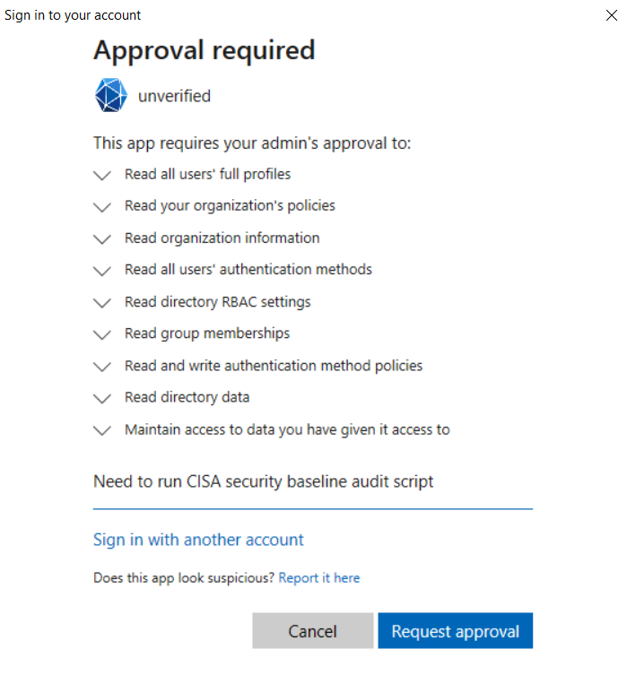
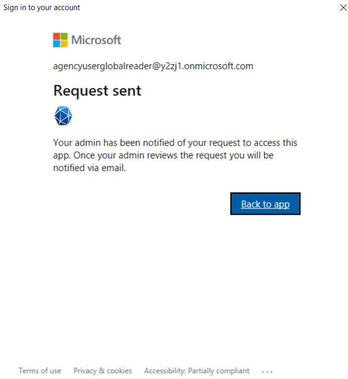
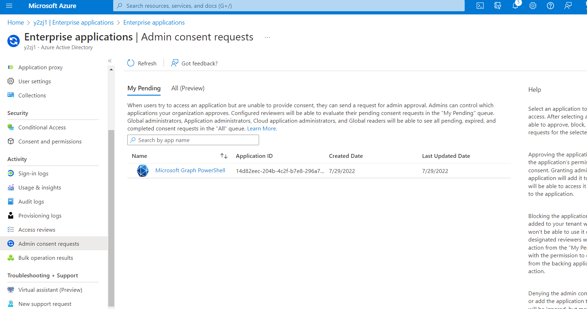
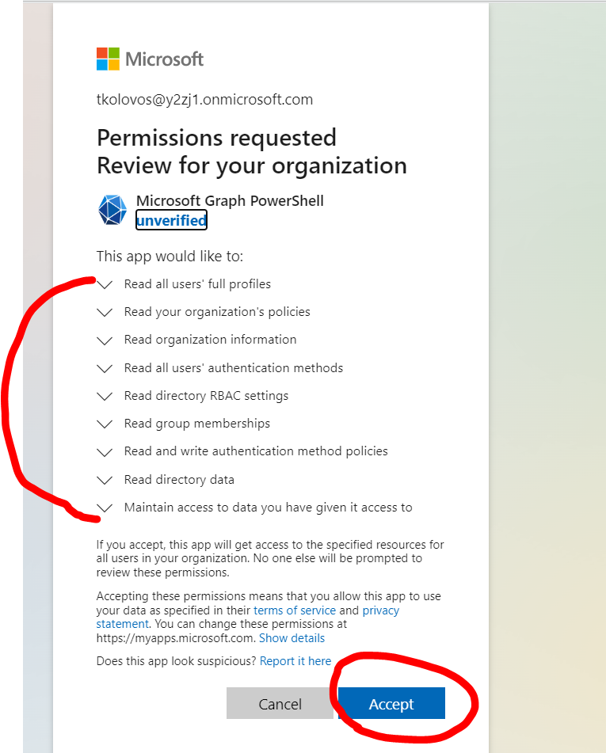
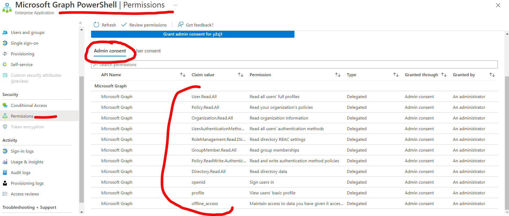
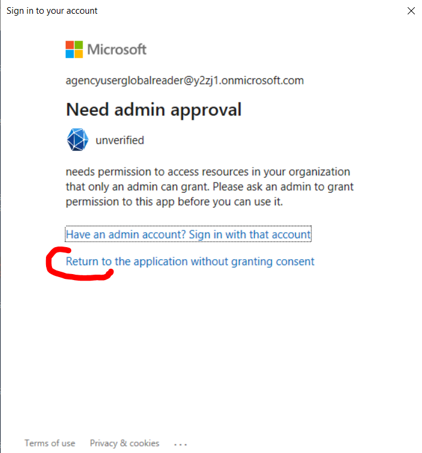
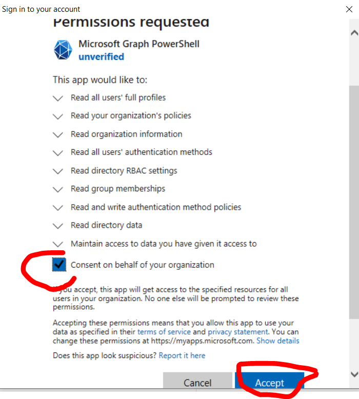
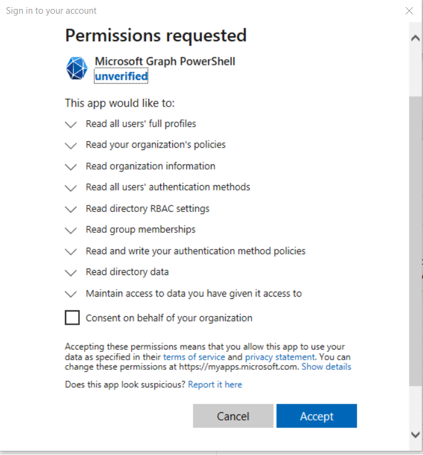
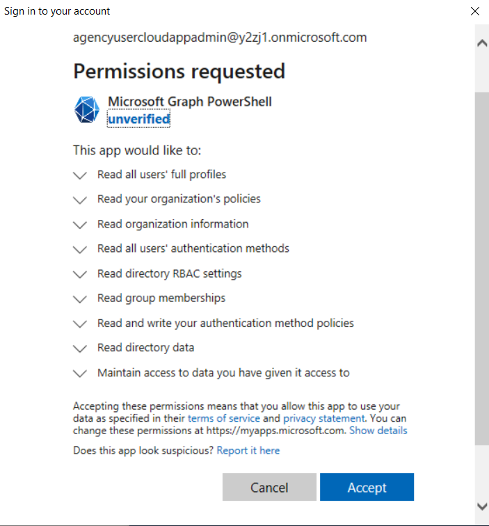

# SCuBA M365 Security Baseline Assessment Tool
Developed by CISA, this assessment tool verifies that an M365 tenant’s configuration conforms to the policies described in the SCuBA Minimum Viable Secure Configuration Baseline documents.

> **Warning**
> This tool is in an alpha state and in active development. At this time, outputs could be incorrect and should be reviewed carefully.

## M365 Product License Assumptions
This tool was tested against tenants that have an E3 or G3 and E5 or G5 M365 license bundle. It may still function for tenants that do not have one of these bundles but it was not specifically tested that way. Also, some of the specific policy checks in the baseline rely on the following specific security licenses which are included by default in E5 and G5. If your tenant does not have the security licenses listed below, the report will display a non-compliant output for those respective policy checks.
- Azure AD Premium Plan 2
- Microsoft Defender for Office 365 Plan 1

## Project License

Unless otherwise noted, this project is distributed under the Creative Commons Zero license. With developer approval, contributions may be submitted with an alternate compatible license. If accepted, those contributions will be listed herein with the appropriate license.

## Installation
### Installing the required PowerShell Modules
To install the required modules, execute the Powershell script `.\SetUp.ps1` (in the project's root folder) as in the example below. 
**Warning**: Note that -AllowClobber -Force flags are currently included in that script. These flags will install the latest available version of all the required Powershell modules. If you need to keep earlier versions of the modules for other software that you use, modify the script file SetUp.ps1 and remove those two flags.

```
.\Setup.ps1
```

## Usage
To run the assessment tool, customize and then execute the Powershell script `.\RunSCuBA.ps1` (in the project's root folder). 

In `RunSCuBA.ps1` there are execution variables that you must customize by entering values that match your specific M365 tenant. The variables are described below, along with execution examples.

### Variable Definitions 

- **$LogIn \-** is a `$true` or `$false` variable that if set to `$true` will prompt you to provide credentials if you want to establish a connection to the specified M365 products in the **$ProductNames** variable. For most use cases, leave this variable to be `$true`. A connection is established in the current PowerShell terminal session with the first authentication. If you want to run another verification in the same PowerShell session simply set this variable to be `$false` to bypass the reauthenticating in the same session.

- **$ProductNames** is a list of one ore more M365 shortened product names that the tool will assess when it is executed. Acceptable product name values are listed below. To assess Azure Active Directory you would enter the value **aad**. To assess Exchange Online you would enter **exo** and so forth.
  - Azure Active Directory: **aad**
  - Defender for Office 365: **defender**
  - Exchange Online: **exo**
  - OneDrive: **onedrive**
  - MS Power Platform: **powerplatform**
  - SharePoint Online: **sharepoint**
  - MS Teams: **teams**

- **$Endpoint** is a variable used to authenticate to Power Platform. This variable is only mandatory if **powerplatform** is included in **$ProductNames**. Valid values include "dod", "prod","preview","tip1", "tip2", "usgov", or "usgovhigh". For M365 tenants with E3/E5 licenses enter the value **"prod"**. For M365 tenants with G3/G5 licenses enter the value **"usgov"**. 

- **$OPAPath** is a variable that refers to the folder location of the OPA Rego executable file. By default the OPA Rego executable embedded with this project is located in the project's root folder `"./"` and for most cases you won't need to modify this variable value. If you want to execute the tool using a version of OPA Rego located in another folder, then customize the variable value with the full path to the alternative OPA Rego exe file.

- **$OutPath** is a variable that refers to the folder path where both the output JSON and the HTML report will be created. By default the Reports folder is created in the same directory where the script is executed so you only need to modify this if you want the reports to be placed in an alternative location. The folder will be created if it does not exist. 

### Example Runs

The example edited variable $ProductNames below in `RunSCuBA.ps1` will run the tool against the MS Teams security baseline
```
$LogIn = $true 
$ProductNames = @("teams")
$Endpoint = ""
$OPAPath = "./" 
$OutPath = "./Reports"
```

After these values are in place and `RunSCuBA.ps1` is saved. In a PowerShell terminal in the same directory as `RunSCuBA.ps1` enter
```
.\RunSCuBA.ps1
```

The example edited variables $ProductNames and $OutPath below in `RunSCuBA.ps1` will run the tool against the Azure Active Directory and SharePoint Online baselines in an M365 tenant with the primary domain contoso.onmicrosoft.com. Notice that the output path for the reports has been customized.

```
$LogIn = $true 
$ProductNames = @("aad", "sharepoint")
$Endpoint = ""
$OPAPath = "./" 
$OutPath = "C:\Users\mgibson\documents\Reports"
```

The example edited variables $ProductNames and $Endpoint below in `RunSCuBA.ps1` will run the tool against all possible product security baselines in an M365 G5 tenant with the primary domain example.onmicrosoft.com.

```
$LogIn = $true 
$ProductNames = @("aad", "defender", "exo", "onedrive", "powerplatform", "sharepoint", "teams")
$Endpoint = "usgov"
$OPAPath = "./" 
$OutPath = "./Reports"
```
### Viewing the Report
The html report should open automatically in your browser once the script completes. If it does not, navigate to the output folder and open the BaselineReports.html file using your browser. The result files generated from the tool are also saved to the output folder.

## Required User Permissions to Execute the tool
The tool has two types of permissions that are required to execute: User Permissions (which are associated with Azure AD roles assigned to a user) and Application Permissions (which are assigned to the MS Graph Powershell application in Azure AD). The minimum user roles needed to execute the tool against each of the products in M365 are described in the bullets below. The application permissions needed to execute against the Azure AD baseline and the process to setup those permissions are described in the section named "MS Graph Powershell permissions". If you run against the Power Platform product you will also need to have a "Power Apps for Office 365" license assigned to you. Before running the tool, check with your M365 administrator to ensure you have the required Azure AD roles. 

Note: If you are running the tool as a user with the Global Administrator role, you have the necessary user permissions and no additional roles should be necessary. No license assignments are needed either. The role requirements listed below are only applicable when running the tool with a user that is NOT Global Administrator.

- Azure Active Directory: User must have the Global Reader role. 
- MS Teams: User must have the Teams Administrator role.
- Exchange Online: User must have the Exchange Administrator role.
- Defender for Office 365: User must have the Exchange Administrator role.
- MS Power Platform: User must have the Power Platform Administrator role. User must also have the "Power Apps for Office 365" license.
- Sharepoint Online: User must have the SharePoint Administrator role.
- OneDrive: User must have the SharePoint Administrator role.

## MS Graph Powershell permissions to run Azure AD Baseline
When executing the tool against the Azure AD baseline for the first time, the script will attempt to configure the required API permissions needed by the MS Graph Powershell module if they have not already been configured in your tenant. The process to configure the API permissions is sometimes referred to as the "application consent process" because an administrator must "consent" for the MS Graph Powershell application to access the tenant and the necessary Graph APIs to extract the configuration data. Depending on the Azure AD roles assigned to you and how the application consent settings are configured in your tenant, the process may vary slightly. This section describes various first time usage scenarios that may occur depending on the roles assigned to you and how to respond for each scenario.

For reference, the following API permissions are used by the tool via the MS Graph Powershell application: 

- Directory.Read.All
- GroupMember.Read.All
- Organization.Read.All
- Policy.Read.All
- Policy.ReadWrite.AuthenticationMethod
- RoleManagement.Read.Directory
- User.Read.All
- UserAuthenticationMethod.Read.All

### Scenario 1 - You need to request approval via a workflow process
When executing for the first time, if you see a screen named Approval Required that has a Request Approval button on it, enter a justification and click Request Approval.




The script will abort and you will see a permissions error. Next notify your administrator that your request was submitted. The administrator should go to the Azure AD > Enterprise Applications > Activity > Admin Consent Requests page. On that page the administrator should see the request for Microsoft Graph Powershell, click on it to open up the Details page, then click Review Permissions and Consent. The administrator should then review the list of permissions requested and click the Accept button if the permissions are acceptable per the organization's security policies.





To verify that Microsoft Graph Powershell was properly configured, the administrator can navigate to the Azure AD > Enterprise Applications > Manage > All Applications > Microsoft Graph Powershell > Security > Permissions page and it should look similar to the screenshot below.



Once the administrator has completed the consent, you can re-execute the tool and it should successfully complete without any permissions errors.

### Scenario 2 - You need Admin approval but the tenant does not have a workflow process configured
When executing for the first time, you may see a screen named Need Admin Approval.



If that screen appears, perform the following steps.
Ask your administrator to download the tool and then execute it against the Azure AD baseline.

```
$LogIn = $true 
$ProductNames = @("aad")
$Endpoint = ""
$OPAPath = "./" 
$OutPath = "./Reports"

---
.\RunSCuBA.ps1
```
When the administrator runs the tool, they will be prompted to perform the consent process. The administrator should see a screen named Permissions Requested. The administrator should select "Consent on behalf of your organization" and click the Accept button.



Once the administrator has completed these steps, you can re-execute the tool and it should successfully complete without any permissions errors.

### Scenario 3 - A user with Global Administrator privileges runs the automation tool
When executing for the first time, if your user account has the Global Administrator role, the consent process is abbreviated compared to scenarios 1 and 2. You should see a screen named Permissions Requested similar to the one below.



On the Permissions Requested screen you have two options:
- Option 1: Configure the permissions for your user account only - if you want to do this, do NOT click the "Consent on behalf of your organization" checkbox. Simply click the Accept button.
- Option 2: Configure the permissions so that other users in the tenant can also execute the tool - if you want to do this, click the "Consent on behalf of your organization" checkbox and then the Accept button.

Then the script should execute without any permissions errors.

### Scenario 4 - A user with Cloud Application Administrator privileges runs the automation tool
When executing for the first time, if your user account has the Cloud Application Administrator role, the consent process is abbreviated compared to scenarios 1 and 2. You can only configure the tool to run with your user account. You should see a screen named Permissions Requested similar to the one below.



On the Permissions Requested screen click the Accept button. Then the script should execute without any permissions errors.

## Design
The tool employs a three-step process:
1. **Export**. In this step, we utilize the various PowerShell modules authored by Microsoft to export and serialize all the relevant settings into json. 
2. **Parse**. Compare the exported settings from the previous step with the configuration prescribed in the baselines. We do this using [OPA Rego](https://www.openpolicyagent.org/docs/latest/policy-language/#what-is-rego), a declarative query language for defining policy. OPA provides a ready-to-use executable and version v0.41.0 is already included in this repo. The code for our tool was tested against the included version of OPA. If you desire to use a later version of Rego, follow the instructions listed [here](https://www.openpolicyagent.org/docs/latest/#running-opa) and customize the $OPAPath variable described in the Usage section above.
3. **Report**. Package the data output by Rego into a human-friendly html report.

## File Organization
- The PowerShell folder contains the code used to export the configuration settings from the M365 tenant and orchestrate the entire process from export to parse to report. The main PowerShell module manifest `SCuBA.psd1` is located in the PowerShell folder. The RunSCuBA.ps1 script located in the root folder uses that module to execute the tool.
- The Rego folder holds the .rego files. Each rego file essentially audits against the "desired state" for each product, per the SCuBA M365 secure configuration baseline documents.
- The Reporter folder contains code and supporting files used to create and format the output report.
- The Testing folder contains code that is used during the development flow to unit test the Rego policies.

## Troubleshooting

### Errors connecting to Defender
If when running the tool against Defender (via ExchangeOnlineManagement PowerShell Module), you may see the connection error "Create Powershell Session is failed using OAuth" in the Powershell window, follow the instructions in this section. An example of the full error message is provided below.

```
WARNING: Please note that you can only use above 9 new EXO cmdlets (the one with *-EXO* naming pattern). You can't use other cmdlets
as we couldn't establish a Remote PowerShell session as basic auth is disabled in your client machine. To enable Basic Auth, please
check instruction here
https://docs.microsoft.com/en-us/powershell/exchange/exchange-online-powershell-v2?view=exchange-ps#prerequisites-for-the-exo-v2-module
Create Powershell Session is failed using OAuth
```

If you see this error message it means that basic authentication needs to be enabled on the client computer running the automation scripts. The automation relies on the Microsoft Security & Compliance PowerShell environment for Defender information. Security & Compliance PowerShell connections, unlike other services used by the ExchangeOnlineManagement module, currently [require](https://learn.microsoft.com/en-us/powershell/exchange/exchange-online-powershell-v2?view=exchange-ps#updates-for-version-300-the-exo-v3-module) basic authentication to be enabled on the local machine. Basic authentication is required because the ExchangeOnlineManagement module connects to Security & Compliance PowerShell using Remote PowerShell, which only supports basic authentication. Even in this case, your password is NOT sent to the remote server. When running the tool against M365 products other than Defender, basic authentication need not be enabled on the client computer. Note that these instructions are only about the behavior of the client computer running the tool. In particular, basic authentication should still be disabled using conditional access per the Azure Active Directory baseline instructions.

Enabling basic authentication instructions are [here](https://docs.microsoft.com/en-us/powershell/exchange/basic-auth-connect-to-exo-powershell?view=exchange-ps).
We provide a convenience script named `.\AllowBasicAuthentication.ps1`, in the root project folder, to enable basic authentication. The script must be run from a PowerShell "Run as administrator" window and it updates a registry key. Depending on how your client computer is configured you may have to re-enable basic authentication each time you restart your computer or after it completes a group policy update.

### Exchange Online maximum connections error
If when running the tool against Exchange Online, you see the error below in the Powershell window, follow the instructions in this section.

```
New-ExoPSSession : Processing data from remote server outlook.office365.com failed with the
following error message: [AuthZRequestId=8feccdea-493c-4c12-85dd-d185232cc0be][FailureCategory=A
uthZ-AuthorizationException] Fail to create a runspace because you have exceeded the maximum
number of connections allowed : 3
```

If you see the error above run the command below in Powershell:
```
Disconnect-ExchangeOnline
```

### Power Platform empty policy in report
In order for the tool to properly assess the Power Platform product, one of the following conditions must be met:
* The tenant includes the `Power Apps for Office 365` license AND the user running the tool has the `Power Platform Administrator` role assigned
*  The user running the tool has the `Global Administrator` role

If these conditions are not met, the tool will generate an incorrect report output. The development team is working on a fix to address this bug that will be included in the next release. The screenshot below shows an example of this error for Power Platform policy 2.3. When a user with the required license and role runs the tool, it will produce a correct report.


### Connect-MgGraph : Key not valid for use in specified state.

If when running the tool you get the error `Connect-MgGraph : Key not valid for use in specified state.`, this is due to a [bug](https://github.com/microsoftgraph/msgraph-sdk-powershell/issues/554) in the Microsoft Authentication Library.  The workaround is to delete broken configuration information by running this command (replace `{username}` with your username):

```
rm -r C:\Users\{username}\.graph
```

After deleting the `.graph` folder in your home directory, re-run the tool and the error should disappear.
