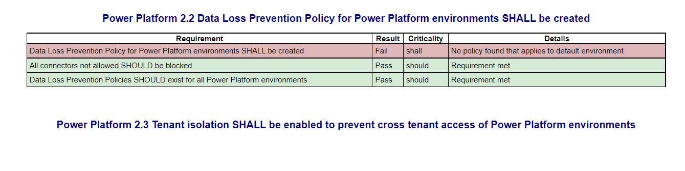

# ScubaGear M365 Secure Configuration Baseline Assessment Tool
Developed by CISA, this assessment tool verifies that an M365 tenant’s configuration conforms to the policies described in the Secure Cloud Business Applications ([SCuBA](https://cisa.gov/scuba)) Minimum Viable Secure Configuration Baseline [documents](https://github.com/cisagov/ScubaGear/tree/main/baselines).

> **Warning**
> This tool is in an alpha state and in active development. At this time, outputs could be incorrect and should be reviewed carefully.

## M365 Product License Assumptions
This tool was tested against tenants that have an M365 E3 or G3 and E5 or G5 license bundle. It may still function for tenants that do not have one of these bundles.

Some of the policy checks in the baseline rely on the following licenses which are included by default in M365 E5 and G5.
- Microsoft Entra ID P2
- Microsoft Defender for Office 365 Plan 1

If a tenant does not have the licenses listed above, the report will display a non-compliant output for those policies.

> **Note**: GCC-High/DOD endpoints are included, but have not been tested. Please open an issue if you encounter bugs. GCC-High testing in progress.

## Installation
### Downloading Repository
To download ScubaGear:

1. Click [here](https://github.com/cisagov/ScubaGear/releases/latest) to see the latest release.
2. Click `ScubaGear-v1-0-0.zip` (or latest version) to download the release.
3. Extract the folder in the zip file.

### Installing the required PowerShell Modules
> **Note**: Only PowerShell 5.1 is currently supported. PowerShell 7 may work, but has not been tested. PowerShell 7 will be added in a future release.

To import the module, open a new PowerShell 5.1 terminal and navigate to the repository folder.

Then run:

```powershell
.\Setup.ps1 #Installs the required modules
Import-Module -Name .\PowerShell\ScubaGear #Imports the tool into your session
```
### Download the required OPA executable
> **Note**: OPA executable download script is called by default when running SetUp.ps1. OPA.ps1 can also be run by itself to download the executable.
In the event of an unsuccessful download, users can manually download the OPA executable with the following steps:
1. Go to OPA download site (https://www.openpolicyagent.org/docs/latest/#running-opa)
2. Check the acceptable OPA version (Currently v0.42.1) for Scuba and select the corresponding version on top left of the website
3. Navigate to the menu on left side of the screen: Introduction - Running OPA - Download OPA
4. Locate the downloaded file, add the file to the root directory of this repository, open PowerShell, and use the following command to check the downloaded OPA version
```powershell
.\opa_windows_amd64.exe version
```

> **Note**
> Starting with release 0.3.0, ScubaGear is signed by a commonly trusted CA.  Depending on the [PowerShell execution policy](https://learn.microsoft.com/en-us/powershell/module/microsoft.powershell.core/about/about_execution_policies?view=powershell-5.1) of the system running ScubaGear, different steps may be required before running ScubaGear.  See [PowerShell Execution Policies](#powershell-execution-policies) for more details.

## Usage
ScubaGear can be invoked interactively or non-interactively. The interactive authentication mode will prompt the user for credentials via Microsoft's popup windows. Non-interactive mode is for invoking ScubaGear using an Azure AD application service principal and supports running the tool in automated scenarios such as pipelines or scheduled jobs. Examples 1-3 provide examples for running with interactive mode and example 4 provides an example for running in non-interactive mode.

### Example 1: Run an assessment against all products (except PowerPlatform)
```powershell
Invoke-SCuBA
```
### Example 2: Run an assessment against Azure Active Directory with custom report output location
```powershell
Invoke-SCuBA -ProductNames aad -OutPath C:\Users\johndoe\reports
```
### Example 3: Run assessments against multiple products
```powershell
Invoke-SCuBA -ProductNames aad, sharepoint, teams
```
### Example 4: Run assessments non-interactively using an application service principal and authenticating via CertificateThumbprint
```powershell
Invoke-SCuBA -ProductNames * -CertificateThumbprint "<insert-thumbprint>" -AppID "<insert-appid>" -Organization tenant.onmicrosoft.com
```

To view more examples and see detailed help run:
```powershell
Get-Help -Name Invoke-SCuBA -Full
```

### Parameter Definitions

- **$ConfigFilePath** is an optional parameter that refers to the path to a configuration file that the tool parses for input parameters when executing ScubaGear. ScubaGear supports either a YAML or JSON formatted configuration file. A sample configuration file is included in [sample-config-files/aad-config.yaml](./sample-config-files/aad-config.yaml). The syntax defines:
  - Use of Pascal case convention for variable names consistent with parameters on the command line
  - A global namespace for values to be used across baselines and products (i.e., GlobalVars)
  - Per product namespace for values related to that specific product (i.e., Aad, SharePoint)
  - Namespace for each policy item within a product for variables related only to one policy item (i.e., MS.AAD.2.1v1)
  - Use of YAML anchors and aliases following Don't Repeat Yourself (DRY) principle for repeated values and sections

  When using the configuration file option, all non-default parameters must be specified in the file. ScubaGear does not allow other command line options with `-ConfigFilePath`. The file path defaults to the same directory where the script is executed. The file path must point to a valid configuration file. It can be either a relative or absolute path. The file can be used to specify both standard tool parameters as well as custom parameters used by the Azure Active Directory (AAD) product assessment. See [AAD Conditional Access Policy Exemptions](#aad-conditional-access-policy-exemptions) for more details.

- **$LogIn** is a `$true` or `$false` variable that if set to `$true` will prompt the user to provide credentials to establish a connection to the specified M365 products in the **$ProductNames** variable. For most use cases, leave this variable to be `$true`. A connection is established in the current PowerShell terminal session with the first authentication. To run another verification in the same PowerShell session,  set this variable to be `$false` to bypass the need to authenticate again in the same session. Note: defender will ask for authentication even if this variable is set to `$false`

- **$ProductNames** is a list of one ore more M365 shortened product names that the tool will assess when it is executed. Acceptable product name values are listed below. To assess Azure Active Directory you would enter the value **aad**. To assess Exchange Online you would enter **exo** and so forth.
  - Azure Active Directory: **aad**
  - Defender for Office 365: **defender**
  - Exchange Online: **exo**
  - Power Platform: **powerplatform**
  - SharePoint Online and OneDrive for Business: **sharepoint**
  - Teams: **teams**

- **$M365Environment** parameter is used to authenticate to the various M365 commercial/ government environments. Valid values include `commercial`, `gcc`, `gcchigh`, or `dod`.     Default value is `commercial`.
    - For M365 tenants that are non-government environments enter the value `commercial`.
    - For M365 Government Commercial Cloud tenants with G3/G5 licenses enter the value `gcc`.
    - For M365 Government Commercial Cloud High tenants enter the value `gcchigh`.
    - For M365 Department of Defense tenants enter the value `dod`.


- **$OPAPath** refers to the folder location of the Open Policy Agent (OPA) policy engine executable file. By default the OPA policy engine executable embedded with this project is located in the project's root folder `"./"` and for most cases this value will not need to be modified. To execute the tool using a version of the OPA policy engine located in another folder, customize the variable value with the full path to the folder containing the OPA policy engine executable file.

- **$OutPath** refers to the folder path where the output JSON and the HTML report will be created. Defaults to the same directory where the script is executed.  This parameter is only necessary if an alternate report folder path is desired.  The folder will be created if it does not exist.

### Viewing the Report
The HTML report should open in your browser once the script completes. If it does not, navigate to the output folder and open the BaselineReports.html file using your browser. The result files generated from the tool are also saved to the output folder.

## Required Permissions
When executing the tool interactively, there are two types of permissions that are required:
- User Permissions (which are associated with Azure AD roles assigned to a user)
- Application Permissions (which are assigned to the MS Graph PowerShell application in Azure AD).


### User Permissions
The minimum user roles needed for each product are described in the table below.

[This article](https://learn.microsoft.com/en-us/microsoft-365/admin/add-users/assign-admin-roles?view=o365-worldwide) also explains how to assign admin roles in M365.

|   Product               |             Role                                                                    |
|-------------------------|:-----------------------------------------------------------------------------------:|
| Azure Active Directory  |  Global Reader                                                                      |
| Teams                   |  Global Reader (or Teams Administrator)                                                                |
| Exchange Online         |  Global Reader (or Exchange Administrator)                                                             |
| Defender for Office 365 |  Global Reader (or Exchange Administrator)                                                             |
| Power Platform          |  Power Platform Administrator and a "Power Apps for Office 365" license             |
| Sharepoint Online       |  SharePoint Administrator                                                           |

- **Note**: Users with the Global Administrator role always have the necessary user permissions to run the tool.


### Microsoft Graph Powershell SDK permissions
The Azure AD baseline requires the use of Microsoft Graph. The script will attempt to configure the required API permissions needed by the Microsoft Graph PowerShell module, if they have not already been configured in the target tenant.

The process to configure the application permissions is sometimes referred to as the "application consent process" because an Administrator must "consent" for the Microsoft Graph PowerShell application to access the tenant and the necessary Graph APIs to extract the configuration data. Depending on the Azure AD roles assigned to the user running the tool and how the application consent settings are configured in the target tenant, the process may vary slightly. To understand the application consent process, read [this article](https://learn.microsoft.com/en-us/azure/active-directory/develop/application-consent-experience) from Microsoft.

Microsoft Graph is used, because Azure AD PowerShell is being deprecated.

> **Note**
> Microsoft Graph PowerShell SDK appears as "unverified" on the AAD application consent screen. This is a [known issue](https://github.com/microsoftgraph/msgraph-sdk-powershell/issues/482).

The following API permissions are required for Microsoft Graph Powershell:

- Directory.Read.All
- GroupMember.Read.All
- Organization.Read.All
- Policy.Read.All
- RoleManagement.Read.Directory
- User.Read.All

### Service Principal Application Permissions & Setup
The minimum API permissions & user roles for each product that need to be assigned to a service principal application for ScubaGear app-only authentication are listed in the table below.

| Product                  | API Permissions                                      | Azure AD Roles                   |
|--------------------------|------------------------------------------------------|----------------------------------|
| Azure Active Directory   | Directory.Read.All, GroupMember.Read.All,            |                                  |
|                          | Organization.Read.All, Policy.Read.All,              |                                  |
|                          | RoleManagement.Read.Directory, User.Read.All,        |                                  |
|                          |                    |                                  |
| Defender for Office 365  | Exchange.ManageAsApp                                 | Global Reader                    |
| Exchange Online          | Exchange.ManageAsApp                                 | Global Reader                    |
| Power Platform           | [See Power Platform App Registration](#power-platform-app-registration)                                                |                                  |
| SharePoint Online        | Sites.FullControl.All, Directory.Read.All            |                                  |
| Microsoft Teams          |                                                      | Global Reader                    |

This [video](https://www.youtube.com/watch?v=GyF8HV_35GA) provides a good tutorial for creating an application manually in the Azure Portal. Augment the API permissions and replace the role assignment instructions in the video with the permissions listed above.

#### Power Platform App Registration
For Power Platform, the application must be [manually registered to Power Platform via interactive authentication](https://learn.microsoft.com/en-us/power-platform/admin/powershell-create-service-principal#registering-an-admin-management-application) with a administrative account. See [Limitations of Service Principals](https://learn.microsoft.com/en-us/power-platform/admin/powershell-create-service-principal#limitations-of-service-principals) for how applications are treated within Power Platform.
```powershell
Add-PowerAppsAccount -Endpoint prod -TenantID $tenantId # use -Endpoint usgov for gcc tenants
New-PowerAppManagementApp -ApplicationId $appId # Must be run from a Power Platform Administrator or Global Administrator account
```

**Certificate store notes**
- Power Platform has a [hardcoded expectation](https://github.com/microsoft/Microsoft365DSC/issues/2781) that the certificate is located in `Cert:\CurrentUser\My`.
- MS Graph has an expectation that the certificate at least be located in one of the local client's certificate store(s).

> **Notes**: Only authentication via `CertificateThumbprint` is currently supported. We will also be supporting automated app registration in a later release.

### AAD Conditional Access Policy Exemptions
The ScubaGear ConfigFilePath command line option allows users to define custom variables for use in policy assessments against the AAD baseline.  These custom variables are used to exempt specific user and group exclusions from conditional access policy checks that normally would not pass if exclusions are present.  These parameters support operational use cases for having backup or break glass account exclusions to global user policies without failing best practices.  Any exemptions and their risks should be carefully considered and documented as part of an organization's cybersecurity risk management program process and practices.

**YAML AAD Configuration File Syntax and Examples**

**Aad** defines the AAD specific variables to specify user, group, and role exclusions that are documented exemptions to select conditional access policies (CAP) in the AAD configuration policy baselines. Users, groups, and roles are specified by their respective Universally Unique Identifier (UUID) in the tenant. This variable set is only needed if the agency has documented CAP exemptions.

**CapExclusions** - Supports both a Users and Groups list with each entry representing the UUID of a user or group that is approved by the agency to be included in a conditional access policy assignment exclusion. Adding an entry to this variable will prevent ScubaGear from failing the policy assessment due to the presence of the users and groups in an exclusion.

CapExclusions can be defined in the following policy namespaces:

- MS.AAD.1.1v1
- MS.AAD.2.1v1
- MS.AAD.2.3v1
- MS.AAD.3.2v1
- MS.AAD.3.3v1
- MS.AAD.3.7v1
- MS.AAD.3.8v1

**RoleExclusions** - Supports both a Users and Groups list with each entry representing the UUID of a user or group that is approved by the agency to be included in a role assignment. Adding an entry to this variable will prevent ScubaGear from failing the policy assessment due to the presence of a role assignment for those users and groups.

RoleExclusions can be defined in the following policy namespaces:

- MS.AAD.7.4v1

The example below illustrates the syntax for defining user, group, and role exemptions to select policies.  The syntax allows the use of a YAML anchor and alias to simplify formatting policies having the same documented exemptions. Items surrounded by chevrons are to be supplied by the user.

        Aad:
          MS.AAD.1.1v1: &CommonExclusions
            CapExclusions:
              Users:
                - <Exempted User 1 UUID>
                - <Exempted User 2 UUID>
              Groups:
                - <Exempted Group 1 UUID>
          MS.AAD.2.1v1:  *CommonExclusions
          MS.AAD.2.3v1:  *CommonExclusions
          MS.AAD.3.2v1:  *CommonExclusions
          MS.AAD.7.4v1:
            RoleExclusions:
              Users:
                - <Exempted User 3 UUID>
              Groups:
                - <Exempted Group 2 UUID>

## Architecture

The tool employs a three-step process:
1. **Extract & Export**. In this step, we utilize the various PowerShell modules authored by Microsoft to export and serialize all the relevant settings into JSON.
2. **Test & Record**. Compare the exported settings from the previous step with the configuration prescribed in the baselines. This is done using [OPA Rego](https://www.openpolicyagent.org/docs/latest/policy-language/#what-is-rego), a declarative query language for defining policy. OPA provides a ready-to-use policy engine executable and version v0.41.0 is already included in this repository. The code for the ScubaGear tool was tested against the included version of OPA. To use a later version of the OPA policy engine, follow the instructions listed [here](https://www.openpolicyagent.org/docs/latest/#running-opa) and customize the `$OPAPath` variable described in the Usage section above.
3. **Format & Report**. Package the data output by the OPA policy engine into a human-friendly HTML report.

## Repository Organization
- `PowerShell` contains the code used to export the configuration settings from the M365 tenant and orchestrate the entire process from export through evaluation to report. The main PowerShell module manifest `SCuBA.psd1` is located in the PowerShell folder.
- `Rego` holds the `.rego` files. Each Rego file audits against the desired state for each product, per the SCuBA M365 secure configuration baseline documents.
- `Testing` contains code that is used during the development process to unit test Rego policies.

## Project License

Unless otherwise noted, this project is distributed under the Creative Commons Zero license. With developer approval, contributions may be submitted with an alternate compatible license. If accepted, those contributions will be listed herein with the appropriate license.


## Troubleshooting

### Executing against multiple tenants
ScubaGear creates connections to several M365 services. If running against multiple tenants, it is necessary to disconnect those sessions.

`Invoke-SCuBA` includes the `-DisconnectOnExit` parameter to disconnect each of connection upon exit.  To disconnect sessions after a run, use `Disconnect-SCuBATenant`.  The cmdlet disconnects from Azure Active Directory (via MS Graph API), Defender, Exchange Online, Power Platform, SharePoint Online, and Microsoft Teams.

```PowerShell
Disconnect-SCuBATenant
```
> The cmdlet will attempt to disconnect from all services regardless of current session state.  Only connections established within the current PowerShell session will be disconnected and removed.  Services that are already disconnected will not generate an error.

### Errors connecting to Defender
If when running the tool against Defender (via ExchangeOnlineManagement PowerShell Module), you may see the connection error "Create Powershell Session is failed using OAuth" in the Powershell window, follow the instructions in this section. An example of the full error message is provided below.

```
WARNING: Please note that you can only use above 9 new EXO cmdlets (the one with *-EXO* naming pattern). You can't use other cmdlets
as we couldn't establish a Remote PowerShell session as basic auth is disabled in your client machine. To enable Basic Auth, please
check instruction here
https://docs.microsoft.com/en-us/powershell/exchange/exchange-online-powershell-v2?view=exchange-ps#prerequisites-for-the-exo-v2-module
Create Powershell Session is failed using OAuth
```

If you see this error message it means that basic authentication needs to be enabled on the client computer running the automation scripts. The automation relies on the Microsoft Security & Compliance PowerShell environment for Defender information. Security & Compliance PowerShell connections, unlike other services used by the ExchangeOnlineManagement module, required basic authentication to be enabled on the local machine for versions of ExchangeOnlineManagement prior to Version 3. As of June 2023, Microsoft has [deprecated Remote PowerShell for Exchange Online and Security & Compliance PowerShell](https://techcommunity.microsoft.com/t5/exchange-team-blog/announcing-deprecation-of-remote-powershell-rps-protocol-in/ba-p/3695597). To resolve this error, you should run the .\SetUp.ps1 script to install the latest compatible ExchangeOnlineManagement module.

### Exchange Online maximum connections error
If when running the tool against Exchange Online, you see the error below in the Powershell window, follow the instructions in this section.

```PowerShell
New-ExoPSSession : Processing data from remote server outlook.office365.com failed with the
following error message: [AuthZRequestId=8feccdea-493c-4c12-85dd-d185232cc0be][FailureCategory=A
uthZ-AuthorizationException] Fail to create a runspace because you have exceeded the maximum
number of connections allowed : 3
```

If you see the error above run the command below in Powershell:
```PowerShell
Disconnect-ExchangeOnline
```

or alternatively run `Disconnect-SCuBATenant` exported by the ScubaGear module.
```PowerShell
Disconnect-SCuBATenant
```

### Power Platform empty policy in report
In order for the tool to properly assess the Power Platform product, one of the following conditions must be met:
* The tenant includes the `Power Apps for Office 365` license AND the user running the tool has the `Power Platform Administrator` role assigned
*  The user running the tool has the `Global Administrator` role

If these conditions are not met, the tool will generate an incorrect report output. The development team is working on a fix to address this bug that will be included in the next release. The screenshot below shows an example of this error for Power Platform policy 2.3. When a user with the required license and role runs the tool, it will produce a correct report.




### Microsoft Graph Errors

#### Infinite AAD Signin Loop
While running the tool, AAD signin prompts sometimes get stuck in a loop. This is likely an issue with the connection to Microsoft Graph.

To fix the loop, run:
```PowerShell
Disconnect-MgGraph
```
Then run the tool again.

#### Error `Connect-MgGraph : Key not valid for use in specified state.`

This is due to a [bug](https://github.com/microsoftgraph/msgraph-sdk-powershell/issues/554) in the Microsoft Authentication Library.  The workaround is to delete broken configuration information by running this command (replace `{username}` with your username):

```
rm -r C:\Users\{username}\.graph
```
After deleting the `.graph` folder in your home directory, re-run the tool and the error should disappear.

#### Error `Could not load file or assembly 'Microsoft.Graph.Authentication'`

This indicates that the authentication module is at a version level that conflicts with the MS Graph modules used by the tool. Follow the instructions in the Installation section and execute the Setup script again. This will ensure that the module versions get synchronized with dependencies and then execute the tool again.


### Running the Script Behind Some Proxies
If you receive connection or network proxy errors, try running:
```powershell
$Wcl=New-Object System.Net.WebClient
$Wcl.Proxy.Credentials=[System.Net.CredentialCache]::DefaultNetworkCredentials
```

### Utility Scripts
The ScubaGear repository includes several utility scripts to help with troubleshooting and recovery from error conditions in the `utils` folder. These helper scripts are designed to assist developers and users when running into errors with the ScubaGear tool or local system environment. See the sections below for details on each script.

#### ScubaGear Support
If a user receives errors and needs additional support diagnosing issues, the `ScubaGearSupport.ps1` script can be run to gather information about their system environment and previous tool output.
The script gathers this information into a single ZIP formatted archive to allow for easy sharing with developers or other support staff to assist in troubleshooting. Since the script does gather report output, do keep in mind that the resulting archive may contain details about the associated M365 environment and its settings.

The script can be run with no arguments and will only collect environment information for troubleshooting.  If the `IncludeReports` parameter is provided, it will contain the most recent report from the default `Reports` folder.

```PowerShell
.\ScubaGearSupport.ps1
```

An alternate report path can be specified via the `ReportPath` parameter.

```PowerShell
.\ScubaGearSupport.ps1 -ReportPath C:\ScubaGear\Reports
```

Finally, the script can optionally include all previous reports rather than the most recent one by adding the `AllReports` option.

```PowerShell
.\ScubaGearSupport.ps1 -AllReports
```

Data gathered by the script includes:
* Listings of locally installed PowerShell modules and their installation paths
* PowerShell versions and environment details
* WinRM client service Basic Authentication registry setting
* (optional) ScubaGear output from one or more previous invocations which contains
  * HTML product and summary reports
  * JSON-formatted M365 product configuration extracts
  * JSON and CSV-formatted M365 baseline test results

#### Removing installed modules
ScubaGear requires a number of PowerShell modules to function.  A user or developer, however, may wish to remove these PowerShell modules for testing or for cleanup after ScubaGear has been run.  The `UninstallModules.ps1` script will remove the latest version of the modules required by ScubaGear and installed by the associated `Setup.ps1` script.  The script does not take any options and can be as follows:

```PowerShell
.\UninstallModules.ps1
```

>PowerShellGet 2.x has a known issue uninstalling modules installed on a OneDrive path that may result in an "Access to the cloud file is denied" error.  Installing PSGet 3.0, currently in beta, will allow the script to successfully uninstall such modules or you can remove the modules files from OneDrive manually.

### PowerShell Execution Policies

On Windows Servers, the default [execution policy](https://learn.microsoft.com/en-us/powershell/module/microsoft.powershell.security/set-executionpolicy?view=powershell-5.1) is `RemoteSigned`, which will allow ScubaGear to run after the publisher (CISA) is agreed to once.

On Windows Clients, the default execution policy is `Restricted`.  In this case, `Set-ExecutionPolicy RemoteSigned` should be invoked to permit ScubaGear to run.
