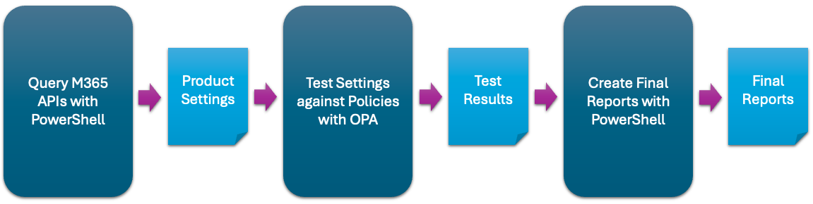

[![GitHub Release][github-release-img]][release]
[![PSGallery Release][psgallery-release-img]][psgallery]
[![CI Pipeline][ci-pipeline-img]][ci-pipeline]
[![Functional Tests][functional-test-img]][functional-test]
[![GitHub License][github-license-img]][license]
[![GitHub Downloads][github-downloads-img]][release]
[![PSGallery Downloads][psgallery-downloads-img]][psgallery]
[![GitHub Issues][github-issues-img]][github-issues]

ScubaGear is an assessment tool that verifies that a Microsoft 365 (M365) tenant’s configuration conforms to the policies described in the Secure Cloud Business Applications ([SCuBA](https://cisa.gov/scuba)) Secure Configuration Baseline [documents](/baselines/README.md).

> **Note**: This documentation can be read using [GitHub Pages](https://cisagov.github.io/ScubaGear).

## Target Audience

ScubaGear is for M365 administrators who want to assess their tenant environments against CISA Secure Configuration Baselines.

## Overview

ScubaGear uses a three-step process:

- **Step One** - PowerShell code queries M365 APIs for various configuration settings.
- **Step Two** - It then calls [Open Policy Agent](https://www.openpolicyagent.org) (OPA) to compare these settings against Rego security policies written per the baseline documents.
- **Step Three** - Finally, it reports the results of the comparison as HTML, JSON, and CSV.



## Getting Started

To install ScubaGear from [PSGallery](https://www.powershellgallery.com/packages/ScubaGear), open a PowerShell 5 terminal on a Windows computer and install the module:

```powershell
# Install ScubaGear
Install-Module -Name ScubaGear
```

To install its dependencies:

```powershell
# Install the minimum required dependencies
Initialize-SCuBA 
```

To verify that it is installed:

```powershell
# Check the version
Invoke-SCuBA -Version
```

To run ScubaGear:

```powershell
# Assess all products
Invoke-SCuBA -ProductNames *
```

> **Note**:  Successfully running ScubaGear requires certain prerequisites and configuration settings.  To learn more, read through the sections below.

## Table of Contents

The following sections should be read in order.

### Installation

- [Install from PSGallery](docs/installation/psgallery.md)
- [Download from GitHub](docs/installation/github.md)
- [Uninstall](docs/installation/uninstall.md)

### Prerequisites

- [Dependencies](docs/prerequisites/dependencies.md)
- [Required Permissions](docs/prerequisites/permissions.md)
  - [Interactive Permissions](docs/prerequisites/interactive.md)
  - [Non-Interactive Permissions](docs/prerequisites/noninteractive.md)

### Execution

- [Execution](docs/execution/execution.md)
- [Reports](docs/execution/reports.md)

### Configuration

- [Parameters](docs/configuration/parameters.md)
- [Configuration File](docs/configuration/configuration.md)

### Troubleshooting

- [Multiple Tenants](docs/troubleshooting/tenants.md)
- [Defender](docs/troubleshooting/defender.md)
- [Exchange Online](docs/troubleshooting/exchange.md)
- [Power Platform](docs/troubleshooting/power.md)
- [Microsoft Graph](docs/troubleshooting/graph.md)
- [Proxy](docs/troubleshooting/proxy.md)

### Misc

- [Assumptions](docs/misc/assumptions.md)

## Project License

Unless otherwise noted, this project is distributed under the Creative Commons Zero license. With developer approval, contributions may be submitted with an alternate compatible license. If accepted, those contributions will be listed herein with the appropriate license.

[release]: https://github.com/cisagov/ScubaGear/releases
[license]: https://github.com/cisagov/ScubaGear/blob/main/LICENSE
[psgallery]: https://www.powershellgallery.com/packages/ScubaGear
[github-cicd-workflow]: https://github.com/cisagov/ScubaGear/actions/workflows/run_pipeline.yaml
[github-issues]: https://github.com/cisagov/ScubaGear/issues
[github-license-img]: https://img.shields.io/github/license/cisagov/ScubaGear
[github-release-img]: https://img.shields.io/github/v/release/cisagov/ScubaGear?label=GitHub&logo=github
[psgallery-release-img]: https://img.shields.io/powershellgallery/v/ScubaGear?logo=powershell&label=PSGallery
[ci-pipeline]: https://github.com/cisagov/ScubaGear/actions/workflows/run_pipeline.yaml
[ci-pipeline-img]: https://github.com/cisagov/ScubaGear/actions/workflows/run_pipeline.yaml/badge.svg
[functional-test]: https://github.com/cisagov/ScubaGear/actions/workflows/test_production_function.yaml
[functional-test-img]: https://github.com/cisagov/ScubaGear/actions/workflows/test_production_function.yaml/badge.svg
[github-cicd-workflow-img]: https://img.shields.io/github/actions/workflow/status/cisagov/ScubaGear/run_pipeline.yaml?logo=github
[github-downloads-img]: https://img.shields.io/github/downloads/cisagov/ScubaGear/total?logo=github
[psgallery-downloads-img]: https://img.shields.io/powershellgallery/dt/ScubaGear?logo=powershell
[github-issues-img]: https://img.shields.io/github/issues/cisagov/ScubaGear
