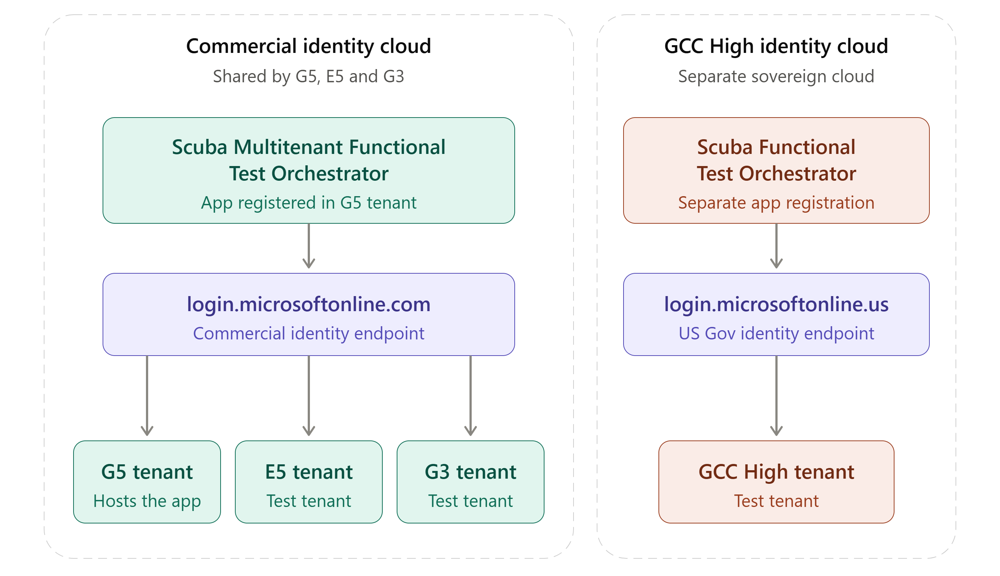
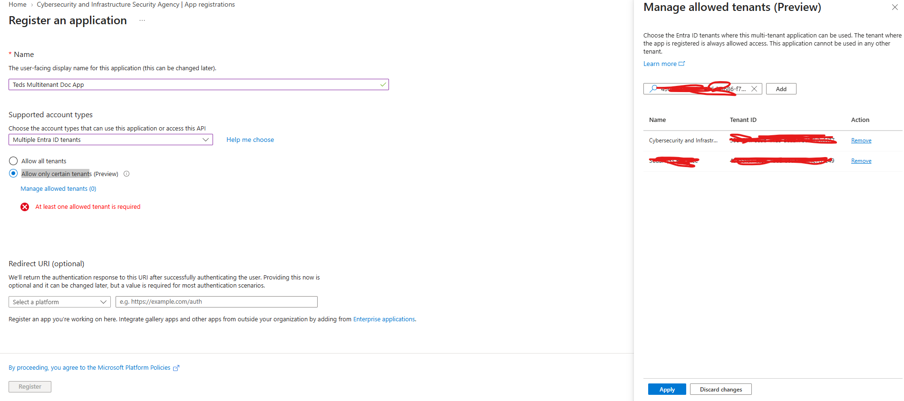
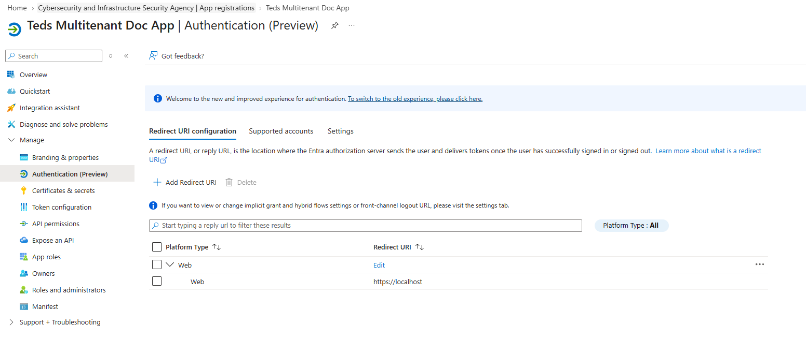
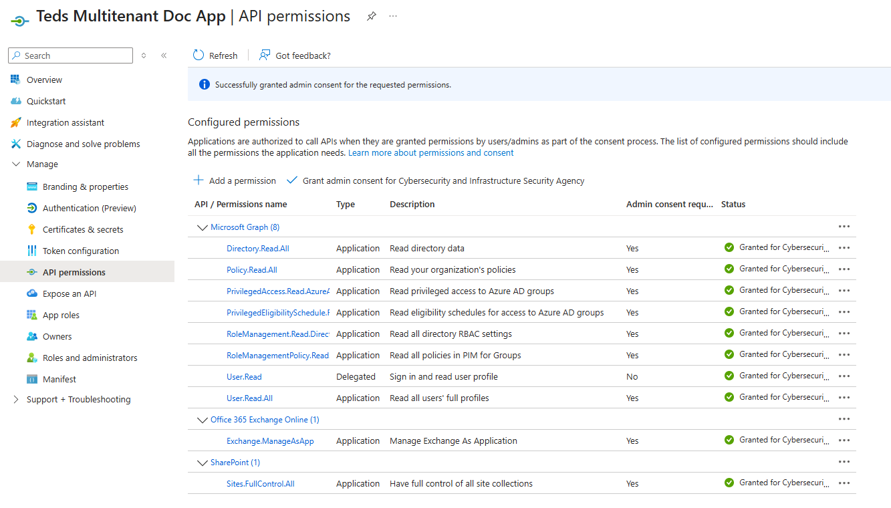
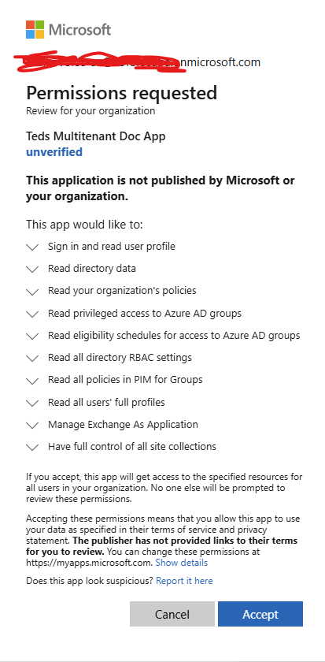
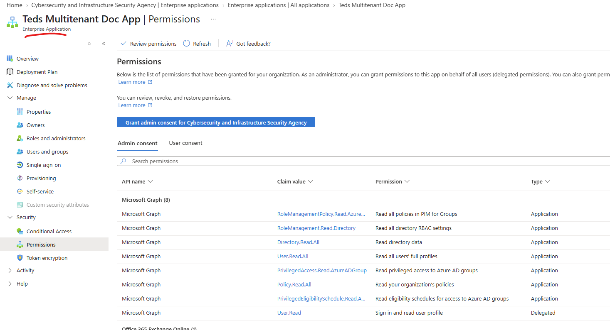
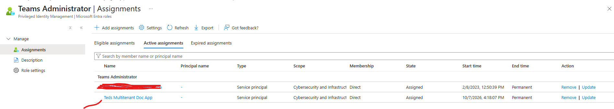
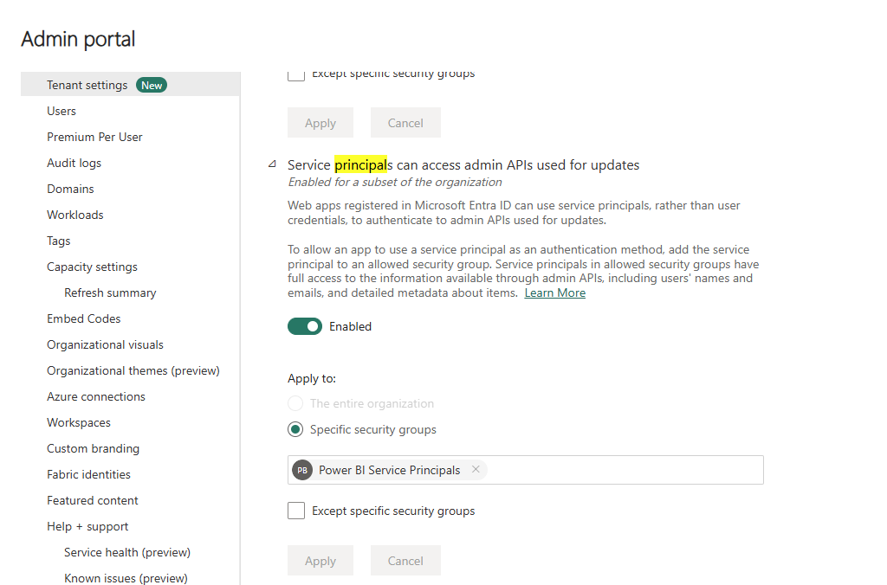

# Setup an AAD app to Run the Scuba Functional Test Orchestrator with a Service Principal

This document describes how to setup an Entra registered application identity to run the Scuba Functional Tests GitHub action using a **service principal (non interactive login)**. We refer to this identity as the functional test orchestrator.

## Multi-tenant application architecture across the test tenants

The functional test orchestrator is designed as a multi-tenant app to reduce administrative configuration overhead across the test tenants. It is easier to manage a central identity instead of re-creating one for each tenant. A common app named Scuba **Multitenant** Functional Test Orchestrator is created in the G5 tenant and used to authenticate the functional tests in the G5, E5 and G3 test tenants. All three of these tenants use the same cloud identity endpoint (login.microsoft.com) and can share an app. The GCC high tenant must use its own app (named Scuba Functional Test Orchestrator) since it is in a separate cloud identity endpoint (login.microsoftonline.us).

## Creating and configuring the registered apps in Entra

These instructions describe the steps to create a new App Registration in Entra that will represent the identity used to authenticate the functional test orchestrator.

1. Perform the app registration in this section steps to create a multi-tenant app named "Scuba **Multitenant** Functional Test Orchestrator" in the G5 tenant
2. For the GCC high tenant you will repeat the steps but create a regular app named "Scuba Functional Test Orchestrator"

Go to Entra > App Registrations and click New registration.
Enter the app name as described at the beginning of this section.
Under Supported account types select Multiple Entra ID tenants and then Allow only certain tenants.
Click on the Manage allowed tenants hyperlink and then enter the tenant identifiers for the E5 and G3 tenants.
Click Register.

*For the GCC High app you will select Single tenant only as the application type.

Once the properties page opens for the new app, click on Manage > Authentication.
Click Add Redirect URI and select Web, then enter the value "https://localhost" for the redirect URI

Click on Manage > API permissions.
Add the permissions needed for the following resources: Microsoft Graph, Office 365 Exchange Online, and SharePoint.
Refer to the [ScubaGear non-interactive authentication permissions page](https://github.com/cisagov/ScubaGear/blob/main/docs/prerequisites/noninteractive.md) for a list of permissions that must be added. Make sure to add the permissions as Application permissions, not Delegated.
Once the permissions have been added, make sure to click on Grant admin consent at the top of the permissions page.

## Authorizing the multi-tenant app in the E5 and G3 tenants

In this section you are in effect "installing" the multi tenant app so that it can be used inside the E5 and G3 tenants.

Copy the hyperlink below into a text editor and replace the following variables with the correct values from your environment:
- {tenant-id} Is the tenant identifier of the target tenant where the multi-tenant app is being installed.
- {client-id} Is the Application (client) ID of the multi-tenant app from the home tenant's registered app configuration page.

Make sure to paste the hyperlink into a browser that is already authenticated to the target tenant to make the experience smoother. You will need to consent to the permissions when the popup page occurs.

https://login.microsoftonline.com/{tenant-id}/v2.0/adminconsent?client_id={client-id}&scope=https://graph.microsoft.com/.default&redirect_uri=https://localhost

This will create an "Enterprise Application" in the target tenant.

> [!IMPORTANT]
> Repeat the same instructions in each of the sections below against each tenant.

## Assign the necessary Entra user roles to the test orchestrator

When a multi-tenant app is authorized (installed) in a tenant, the app will inherit the API permissions defined in the home tenant's application manifest (which we configured in the steps above). However the app needs some Entra roles in the target tenant that are required to A) execute ScubaGear and B) modify the tenant during the functional tests.

Go to the Entra Roles and Administrators page for each of the roles listed below and assign the service principal associated with the registered app we created earlier.

- Global Reader
- Teams Administrator

## PowerPlatform API configuration

Follow [the steps at this page](https://github.com/cisagov/ScubaGear/blob/main/docs/prerequisites/noninteractive.md#power-platform-registration) to configure PowerPlatform for the functional test orchestrator.

## Power BI API configuration

Follow [the steps at this page](https://github.com/cisagov/ScubaGear/blob/main/docs/prerequisites/noninteractive.md#power-bi-tenant-setting) to configure Power BI for the functional test orchestrator.

To create consistent configurations that are easy to manage across tenants follow these guidelines when setting up the functional test orchestrator to work with Power BI.

1. Create a security group with the standard name "Power BI Service Principals". This will be the security group assigned in the Power BI admin page described in the instructions.
2. Put the functional test orchestrator service principal in the security group.

## Power BI Extra configuration for E5 tenant

The Power BI functional tests modify the tenant in E5, therefore an addition permission configuration is needed. 

1. On the Power BI admin page, navigate to the configuration named "Service principals can access admin APIs used for updates".
2. Enable the setting, select Specific security groups and then enter the name "Power BI Service Principals".
3. Click Apply.

