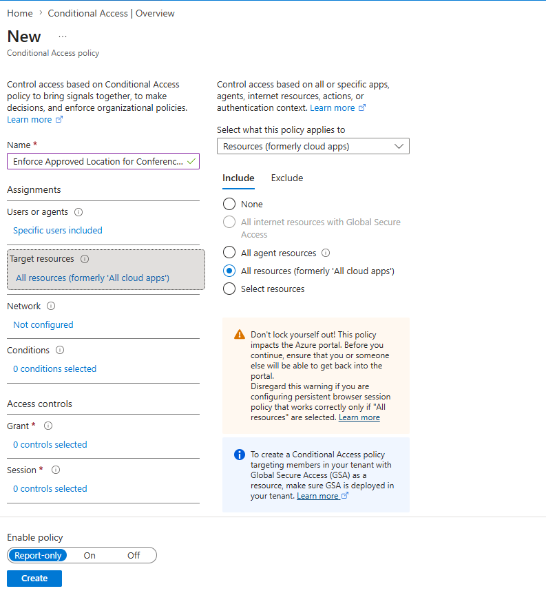

# Entra Conditional Access: Restrict Access to Specific Users from an Approved Location

## Overview

Sometimes an organization needs to exclude special types of users from
Scuba conditional access policies that require MFA. For example, some
conference phone systems need a Microsoft Entra ID account to access
Microsoft Teams. Because those accounts are machines rather than human
users, they do not have the ability to perform MFA. Microsoft refers to
the identities used by these machines as **Teams Rooms resource
accounts**.

Because granting access to a user account without requiring MFA presents
a security risk, the risk can be reduced by enforcing a Microsoft Entra
Conditional Access policy that only allows sign-ins from these users
from an approved IP address network location. If these accounts are
compromised, this restriction makes their access more difficult to
exploit.

## References

This guidance aligns with Microsoft's authentication recommendations for
Teams Rooms and experience from the Scuba program.

-   [Use location-based access with named
    locations](https://learn.microsoft.com/en-us/microsoftteams/devices/authentication-best-practices-for-android-devices#use-location-based-access-with-named-locations)
-   [Use compliant
    devices](https://learn.microsoft.com/en-us/microsoftteams/devices/authentication-best-practices-for-android-devices#use-compliant-devices)


This walkthrough focuses on **creating a Conditional Access policy that
uses named locations**. Scuba also has a complementary policy which requires
compliant devices that matches Microsoft's recommendations and will help to mitigate the risks of allowing access to specific accounts without MFA. Reference the link below for the Scuba policy with instructions. Teams Rooms
phones and devices must be enrolled in Intune to use that policy.

-   [Scuba Entra ID policy
    MS.AAD.3.7v1](https://github.com/cisagov/ScubaGear/blob/main/PowerShell/ScubaGear/baselines/aad.md#msaad37v1)

## Approach

1.  Create a Microsoft Entra ID security group containing the special
    user accounts.
2.  Create an approved location in Microsoft Entra Conditional Access.
3.  Create a Conditional Access policy that targets the security group
    and blocks access from all locations **except** the approved location.
4.  Create the Scuba Conditional Access policies that enforce MFA, such
    as Entra ID policy 3.1.
    -   Exclude the security group from the MFA policy.
5.  Document the excluded security group in the ScubaGear configuration
    file.
6.  Execute ScubaGear with the configuration file containing the
    approved exclusion.

> **Note:** The examples in this document use the group name
> `Conference Room Phones`. Customize the group name to match your
> exclusion scenario.

## Create a Security Group for the Special User Accounts

In **Microsoft Entra ID \> Manage \> Groups**, create a new security group named **Conference
Room Phones**. Under **Members**, select the Teams Rooms resource user
accounts associated with the phones.


## Create an Approved Location in Conditional Access

In **Microsoft Entra ID \> Security \> Protect \> Conditional Access**, go to **Manage \> Named locations**.

Create an IP ranges location named **Approved Location Conference
Phones**.

Enter the IP address range from which the special user accounts are
allowed to authenticate.


## Create a Conditional Access Policy to Enforce the Approved Location

In **Microsoft Entra ID \> Security \> Protect \> Conditional Access \> Policies**, create a new Conditional Access policy named **Enforce Approved Location
for Conference Phones**.

### Select the Users and Group

Configure the policy to include the **Conference Room Phones** group.


### Select Target Resources

Set **Target resources** to **All resources (formerly 'All cloud
apps')**.



### Configure the Network Location

Configure the network assignment and include **Any network or
location**.


Then, under **Exclude**, select **Selected networks and locations** and
choose **Approved Location Conference Phones**.


### Block Access and Enable the Policy

Under **Grant**, select **Block access**.


Switch **Enable policy** to **On**, and then save the policy.

> **Important:** Test access to Microsoft 365 from a conference room
> phone, or the source device applicable to your scenario, to ensure
> that it can access Microsoft 365 resources after the new Conditional
> Access policy is in place.

## Exclude the Group from Scuba MFA Policies

In each Conditional Access policy that enforces MFA, open the **Users**
page, select **Exclude**, and select the **Conference Room Phones**
group created earlier.


## Document the Excluded Group in the ScubaGear Configuration File

In your ScubaGear configuration file, create a `CapExclusions` section
for each Scuba MFA policy from which you excluded the special group. In
the `Groups` section, add the unique identifier of the excluded
Microsoft Entra group.

See the [ScubaGear Entra ID configuration
documentation](https://github.com/cisagov/ScubaGear/blob/main/docs/configuration/configuration.md#entra-id-configuration).

Example for Entra MFA policy 3.1:

``` yaml
Aad:
  MS.AAD.3.1v1:
    CapExclusions:
      Groups:
        - "11111111-1111-1111-1111-111111111111" # Conference Room Phones group
```

You can also use the [ScubaGear Config
App](https://github.com/cisagov/ScubaGear/blob/main/docs/configuration/scubaconfigapp.md)
to define exclusions with the visual editor.

## Execute ScubaGear with the Updated Configuration File

Execute ScubaGear and pass the path to the configuration file. The
documented exclusion signals to ScubaGear that it should not fail the
policy when it finds that specific group's identifier in the
configuration file.

``` powershell
Invoke-Scuba -ConfigFilePath C:\users\tkolovos\scubaconfig.yaml
```
