# SCuBAGear Configuration Editor - Step-by-Step Walkthrough

This guide walks you through every step of creating a ScubaGear configuration file using the SCuBAGear Configuration Editor (ScubaConfigApp), from launching the application to saving your final YAML.

---

## Before You Begin

- ScubaGear must be installed. Run `Install-ScubaDependencies` if you haven't already.
- You must have PowerShell 5.1 or later on a Windows machine with a graphical desktop.
- To use **Graph-assisted lookups** (auto-populate users and groups), launch with `-Online`. See [Using the -Online Mode](#using-the--online-mode) for a full walkthrough of what this enables. The signed-in account must have the following Microsoft Graph **delegated** permissions:

  | Permission | Used for |
  |------------|---------|
  | `User.Read.All` | Browse and resolve users when filling exclusion fields |
  | `Group.Read.All` | Browse and resolve groups when filling exclusion fields |
  | `Organization.Read.All` | Read tenant information |
  | `Application.Read.All` | Browse registered applications when filling the App ID field in Advanced Settings |

  These are delegated (user-context) permissions. The account you sign in with must be granted consent for all four, either via admin consent or user consent. A **Global Reader** role is typically sufficient for read access.

>TIP: To use **Run ScubaGear** from within the app, you must configure Application Authentication (non-interactive mode) - see [Step 7](#step-7-configure-advanced-settings).

---

## Step 1 - Launch the Application

Open a PowerShell window and run:

```powershell
Import-Module ScubaGear
Start-SCuBAConfigApp
```

> **Tip:** To pre-load an existing YAML configuration, pass it on launch:
> ```powershell
> Start-SCuBAConfigApp -ConfigFilePath ".\Sample-Config-Files\full_config.yaml"
> ```

The application window opens. The **Main** tab is active by default.
---

## Step 2 - Fill In the Main Tab

The **Main** tab collects organization information and product selection. It must be completed before other tabs become usable.

### 2a. Organization Information

| Field | Required | Description |
|-------|----------|-------------|
| Tenant Domain | **Yes** | Your M365 tenant domain, e.g. `contoso.onmicrosoft.com` |
| Organization Name | **Yes** (BOD submissions) | Human-readable org name, e.g. `Department of Example` |
| Org Unit Name | No | Sub-unit, e.g. `Office of IT` |
| Description | No | Free-text note about this configuration |

1. Click the **Tenant Domain** field and type your domain. The field validates the format in real time - a red border indicates an invalid format.
2. Fill in **Organization Name**.
3. Fill in optional fields as needed.

### 2b. Select M365 Environment

Click the **M365 Environment** dropdown and select one:

- **Commercial** - standard public tenants
- **Government Community Cloud (GCC)**
- **Government Community Cloud High (GCC High)**
- **Department of Defense (DoD)**

### 2c. Select Products

Check at least one product under **Select at least one product**:

- Microsoft Entra ID (AAD)
-  Security Suite (Defender)
- Exchange Online (EXO)
- Power BI
- Power Platform
- SharePoint & OneDrive
- Microsoft Teams

> **At least one product must be selected.** Checking a product immediately enables that product's sub-tabs in the Exclusions, Annotate Policies, and Omit Policies tabs.

---

> NOTE: there are validation checks along the way. Be sure to follow them
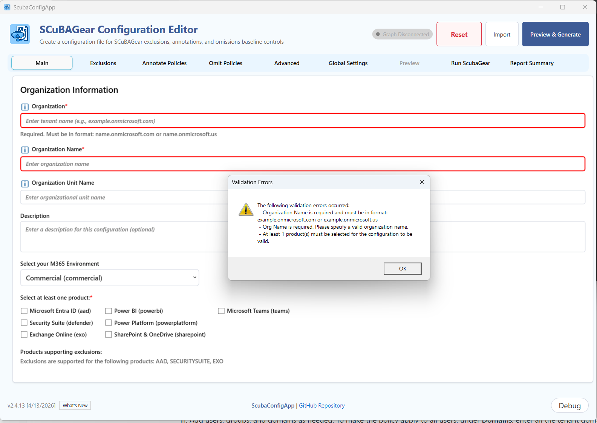

## Step 3 - Configure Exclusions

Navigate to the **Exclusions** tab.

Exclusions tell ScubaGear evaluation process to validate the specific policy with additional items defined such as specific users, groups, domains, etc. Only products that support exclusions will appear as sub-tabs (e.g., AAD, EXO, Security Suite).

### 3a. Navigate to the Product Sub-Tab

Click the sub-tab for the product you want to configure (e.g., **AAD**, **DEFENDER**).

### 3b. Find the Policy

Use the **search box** at the top to filter by policy name or ID, or use the **criticality** and **configuration status** dropdowns to narrow results.

### 3c. Add an Exclusion

1. Locate the policy card.
2. Click the **exclusion type** dropdown on the card (e.g., *Conditional Access Policy Excluded Groups, Users…*) and select the exclusion type.
3. Fill in the fields (GUIDs, email addresses, domains, etc.).
   - If connected with `-Online`, click the **Get Groups** or **Get Users** button next to a list field to search and select objects from your tenant via Microsoft Graph. See [Using the -Online Mode](#using-the--online-mode) for details.
4. Click **Save Exclusion**.

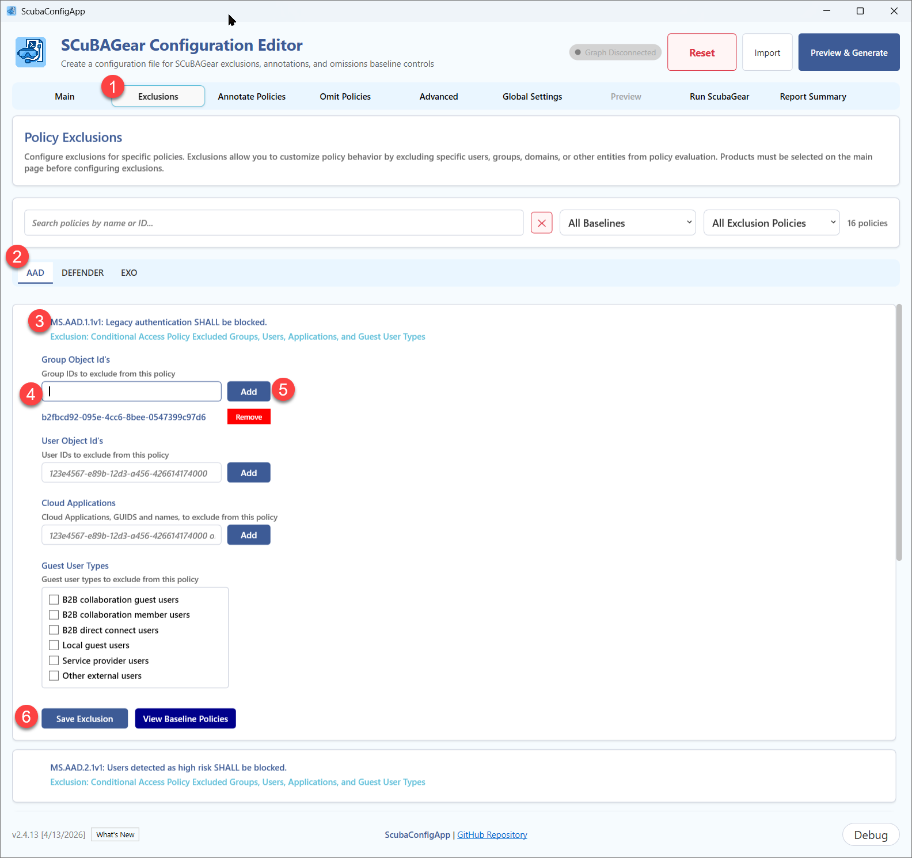

### 3d. View the Baseline Policy Reference

A **View Baseline Policies** button is available on every policy card, on every tab. Click it at any time to open the **ScubaGear Baseline Policies** panel alongside the app. The panel opens pre-navigated to that policy so you can review the requirement, rationale, and implementation guidance while you configure it.

The panel shows:

- **Policy title and description**
- **Badges** - whether the policy is automatically checked or requires manual configuration
- **Rationale** - why the requirement exists
- **MITRE ATT\&CK Mappings** - relevant threat categories
- **Implementation Instructions** - step-by-step remediation guidance
- **License Requirements** - any license prerequisites
- **Additional Resources** - links to relevant Microsoft documentation

The viewer stays in sync - selecting a different policy in the left pane navigates the viewer to that policy automatically. You can also browse the full policy list independently using the product buttons and search field in the viewer. The panel can remain open while you work through all your cards.

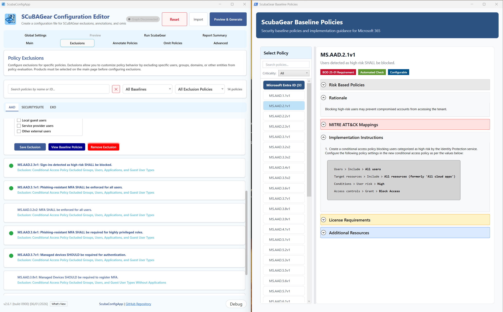

> **Tip:** Snap the Policy Viewer to the right and the ConfigApp to the left for side-by-side viewing. Requires a minimum resolution of 1280x1024 at 100% DPI scaling; 1920x1200 or higher is recommended.

> **Standalone mode:** You can also launch the viewer as a separate, independent process without opening the full ConfigApp:
> ```powershell
> Import-Module ScubaGear
> Show-SCuBABaselinePolicyViewer
> ```
> This is useful for reading baseline guidance outside of a configuration session, or for sharing with team members who do not need to edit a config file.

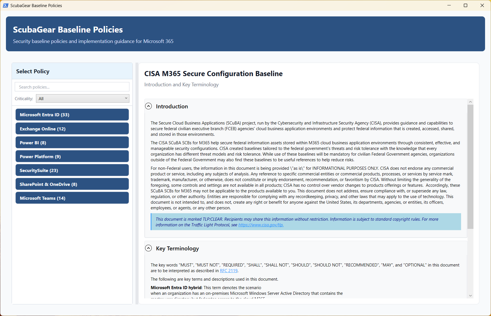


### 3e. Look for the Green Dot 🟢

After saving, a **green dot** appears on the policy card header. This confirms the exclusion was saved to the in-memory configuration.

> **Yellow dot** = unsaved changes are pending. Always click **Save Exclusion** before moving to another policy or tab - unsaved data is lost on navigation.

> **No dot** = no exclusion configured for this policy.

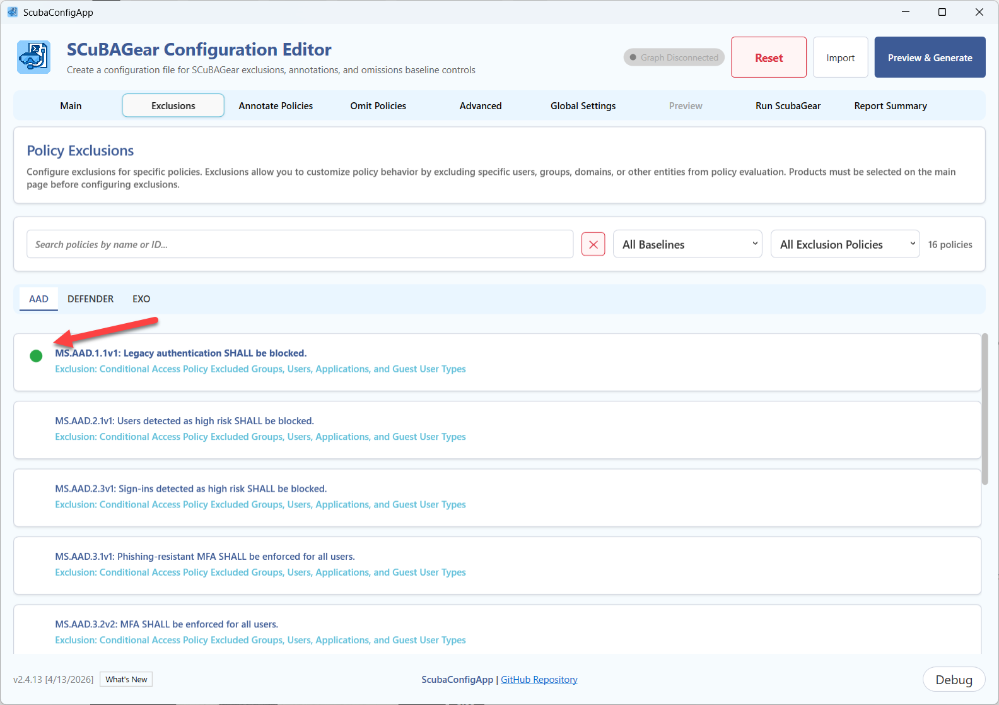

### 3f. Repeat for Other Products

Switch to other product sub-tabs (e.g., **EXO**, **SECURITYSUITE**) and repeat.

---

## Step 4 - Configure Annotations

Navigate to the **Annotate Policies** tab.

Annotations add comments and flags to individual policies - for example, marking a result as an incorrect result (false positive) or noting a planned remediation date.

### 4a. Find the Policy

All products you selected appear as sub-tabs. Click the product sub-tab, then use search/filter to find the policy.

### 4b. Add an Annotation

1. Locate the policy card.
2. Check **Incorrect Result (False Positive)** if the assessment result is wrong.
3. Enter a **Comment** explaining the annotation. This is required if you mark the result incorrect.
4. Optionally set a **Remediation Date** (the date you expect the issue to be resolved).
5. Click **Save Annotate**.

> **Tip:** Click **View Baseline Policies** on any card to open the policy reference panel at any time - useful for understanding the requirement before filling in configuration values.

### 4c. Look for the Green Dot 🟢

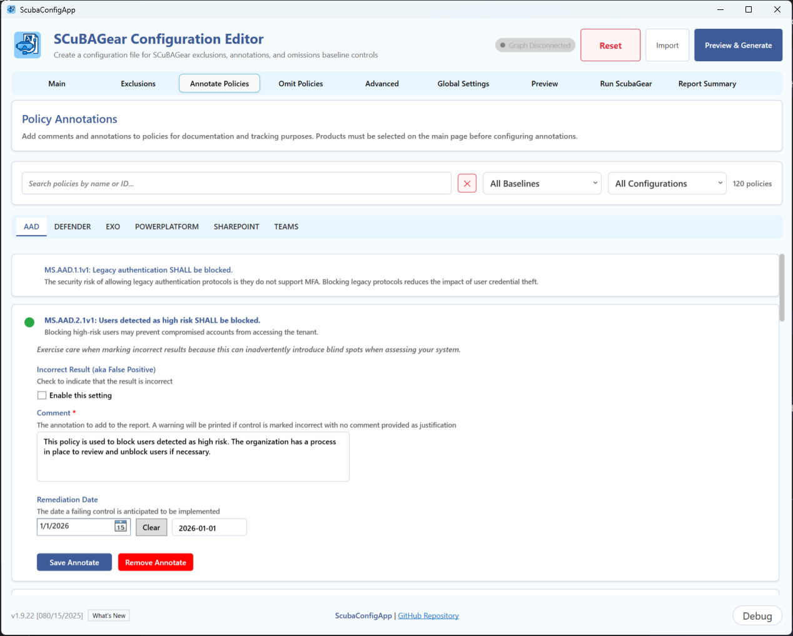

A **green dot** confirms the annotation is saved. A **yellow dot** means you have unsaved changes - click **Save Annotate** before leaving.

> [!CAUTION]
> Marking a policy as an incorrect result can mask genuine compliance gaps. Only do this when you are certain the result is a false positive and document the justification in the Comment field.

---

## Step 5 - Configure Omissions

Navigate to the **Omit Policies** tab.

Omissions exclude a policy entirely from the assessment output - for example, if a policy is not applicable to your organization.

### 5a. Find the Policy

Click the product sub-tab, then use search/filter.

### 5b. Add an Omission

1. Locate the policy card.
2. Enter a **Rationale** explaining why this policy is being omitted. This field is required.
3. Optionally set an **Expiration Date** - after this date, the omission will no longer apply and the policy re-enters the assessment.
4. Click **Save Omit**.

> **Tip:** Click **View Baseline Policies** on any card to open the policy reference panel - available across all tabs at any time. See [Step 3d](#3d-view-the-baseline-policy-reference) for details.

### 5c. Look for the Green Dot 🟢

Same indicator as Exclusions and Annotations - green dot = saved, yellow dot = unsaved pending changes.

> [!CAUTION]
> Omitting policies can introduce blind spots. Provide clear justification and always set an expiration date.

---

## Step 6 - Configure Global Settings *(optional)*

Navigate to the **Global Settings** tab.

These settings apply across all products and assessments:

| Setting | Description |
|---------|-------------|
| Preferred DNS Resolvers | IP addresses of DNS resolvers for SPF/DKIM/DMARC lookups |
| Skip DNS over HTTPS (DoH) | Check to disable DoH retry for failed DNS queries |

1. Expand the **Global Settings** section using the toggle.
2. Fill in any applicable values.
3. Click **Save** on the card.

---

## Step 7 - Configure Advanced Settings *(required for Run ScubaGear)*

Navigate to the **Advanced** tab.

### 7a. Application Authentication *(required to Run ScubaGear from within the app)*

> Due to Windows Authentication Manager (WAM) changes, ScubaGear can no longer run interactively **within the app**. **You must configure a service principal with a certificate.**

1. Enable the **Application Settings** toggle.
2. Enter your **Application (Client) ID** - the GUID of your registered ScubaGear service principal.
   - Click the browse icon to search registered applications from Microsoft Graph (requires `-Online`).
3. Enter the **Certificate Thumbprint** - the 40-character hex thumbprint of the certificate in your local personal store.
   - Click **Select Certificate** to browse your certificate store.

### 7b. Output Configuration *(optional)*

1. Enable the **Output Configuration** toggle.
2. Set **Output Path** to where ScubaGear should write results (default: current directory).
3. Adjust file name prefixes if needed.

### 7c. OPA Configuration *(optional)*

Only needed if your OPA binary is not in the default path.

### 7d. General Settings *(optional)*

- **Log In**: Keep checked to allow ScubaGear to authenticate during execution.
- **Disconnect on Exit**: Uncheck to remain connected after execution.

---

## Step 8 - Preview Your Configuration

Click the **Preview & Generate** button in the top-right toolbar.

> [!IMPORTANT]
> **Always click Preview & Generate after making any changes.** Clicking the Preview tab directly does not refresh the YAML, the button **must** be pressed to regenerate the output from your current changes.

The app navigates to the **Preview** tab and displays your complete YAML configuration.

### Review the YAML

Check that:
- `Organization:` matches your tenant domain
- `ProductNames:` lists all selected products
- `Exclusions:` contains all saved exclusion entries under the correct product and policy IDs
- `AnnotatePolicy:` contains your annotation entries
- `OmitPolicy:` contains your omission entries
- Advanced settings appear if configured

### Make Corrections

If anything looks wrong:
1. Navigate back to the relevant tab (Main, Exclusions, Annotate Policies, etc.)
2. Make your change and **click Save** on the card - watch for the **green dot** confirming the save
3. Return and click **Preview & Generate** again to refresh the YAML

---

## Step 9 - Save the YAML File

In the **Preview** tab:

1. Click **Save YAML** to write the file to disk. A file picker dialog opens.
2. Choose a location and file name (default is based on your tenant domain).
3. Click **Save**.

A success message confirms the file was saved.

> **Tip:** Click **Copy to Clipboard** to paste the YAML into another tool or editor without saving to a file.

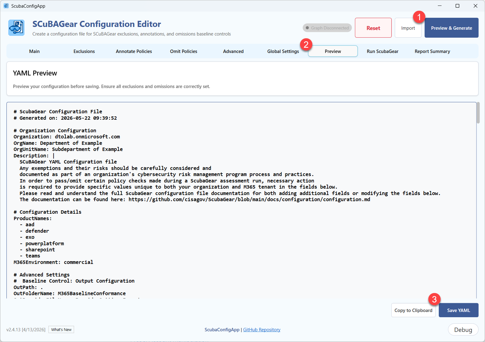
---

## Step 10 - Run ScubaGear from the App *(optional)*

Navigate to the **Run ScubaGear** tab.

> **Prerequisite:** Application Authentication must be configured (see [Step 7a](#7a-application-authentication-required-to-run-scubagear-from-within-the-app)). The **Run ScubaGear** button will be disabled with an explanatory message if credentials are missing.

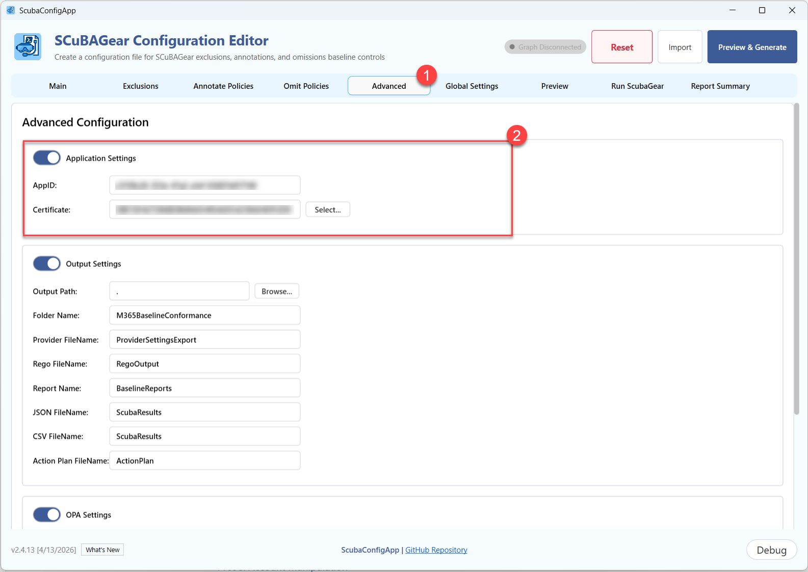

### 10a. Review Pre-Run Settings

Optionally adjust:

- **Silence BOD Warnings** - suppress Binding Operational Directive warnings in output
- **Dark Mode** - generate the HTML report in dark mode
- **Quiet Mode** - suppress the report from opening automatically
- **UUID Truncation** - control how much of UUIDs are shown in report file names

### 10b. Start the Assessment

1. Verify the status bar shows a green **Ready** message.
2. Click **Run ScubaGear**.
3. A progress window appears with real-time output from ScubaGear.
4. Wait for completion - assessments typically take 5–45 minutes depending on tenant size and number of products selected.
5. When complete the *Run ScubaGear* button will be green and the Scuba report will open in default browser (behind the app)

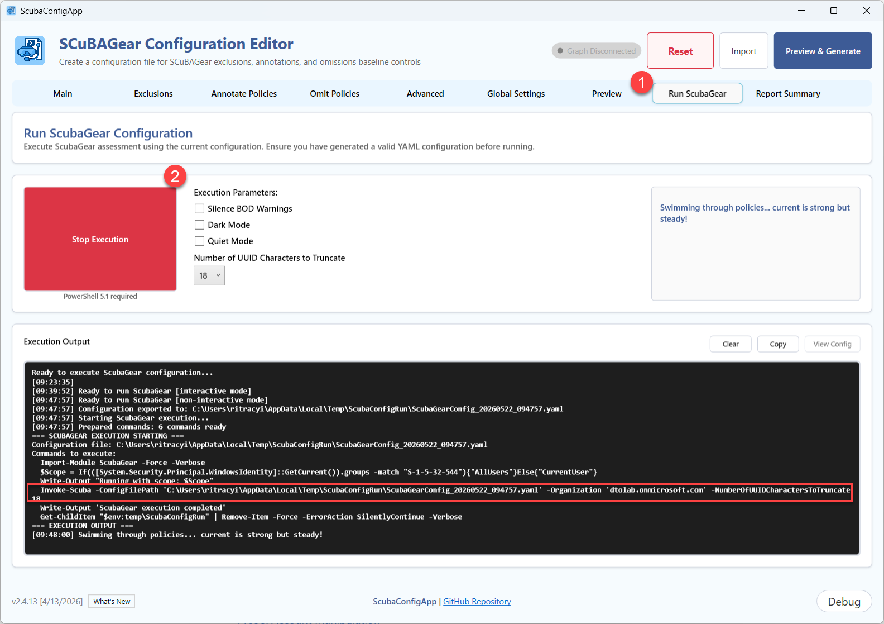

### 10c. Stop an In-Progress Run

Click **Stop** to cancel execution. Partial results may be available.

---

## Step 11 - Review Results

After execution completes, the app automatically navigates to the **Report Summary** tab.

### Reading the Report

Each assessed product appears as its own sub-tab. Within each tab:

| Column | Description |
|--------|-------------|
| Control ID | The policy identifier (e.g., `MS.AAD.1.1v1`) |
| Requirement | The policy requirement text |
| Result | Pass / Fail / Warning / Manual / Error |
| Criticality | SHALL or SHOULD |
| Details | Specific findings from the assessment |

### Status Indicators

See the [Indicator Reference](#indicator-reference) section at the end of this guide for the full breakdown of card dots and report result colors.

### Taking Action

For each failing or warning policy:
1. Note the **Control ID** and **Details** text.
2. Follow the remediation guidance in the [ScubaGear baselines documentation](../../PowerShell/ScubaGear/baselines/).
3. After remediation, run ScubaGear again (Step 10) to confirm the fix.

---

## Indicator Reference

### Policy Card Indicators

Each policy card header shows one of three dot states:

| Indicator | Meaning |
|-----------|----------|
| 🟢 Green dot | Data is saved to the in-memory configuration |
| 🟡 Yellow dot | Unsaved changes are pending - click **Save** before leaving or your changes will be lost |
| No dot | No data configured for this policy |

> **Migration pending (orange card border):** When a legacy YAML is imported and the app auto-migrates a policy, the card is highlighted with an orange border and the label *⚠ Auto-migrated - please review and save* until you open the card, verify the values, and click **Save**. The card may already show a green dot (data was pre-populated) but the orange border means the data has not been human-reviewed yet. **Preview & Generate is blocked until all orange cards are saved.**

### Run ScubaGear Status Bar

| Indicator | Meaning |
|-----------|----------|
| Green status bar | Ready to run - all required fields are set |
| Red status bar | Cannot run - check the message for what is missing |

### Report Result Colors (Step 11)

These apply to assessment results in the **Report Summary** tab, not to policy card states:

| Color | Result | Meaning |
|-------|--------|---------|
| 🟢 Green | Pass | Meets compliance requirements |
| 🔴 Red | Fail | Does not meet requirements |
| 🟡 Yellow | Warning | Needs attention |
| 🔵 Blue | Manual | Requires human review - cannot be automatically assessed |
| ⚫ Gray | Error / N/A | Evaluation error or not applicable |

---

## Common Mistakes

| Mistake | What Happens | Fix |
|---------|-------------|-----|
| Navigating away with a yellow dot | Your exclusion/annotation/omission is lost | Click **Save** before changing tabs |
| Clicking the Preview tab without pressing **Preview & Generate** | Stale YAML is displayed | Always click the **Preview & Generate** button |
| Not enabling Application Settings before running | Run ScubaGear button stays disabled | Configure App ID and Certificate Thumbprint in Advanced tab |
| Setting an expiration date in the past for omissions | Policy re-enters assessment immediately | Use a future date or leave blank for permanent omission |

---

## Using an Existing Configuration

To load and modify a previously saved YAML:

```powershell
Start-SCuBAConfigApp -ConfigFilePath "C:\configs\contoso.onmicrosoft.com.yaml"
```

The app pre-populates all fields from the file. Make your changes, then follow Steps 8–9 to regenerate and save.

---

## Migrating a Legacy Configuration File

If your YAML file was created before the Defender Security Suite baseline was introduced (ScubaGear 1.8.0), it may contain old policy IDs from the `Defender` and `Exo` baselines that have since been moved, renamed, or removed. When you load that file, the app **automatically migrates** any recognized legacy policy settings and shows you a migration report before you proceed.

### What Gets Migrated

The migration covers exclusions, annotations, and omissions. The complete list of mappings is maintained in [`PowerShell/ScubaGear/mappings/scuba-baseline-policy-migrations.csv`](../../PowerShell/ScubaGear/mappings/scuba-baseline-policy-migrations.csv). To check what a specific old policy maps to, search that file by the old policy ID.

### How to Import a Legacy File

1. Launch the app:
   ```powershell
   Start-SCuBAConfigApp -ConfigFilePath "C:\configs\old-config.yaml"
   ```
2. When the import finishes, a **Legacy Policy Migration Applied** dialog appears summarizing what changed.

   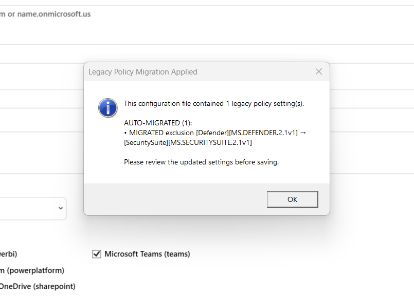

3. Review the dialog carefully - it has up to three sections.

### Reading the Migration Report

The dialog groups changes into three categories:

#### AUTO-MIGRATED
These are straight one-to-one renames. The old policy ID was replaced with the new SecuritySuite equivalent and no data was lost.

After dismissing the dialog, any auto-migrated card is highlighted with an **orange border** and the label *⚠ Auto-migrated - please review and save*. The data has been pre-populated but needs your confirmation.

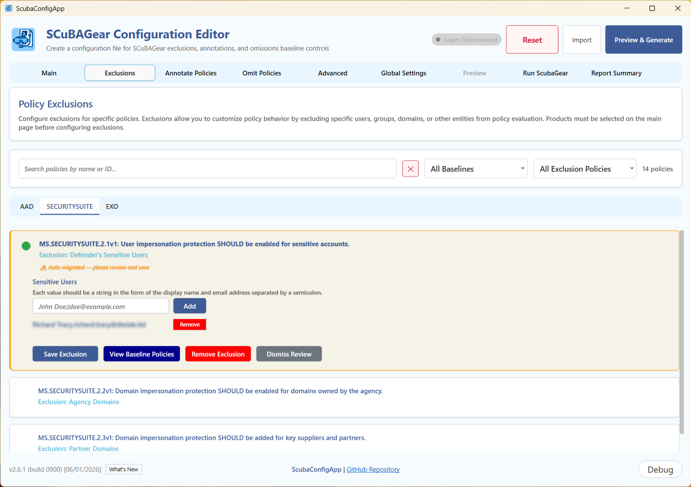

Open each orange card, verify that the pre-populated values are correct, and click **Save Exclusion** (or **Save Annotate** / **Save Omit**). The orange border clears once saved.

**Example:**
```
• MIGRATED exclusion [Exo][MS.EXO.14.1v2] → [SecuritySuite][MS.SECURITYSUITE.6.1v1]
```

#### NEEDS REVIEW - POLICY SPLIT
These are policies that were **decoupled** - one old policy was broken into several new, more granular ones. The app can only automatically migrate your data to the **first** new policy in the split. The remaining new policies start with no configuration.

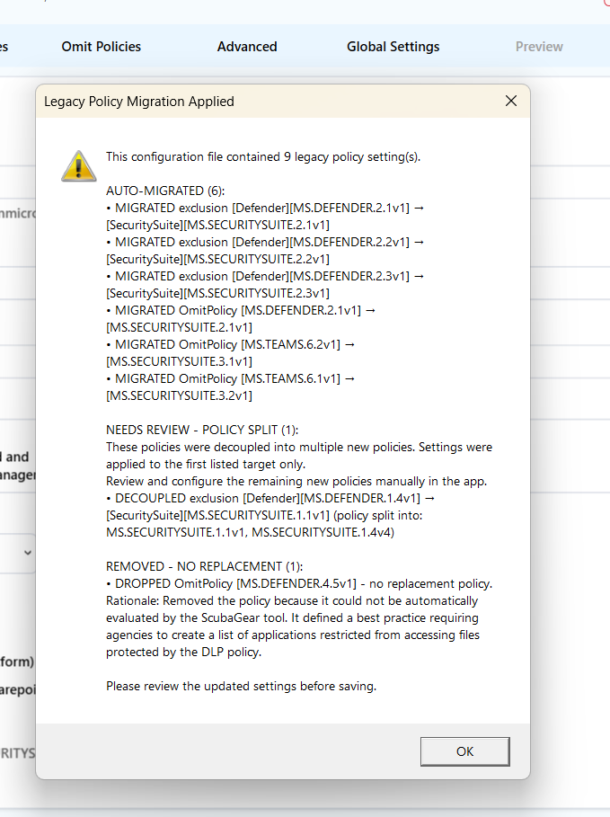

**Example:**
```
• DECOUPLED exclusion [Defender][MS.DEFENDER.1.1v1] → [SecuritySuite][MS.SECURITYSUITE.1.1v1]
  (policy split into: MS.SECURITYSUITE.1.1v1, MS.SECURITYSUITE.1.2v1, MS.SECURITYSUITE.1.3v1, MS.SECURITYSUITE.1.4v1)
```

> [!IMPORTANT]
> After dismissing the dialog, go to the **Exclusions** (or **Annotate Policies** / **Omit Policies**) tab and open the **SecuritySuite** sub-tab. Check the first migrated policy and then manually configure the remaining split policies as needed. Your exclusion data was preserved on the first policy only.

#### REMOVED - NO REPLACEMENT
These policies were retired with no SecuritySuite equivalent. Any exclusions, annotations, or omissions you had configured for them have been dropped because there is no corresponding new policy.

**Example:**
```
• DROPPED exclusion [Defender][MS.DEFENDER.4.5v1] - no replacement policy.
  Rationale: Removed the policy because it could not be automatically evaluated...
```

No action is required unless you want to re-apply the intent of the old configuration to a different current policy.

If you no longer need that policies configured, you can Dismiss the review. This will remove the policy from configured.


### After Dismissing the Migration Report

1. Navigate to the **Exclusions** tab → **SecuritySuite** sub-tab. All auto-migrated cards are highlighted with an orange border.
2. Open each orange card, verify the pre-populated values, and click **Save Exclusion**. Repeat for **Annotate Policies** and **Omit Policies** if those tabs have orange cards.
3. If any **DECOUPLED** entries appeared, manually configure the remaining split policies.
4. Click **Preview & Generate**.
   - If any orange cards have not been saved yet, the app will block generation and display a **Validation Errors** dialog listing the unreviewed policy IDs. It also navigates to the first tab that contains them.

   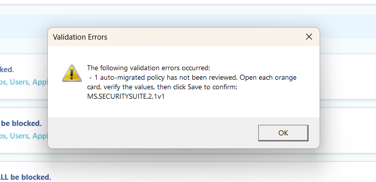

   Dismiss the dialog, save each remaining orange card, then click **Preview & Generate** again.
5. Review the YAML output and confirm the SecuritySuite section contains what you expect.
6. Click **Save YAML** to write the migrated configuration to disk.

> **Tip:** To help review the policy be sure to open Policy viewer for additional details.

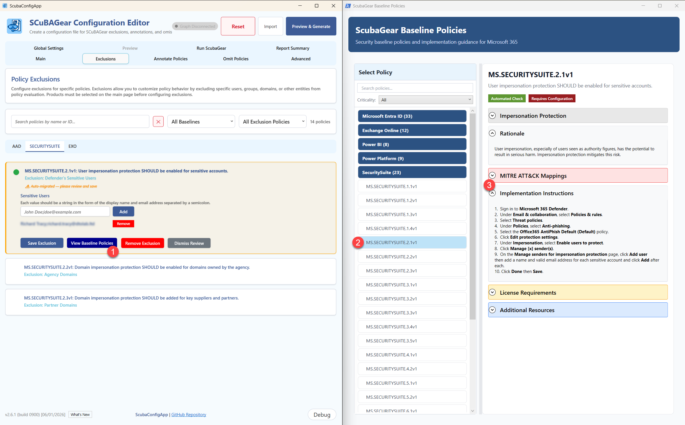


### If the Migration Report Does Not Appear

If you load an old file and no migration dialog appears, one of the following is true:
- The file does not contain any recognized legacy policy IDs (already up to date).
- The migration CSV could not be found - check that [`scuba-baseline-policy-migrations.csv`](../../PowerShell/ScubaGear/mappings/scuba-baseline-policy-migrations.csv) exists in the installed ScubaGear module.
- An error occurred during import - check the **Debug** tab for details.

---

## Using the -Online Mode

Launching with `-Online` connects the app to Microsoft Graph and unlocks several features that make configuration faster and more reliable. Without it the app works fully but all IDs must be typed manually.

```powershell
Start-SCuBAConfigApp -Online
```

### Browsing and Selecting Groups

On any exclusion list field that accepts group object IDs, a **Get Groups** button appears next to the entry area. Click it to open a searchable browser showing all groups in your tenant.

> **Tip:** You do not have to scroll the full list. Type any part of the group name in the input box on the exclusion card before clicking **Get Groups** - the browser opens pre-filtered to that search term. You can also type or change the filter term inside the browser itself.

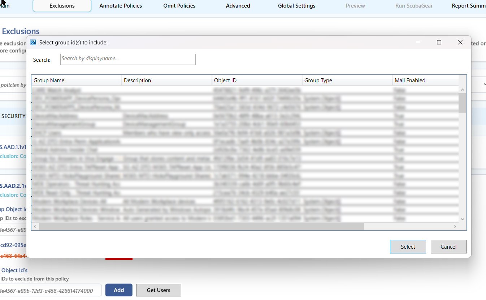

Select one or more groups and click **OK**. The selected object IDs are added to the list immediately, each with the group's display name shown as a hover tooltip. The display name is also written as an inline comment when the YAML is generated:

```yaml
CapExclusions:
  Groups:
    - b2fbcd92-095e-4cc6-8bdd-0547399b97d7 #SG-AZ-DTO-Entra-CAPolicy-Exclude-BreakGlassAccounts
```

This makes the saved YAML human-readable without any extra steps.

### Browsing and Selecting Users

Fields that accept user object IDs have a **Get Users** button that works the same way - type a name fragment in the input box first to pre-filter, or search inside the browser. The selected user's display name is stored as a tooltip and written as an inline comment in the YAML output.

### Resolving IDs When Importing a YAML

When you import an existing YAML file while connected with `-Online`, the app automatically resolves the object IDs already present in the file against Microsoft Graph. It does **not** add new groups or users - it only validates the IDs that are already in the YAML. The import progress window shows real-time status:

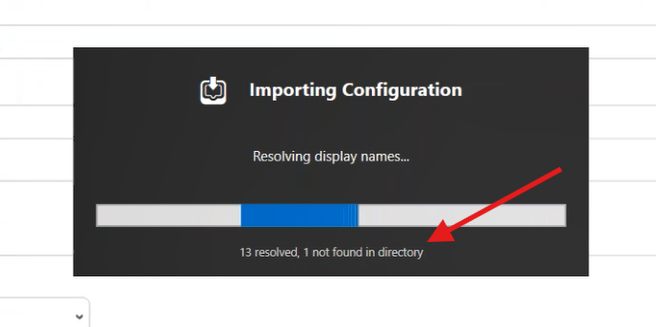

IDs that were already annotated with a `#DisplayName` comment in the YAML are resolved directly from that comment - no Graph call needed for those. Any remaining bare GUIDs are looked up in a single batched Graph request. The progress message reports how many were resolved and how many were not found.

### Flagging Deleted or Missing Objects

If an ID from the imported YAML cannot be found in the directory - because the group or user was deleted, moved, or never existed in this tenant - the app flags it in two ways:

1. **Policy card header** - the status dot turns **red** instead of green, making affected cards easy to spot in the list without opening them.
2. **List item** - the ID is displayed in **orange-red with a strikethrough** and its tooltip reads *"Object not found in directory - this ID may have been deleted"*.

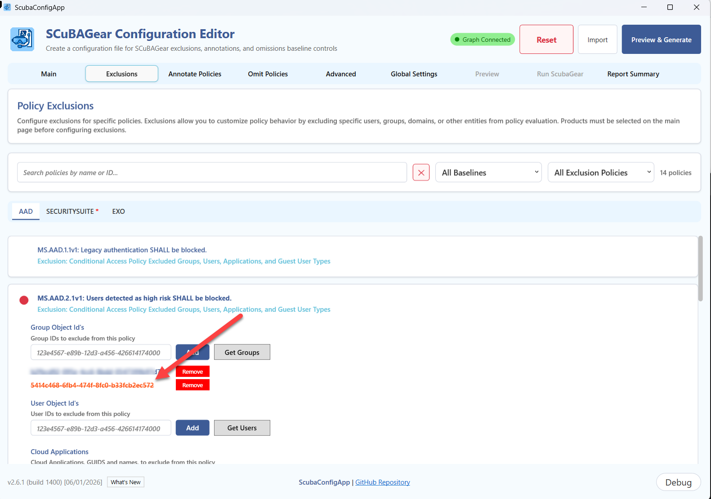

The value is still present in the configuration so you can decide what to do with it. Use the **Remove** button on that row to delete it from the exclusion list, then click **Save** to update the card to a green dot.

### Summary of -Online Benefits

| Feature | Without `-Online` | With `-Online` |
|---------|-------------------|----------------|
| Fill group/user exclusion fields | Type GUIDs manually | Browse and select from tenant |
| Filter the browser | N/A | Type name in input box before clicking Get |
| Display names in YAML | Not included | Written as inline `#Name` comments automatically |
| Display names on import | Not shown | Resolved from inline comments or live Graph lookup |
| Deleted object detection | Not detected | Red dot on card header + strikethrough on the list item |

---

## Related Documentation

- [Configuration File Reference](configuration.md) - manual YAML format documentation
- [ScubaConfigApp Module Reference](scubaconfigapp.md) - function parameters and module overview
- [ScubaGear Execution](../execution/execution.md) - running ScubaGear from the command line
