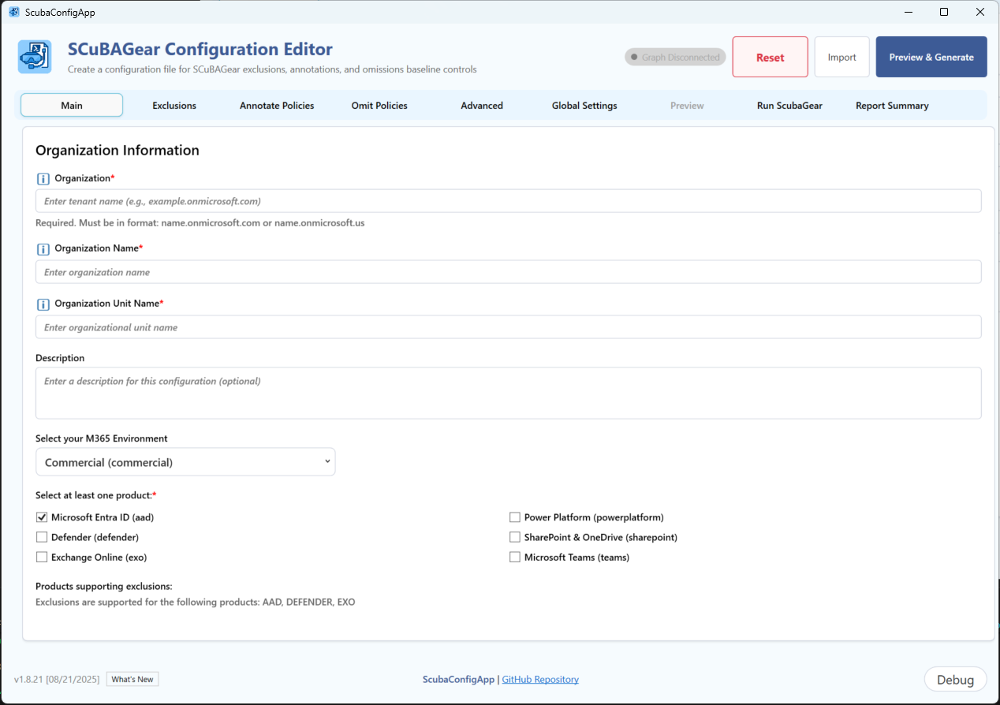

# SCuBAConfig Module

The SCuBAConfig module provides a graphical user interface for creating and managing SCuBAGear configuration files. This module contains the PowerShell functions and resources needed to launch the configuration UI and manage SCuBAGear settings.

## Overview

SCuBAConfig is a PowerShell module that includes:

- **Configuration UI**: WPF-based graphical interface for creating YAML configuration files
- **Configuration Management**: Functions for loading, validating, and exporting SCuBAGear configurations
- **ScubaGear Execution**: Integrated ScubaGear assessment execution with real-time progress monitoring
- **Native Report Viewer**: Built-in WPF report viewer with colorful status badges and space-optimized layouts
- **Localization Support**: Multi-language UI text and validation messages. **Currently only supported locale is: _en-US_**
- **Connected Support**: Simplify selection screen to pull in graph users and groups
- **Debug Capabilities**: Comprehensive debugging features



## Main Function

### Start-ScubaConfigApp

Opens the SCuBAGear Configuration UI for creating and managing configuration files, executing ScubaGear assessments, and viewing results with native report viewers.

#### Syntax

```powershell
Start-ScubaConfigApp [[-ConfigFilePath] <String>] [[-Language] <String>] [-Online] [[-M365Environment] <String>] [-Passthru]
```

#### Parameters

| Parameter | Type | Description | Default |
|-----------|------|-------------|---------|
| ConfigFilePath | String | Path to existing YAML configuration file to import | None |
| Language | String | UI language (localization) | "en-US" |
| Online | Switch | Enable Microsoft Graph connectivity | False |
| M365Environment | String | Target M365 environment (commercial, gcc, gcchigh, dod) | "commercial" |
| Passthru | Switch | Return the configuration objects | False |

#### Examples

```powershell
# Basic usage - Launch the configuration UI
Start-ScubaConfigApp

# Launch with Graph connectivity for commercial environment (Interactive)
Start-ScubaConfigApp -Online -M365Environment commercial

# Import existing configuration
Start-ScubaConfigApp -ConfigFilePath "C:\configs\myconfig.yaml"

# Launch and connect to graph for GCC High environment
Start-ScubaConfigApp -Online -M365Environment gcchigh

#Use Passthru with a variable to save all configurations in hashtables
$SCuBAUI = Start-ScubaConfigApp -Passthru
#retrieving data
$SCuBAUI.GeneralSettings | ConvertTo-Json
$SCuBAUI.AdvancedSettings | ConvertTo-Json
$SCuBAUI.Exclusions | ConvertTo-Json -Depth 4
$SCuBAUI.Annotations | ConvertTo-Json -Depth 4
$SCuBAUI.Omissions | ConvertTo-Json -Depth 4
```

## Features

### Configuration Management

- **Organization Settings**: Tenant information, display names, descriptions
- **Product Selection**: Choose which M365 services to assess
- **Exclusions**: Configure policy exclusions for product-specific configurations outline in the [Configuration File](docs/configuration/configuration.md)
- **Annotations**: Add contextual information to policies
- **Omissions**: Skip specific policies with rationale and expiration dates
- **Advanced Settings**: Output paths, authentication, and technical parameters

### User Interface

- **Tabbed Navigation**: Organized sections for different configuration areas
- **Real-time Validation**: Input validation with immediate feedback
- **Preview Generation**: Live YAML preview before export
- **Import/Export**: Load existing configurations and save new ones (See [Known UI Issues](#Known UI Issues))
- **Graph Integration**: Browse users and groups via Microsoft Graph API

### File Operations

- **YAML Import**: Load existing SCuBAGear configuration files
- **YAML Export**: Save configurations in SCuBAGear-compatible format
- **Clipboard Support**: Copy configurations for use elsewhere
- **Auto-naming**: Intelligent file naming based on organization settings

### ScubaGear Execution

- **Run ScubaGear**: Execute SCuBAGear assessments directly from the UI
- **Real-time Progress**: Live monitoring of assessment execution with detailed progress updates
- **Dynamic Output**: Real-time display of ScubaGear execution output and status
- **Error Handling**: Comprehensive error detection and reporting during execution
- **Results Integration**: Seamless transition from execution to report viewing

### Report Summary

- **Native Report Viewer**: Pure WPF report viewer replacing problematic web browser controls
- **Colorful Status Badges**: Visual status indicators with rounded rectangles for:
  - **Green**: Passes (✓)
  - **Yellow**: Warnings (⚠)
  - **Red**: Failures (✗)
  - **Blue**: Manual Checks (👁)
  - **Gray**: Errors or Not Implemented (?)
- **Dynamic Report Tabs**: Automatically generated tabs for each product assessed
- **Space-Optimized Layout**: Reduced vertical scrolling with compact report display
- **Interactive Results**: Clickable policy details and recommendations

## Usage Workflow

Follow this comprehensive step-by-step guide to use the ScubaConfigAppUI for configuration creation, ScubaGear execution, and report review:

### Step 1: Launch the Application
```powershell
Start-ScubaConfigApp
```
- The WPF application window will open with tabbed navigation
- Begin with the "Organization" tab which is selected by default

### Step 2: Configure Organization Information
- **Tenant Domain**: Enter your organization's primary domain (e.g., contoso.onmicrosoft.com)
- **Display Name**: Provide a descriptive name for your organization
- **Description**: Add optional details about this assessment configuration
- **M365 Environment**: Select your tenant environment (Commercial, GCC, GCC High, DoD)

### Step 3: Select Products for Assessment
Navigate to the "Products" tab:
- Check the boxes for products you want to assess:
  - **AAD (Entra)**: Azure Active Directory/Entra ID policies
  - **Defender**: Microsoft Defender for Office 365
  - **EXO (Exchange)**: Exchange Online configurations
  - **SharePoint**: SharePoint Online settings
  - **Teams**: Microsoft Teams policies
  - **Power BI**: Power BI security settings
  - **Power Platform**: Power Platform governance

### Step 4: Configure Exclusions (Optional)
In the "Exclusions" tab:
- Add specific users, groups, or policies to exclude from assessment
- Use the search functionality to find and select items
- Document rationale for each exclusion

### Step 5: Add Annotations (Optional)
In the "Annotations" tab:
- Add contextual notes or explanations for specific policies
- Provide additional information that will appear in reports
- Useful for documenting organization-specific configurations

### Step 6: Configure Omissions (Optional)
In the "Omissions" tab:
- Skip specific policies that don't apply to your organization
- Provide rationale and expiration dates for omitted policies
- Essential for compliance documentation

### Step 7: Set Advanced Settings
In the "Advanced" tab:
- **Output Path**: Specify where ScubaGear results will be saved
- **Authentication Method**: Choose interactive login or certificate-based authentication
- **Additional Parameters**: Set optional technical parameters

### Step 8: Review Configuration Preview
Click "Preview & Generate" to enable the preview tab and generate the YAML file. This should automatically navigate to the "Preview" tab:
- Review the generated YAML configuration
- Verify all settings are correct
- Make adjustments by returning to previous tabs if needed. 

> [!IMPORTANT]
> Be sure to click the "Preview & Generate" when done making updates to pull those changed into yaml output. Clicking on the _Preview_ tab won't show the update

### Step 9: Save Configuration
Click "Save YAML":
- Save the configuration file to your desired location
- The file will be named automatically based on your organization domain
- Configuration is now ready for ScubaGear execution

### Step 10: Execute ScubaGear Assessment **(beta)**
Click the "Run ScubaGear" button:
- The "Results" tab will automatically activate
- Real-time progress monitoring will begin
- Watch the output window for execution details and status updates
- Assessment may take 5-15 minutes depending on tenant size and products selected

### Step 11: Monitor Execution Progress
While ScubaGear runs:
- Progress updates appear in real-time in the output area
- Status messages indicate which products are being assessed
- Any errors or warnings are displayed immediately
- The interface remains responsive during execution

### Step 12: Review Report Summary **(beta)**
Once execution completes:
- Report tabs automatically appear for each assessed product
- Navigate between product-specific reports using the dynamic tabs
- Review colorful status badges indicating policy compliance:
  - **Green badges**: Policies that pass compliance requirements
  - **Yellow badges**: Policies with warnings requiring attention
  - **Red badges**: Policies that fail compliance requirements
  - **Blue badges**: Policies requiring manual review
  - **Gray badges**: Policies with errors or not implemented

### Step 13: Analyze Results and Take Action
For each product report:
- Click on individual policies to view detailed findings
- Review recommendations for failed or warning policies
- Document remediation actions needed
- Export or save reports for compliance documentation


## Run ScubaGear Feature

The integrated ScubaGear execution feature allows you to run assessments directly from the UI without manual command-line operations.

### Key Capabilities

- **One-Click Execution**: Start ScubaGear assessments with a single button click
- **Real-Time Monitoring**: Live progress updates and status messages during execution
- **Automatic Configuration**: Uses the currently configured settings automatically
- **Error Detection**: Immediate notification of execution errors or issues
- **Results Integration**: Seamless transition to report viewing upon completion

### Execution Process

1. **Pre-Execution Validation**: The UI validates your configuration before starting
2. **ScubaGear Invocation**: Automatically calls `Invoke-SCuBA` with your settings
3. **Progress Tracking**: Real-time output display with status updates
4. **Completion Handling**: Automatic report loading and tab generation
5. **Error Management**: Clear error messages and troubleshooting guidance

### Requirements for Execution

- Valid configuration with at least one product selected
- Appropriate Microsoft Graph permissions for your account
- Network connectivity to Microsoft 365 services
- Sufficient disk space for report generation

### Output Monitoring

During execution, you'll see:
- Product assessment progress (e.g., "Assessing Entra ID policies...")
- Policy evaluation status
- Authentication confirmations
- Report generation progress
- Completion notifications or error messages

## Report Summary Feature

The native WPF report viewer provides a modern, integrated experience for reviewing ScubaGear assessment results.

### Visual Design

- **Colorful Status Badges**: Instantly recognizable policy status indicators
- **Space-Optimized Layout**: Compact design reducing vertical scrolling
- **Dynamic Tabs**: Automatically generated tabs for each assessed product
- **Native Performance**: Faster rendering compared to web browser controls

### Status Badge System

Each policy displays a colored status badge indicating compliance level:

| Badge Color | Status | Icon | Meaning |
|-------------|--------|------|---------|
| **Green** | Pass | ✓ | Policy meets compliance requirements |
| **Yellow** | Warning | ⚠ | Policy needs attention or has minor issues |
| **Red** | Failure | ✗ | Policy fails compliance requirements |
| **Blue** | Manual | 👁 | Policy requires manual review or verification |
| **Gray** | Error/N/A | ? | Policy has errors or is not implemented |

### Report Navigation

- **Product Tabs**: Click between different product assessments (AAD, Exchange, etc.)
- **Policy Details**: Click on individual policies for detailed findings
- **Status Filtering**: Visual scanning using color-coded badges
- **Scroll Optimization**: Compact layout minimizes scrolling requirements

### Integration Benefits

- **Immediate Results**: No need to open separate HTML reports
- **Consistent Interface**: Same UI for configuration and results
- **Performance**: Native WPF rendering for smooth scrolling and interaction
- **Reliability**: Eliminates web browser compatibility issues

## Integration with SCuBAGear

The configurations created by this UI are fully compatible with the main SCuBAGear assessment tool:

```powershell
# Use the generated configuration
Invoke-SCuBA -ConfigFilePath "path\to\generated\example.onmicrosoft.com.yaml"
```

## Module Files

### Core Files

- **SCuBAConfig.psm1**: Main module file containing all functions and UI logic
- **SCuBAConfig.psd1**: Module manifest with metadata and dependencies
- **SCuBAConfigAppUI.xaml**: WPF UI definition file

### Configuration Files

- **SCuBAConfig_en-US.json**: English localization and configuration settings
- Additional language files can be added following the same naming pattern

### Resource Files

- UI templates, styles, and other resources as needed

## Configuration File Structure

The `SCuBAConfig_en-US.json` file contains:

```json
{
  "DebugMode": false,
  "EnableSearchAndFilter": false,
  "EnableScubaRun": true,
  "EnableResultReader": true,
  "localeContext": {
    // UI text elements
  },
  "localePlaceholder": {
    // Input field placeholder text
  },
  "defaultAdvancedSettings": {
    // Default values for advanced settings
  },
  "localeInfoMessages": {
    // Success and information messages
  },
  "localeErrorMessages": {
    // Error and validation messages
  },
  "products": {
    // defines supported product for SCuBAgear
  },
  "advancedSections": {
    //defined advanced settings toggle.
  },
  "M365Environment": {
    //supported tenant environments for config file
  },
  "baselineControls": {
    // defines the types of baseline controls to display
  },
  "baselines": [
    "aad": {
      // defines SCuBAgear baselines for Entra Admin Center
    },
    "defender": {
      // defines SCuBAgear baselines for Defender Admin Center
    },
    "exo": {
      // defines SCuBAgear baselines for M365 Exchange Admin Center
    },
    "sharepoint": {
      // defines SCuBAgear baselines for SharePoint Admin Center
    },
    "teams": {
      // defines SCuBAgear baselines for Teams Admin Center
    },
    "powerbi": {
      // defines SCuBAgear baselines for Powrbi
    },
    "powerplatform": {
      // defines SCuBAgear baselines for PowerPlatform
    }
  ],
  "inputTypes": {
    // defines fields and value types for all baseline cards
  },
  "valueValidations":{
      // defines field value validation checks
  },
   "graphQueries": {
    // defines graph queries used in UI (when online)
  }
}
```

## Requirements

- **PowerShell 5.1** or later
- **.NET Framework 4.5** or later
- **Windows OS** with WPF support
- **SCuBAGear Module** (parent module)

## Troubleshooting

### Debug Configuration

#### Debug Modes

#### Enabling Debug Mode

If your not seeing the debug button, follow these steps

1. Edit `SCuBAConfig_en-US.json` in the module directory
2. Change `"DebugMode": true` to enable
3. Restart the UI application. There will be a debug button in the bottom right corner.

Example:
```json
{
  "DebugMode": true,
  ...
}
```

The **Debug Window** displays detailed diagnostic information, but it is **not intended** for end users to troubleshoot issues on their own.
Instead, it is recommended to:

- Open an issue
- Export the log
- Or copy the contents to the clipboard and paste them into the issue or an email

A **Sanitize** option is available to replace sensitive data with placeholder values.


### Common Issues

- **UI won't launch**: Check PowerShell execution policy and .NET Framework version. Use `-Passthru` parameter to output error:

  ```powershell
  # Basic usage - Launch the configuration UI
  $SCuBAUI = Start-ScubaConfigApp -Passthru
  $SCuBAUI.error
  ```

- **Graph connectivity fails**: Verify the `Microsoft.Graph.Authentication` module is installed and your authentication credentials has graph permissions. You must have these graph permissions.

  ```
  User.Read.All
  Group.Read.All
  Policy.Read.All
  Organization.Read.All
  Application.Read.All
  ```

- **Configuration validation errors**: Review required fields and format requirements. Be sure to click `Save` for each configurations and then the click `Review & Generate` button

### Debug Information

Enable debug mode to get detailed information about:

- UI events and user interactions
- Configuration validation results
- Import/export operations
- Graph API calls and responses

## Known UI Issues

- When importing a configuration file, the Exclusions, Annotations, and Omissions tabs do not refresh, though the data is successfully imported and visible in the Preview. Adding new items to an existing policy may overwrite the imported data. A fix is planned for a future update.
- Clicking between `New Session` and `Import` multiple times may cause UI issues. Close UI and relaunch is the recommended
- The UI does not support YAML anchors or aliases at this time.
- The UI does not support JSON export at this time
- The `-Online` parameter does not support using a service principal at this time. It must be interactive
- Enabling "Search and Filter" may cause baseline policies to disappear under each sub tab. To resolve, press the clear filter button for each tab.

### Run ScubaGear and Report Summary Notes

- **Report tabs**: Report tabs are dynamically generated based on assessment results. If no results are found for a product, no tab will be created.
- **Execution monitoring**: ScubaGear execution runs in a background process. Closing the UI during execution will terminate the assessment.
- **Report refresh**: To view updated reports after making configuration changes, you must re-run the ScubaGear assessment.
- **Native report viewer**: The WPF report viewer replaces web browser controls and may display differently than the standard HTML reports generated by ScubaGear.

## Development

### Extending the UI

The UI is built using WPF and follows MVVM-like (Model–View–ViewModel) patterns:

- **View**: Defined in `SCuBAConfigAppUI.xaml`
- **Logic**: Contained in `SCuBAConfigAppUI.psm1`
- **Data**: Managed through PowerShell hashtables and objects

### Adding Localization

1. Create new JSON file following naming pattern: `SCuBAConfig_<locale>.json`
2. Translate all text elements in the localeContext section
3. Update module to load appropriate locale file

### Contributing

Follow the main SCuBAGear contribution guidelines when making changes to this module.

## Version History

- **1.12.0**: Current version with full configuration functionality
- Previous versions: See [SCuBAGearAppUI changelog](../../PowerShell/SCuBAGear/Modules/SCuBAConfig/SCuBACONFIGAPPapp_CHANGELOG.md)

## License

Same license as the parent SCuBAGear project.

## Support

For issues and questions:

- **SCuBAGear Issues**: [GitHub Issues](https://github.com/cisagov/SCuBAGear/issues)
- **Documentation**: [SCuBAGear Docs](https://github.com/cisagov/SCuBAGear/docs)
- **Discussions**: [GitHub Discussions](https://github.com/cisagov/SCuBAGear/discussions)