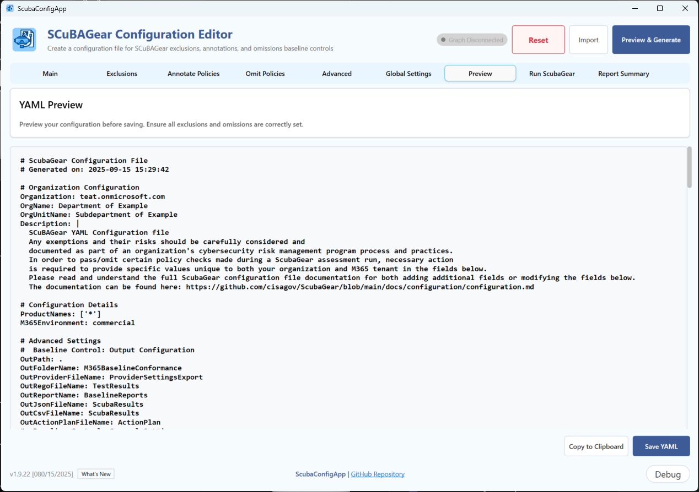
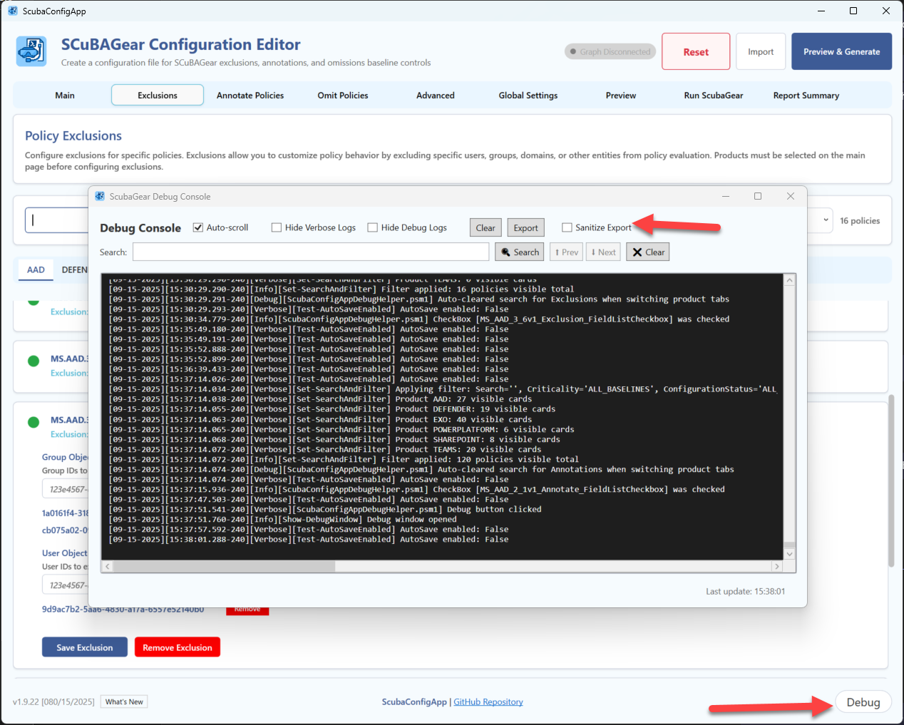

# ScubaConfigApp Module

The ScubaConfigApp is a PowerShell-driven UI built with Windows Presentation Framework. It’s not an executable—it’s lightweight, portable, and supports any Microsoft OS with graphical UI.

## Overview

ScubaConfigApp module contains these elements:

- **Configuration UI**: WPF-based graphical interface for creating YAML configuration files
- **Configuration Management**: Functions for loading, validating, and exporting SCuBAGear configurations
- **ScubaGear Execution**: Integrated ScubaGear assessment execution with real-time progress monitoring
- **Native Report Viewer**: Built-in WPF report viewer with colorful status badges and space-optimized layouts
- **Localization Support**: Multi-language UI text and validation messages. **Currently only supported locale is: _en-US_**
- **Connected Support**: Simplify selection screen to pull in Graph users and group IDs
- **Debug Capabilities**: Comprehensive debugging features


## Main Function

### Start-SCuBAConfigApp

Opens the ScubaGear Configuration UI for creating and managing configuration files, executing ScubaGear assessments, and viewing results with native report viewers.

#### Syntax

```powershell
Start-SCuBAConfigApp [[-ConfigFilePath] <String>] [[-Language] <String>] [-Online] [[-M365Environment] <String>] [-Passthru]
```

#### Parameters

| Parameter | Type | Description | Default |
|-----------|------|-------------|---------|
| ConfigFilePath | String | Path to existing YAML configuration file to import | None |
| Language | String | UI language (localization) | "en-US" |
| Online | Switch | Enable Microsoft Graph connectivity | False |
| M365Environment | String | Target M365 environment (commercial, gcc, gcchigh, dod) | "commercial" |
| Passthru | Switch | Return the configuration objects | False |

#### Examples:

```powershell
# Basic usage - Launch the configuration UI
Start-SCuBAConfigApp
```
```powershell
# Launch with Graph connectivity for commercial environment (Interactive)
Start-SCuBAConfigApp -Online
```
```powershell
# Import existing configuration
Start-SCuBAConfigApp -ConfigFilePath "C:\configs\myconfig.yaml"
```
```powershell
# Launch and connect to graph for GCC High environment
Start-SCuBAConfigApp -Online -M365Environment gcchigh
```
```powershell
#Use Passthru with a variable to retrieve all configurations in hashtables
$SCuBAUI = Start-SCuBAConfigApp -Passthru
#retrieving data
$SCuBAUI.GeneralSettings | ConvertTo-Json
$SCuBAUI.AdvancedSettings | ConvertTo-Json
$SCuBAUI.GlobalSettings | ConvertTo-Json
$SCuBAUI.Exclusions | ConvertTo-Json -Depth 4
$SCuBAUI.Annotations | ConvertTo-Json -Depth 4
$SCuBAUI.Omissions | ConvertTo-Json -Depth 4
```

## Features

### Configuration Management

- **Organization Settings**: Tenant information, display names, descriptions
- **Product Selection**: Choose which M365 services to assess
- **Exclusions**: Configure policy exclusions for product-specific configurations outline in the [Configuration File](docs/configuration/configuration.md)
- **Annotations**: Add contextual information to policies
- **Omissions**: Skip specific policies with rationale and expiration dates
- **Advanced Settings**: Output paths, authentication, and technical parameters

### User Interface

- **Tabbed Navigation**: Organized sections for different configuration areas
- **Real-time Validation**: Input validation with immediate feedback
- **Preview Generation**: Live YAML preview before export
- **Import/Export**: Load existing configurations and save new ones (See [Known UI Issues](#Known UI Issues))
- **Graph Integration**: Browse users and groups via Microsoft Graph API

### File Operations

- **YAML Import**: Load existing SCuBAGear configuration files
- **YAML Export**: Save configurations in SCuBAGear-compatible format
- **Clipboard Support**: Copy configurations for use elsewhere

### ScubaGear Execution

- **Run ScubaGear**: Execute SCuBAGear assessments directly from the UI
- **Real-time Progress**: Live monitoring of assessment execution with detailed progress updates

### Report Summary

- **Dynamic Report Tabs**: Automatically generated tabs for each product assessed
- **Space-Optimized Layout**: Reduced vertical scrolling with compact report display
- **Interactive Results**: Clickable policy details and summary review

## Usage Workflow

Follow this step-by-step guide to use the ScubaConfigApp for configuration creation, ScubaGear execution, and report review:

### Step 1. Launch the Application
```powershell
Start-SCuBAConfigApp
```
- The WPF application window will open with tabbed navigation
- Begin with the "Organization" tab which is selected by default

### Step 2. Configure Organization Information
- **Tenant Domain**: Enter your organization's primary domain (e.g., contoso.onmicrosoft.com)
- **Display Name**: Provide a descriptive name for your organization
- **Description**: Add optional details about this assessment configuration
- **M365 Environment**: Select your tenant environment (Commercial, GCC, GCC High, DoD)

### Step 3. Select Products for Assessment
Navigate to the "Products" tab:
- Check the boxes for products you want to assess:
  - **AAD (Entra)**: Azure Active Directory/Entra ID policies
  - **Defender**: Microsoft Defender for Office 365
  - **EXO (Exchange)**: Exchange Online configurations
  - **SharePoint**: SharePoint Online settings
  - **Teams**: Microsoft Teams policies
  - **Power BI**: Power BI security settings
  - **Power Platform**: Power Platform governance

### Step 4. Configure Exclusions
In the "Exclusions" tab:
- Add specific users, groups, or policies to exclude from assessment
- Use the search functionality to find and select items
- Document rationale for each exclusion

### Step 5. Add Annotations
In the "Annotations" tab:
- Add contextual notes or explanations for specific policies
- Provide additional information that will appear in reports
- Useful for documenting organization-specific configurations

### Step 6. Add Omissions
In the "Omissions" tab:
- Skip specific policies that don't apply to your organization
- Provide rationale and expiration dates for omitted policies
- Essential for compliance documentation

### Step 7. Set Advanced Settings
In the "Advanced" tab:
- **Output Path**: Specify where ScubaGear results will be saved
- **Authentication Method**: Choose interactive login or certificate-based authentication
- **Additional Parameters**: Set optional technical parameters

### Step 8. Review Configuration Preview
Click "Preview & Generate" to enable the preview tab and generate the YAML file. This should automatically navigate to the "Preview" tab:
- Review the generated YAML configuration
- Verify all settings are correct
- Make adjustments by returning to previous tabs if needed

> [!IMPORTANT]
> **Be sure to click the "Preview & Generate" when done making updates to pull those changed into yaml output. Clicking on the _Preview_ tab won't show the update**

### Step 9. Save Configuration
Click "Save YAML":
- Save the configuration file to your desired location
- The file will be named automatically based on your organization domain
- Configuration is now ready for ScubaGear execution

### Step 10. Execute ScubaGear Assessment

- The "Results" tab will automatically activate
- Real-time progress monitoring will begin
- Watch the output window for execution details and status updates
- Assessment may take 5-15 minutes depending on tenant size and products selected

### Step 11. Monitor Execution Progress
While ScubaGear runs:
- Progress updates appear in real-time in the output area
- Status messages indicate which products are being assessed
- Any errors or warnings are displayed immediately
- The interface remains responsive during execution

### Step 12. Review Report Summary
Once execution completes:
- Report tabs automatically appear for each assessed product
- Navigate between product-specific reports using the tabs

### Step 13. Analyze Results and Take Action
For each product report:
- Click on individual policies to view detailed findings
- Review recommendations for failed or warning policies
- Document remediation actions needed
- Export or save reports for compliance documentation



## Run ScubaGear Feature

The integrated ScubaGear execution feature allows you to run assessments directly from the UI without manual command-line operations.

### Execution Process

1. **Pre-Execution Validation**: The UI validates your configuration before starting
2. **ScubaGear Invocation**: Automatically calls `Invoke-SCuBA` with your settings
3. **Progress Tracking**: Real-time output display with status updates
4. **Completion Handling**: Automatic report loading and tab generation
5. **Error Management**: Clear error messages and troubleshooting guidance

### Requirements for Execution

- _Initialize-Scuba_ has been ran to ensure all modules and dependencies are installed
- Valid configuration with at least one product selected
- Appropriate Microsoft Graph permissions for your account
- Network connectivity to Microsoft 365 services

### Output Monitoring

During execution, you'll see:
- Product assessment progress (e.g., "Assessing Entra ID policies...")
- Policy evaluation status
- Authentication confirmations (if running in interactive mode)
- Report generation progress
- Completion notifications or error messages

## Report Summary Feature

The native WPF report viewer provides a modern, integrated experience for reviewing ScubaGear assessment results.

### Status Badge System

Each policy displays a colored status badge indicating compliance level:

| Badge Color | Status | Meaning |
|-------------|--------|---------|
| **Green** | Pass | Policy meets compliance requirements |
| **Yellow** | Warning | Policy needs attention or has minor issues |
| **Red** | Failure | Policy fails compliance requirements |
| **Blue** | Manual | Policy requires manual review or verification |
| **Gray** | Error/N/A | Policy has errors or is not implemented |

### Report Navigation

- **Product Tabs**: Click between different product assessments (AAD, Exchange, etc.)
- **Policy Details**: Click on individual policies for detailed findings
- **Status Filtering**: Visual scanning using color-coded badges
- **Scroll Optimization**: Compact layout minimizes scrolling requirements

## Integration with ScubaGear

The configurations created by this UI are fully compatible with the main ScubaGear assessment tool:

```powershell
# Use the generated configuration
Invoke-SCuBA -ConfigFilePath "path\to\generated\example.onmicrosoft.com.yaml"
```

## Module Files

### Core Files

- **SCuBAConfig.psm1**: Main module file containing all functions and UI logic
- **SCuBAConfig.psd1**: Module manifest with metadata and dependencies
- **ScubaConfigApp.xaml**: WPF UI definition file

### Configuration Files

- **ScubaConfigApp_Control_en-US.json**: English localization and configuration settings
- Additional language files can be added following the same naming pattern

## Requirements

- **PowerShell 5.1** or later
- **.NET Framework 4.5** or later
- **Windows OS** with WPF support
- **SCuBAGear Module** (parent module)

## Troubleshooting

### Debug Configuration

Use debug window to get detailed information about:

- UI events and user interactions
- Configuration validation results
- Import/export operations
- Graph API calls and responses

#### Enabling Debug Mode

This is enabled by default. However if your not seeing the debug button, follow these steps:

1. Edit `ScubaConfigApp\ScubaConfigApp_Control_en-US.json` in the module directory.
2. Change `"DebugMode": true` to enable.
3. Restart the UI application. There will be a debug button in the bottom right corner.

Example:
```json
{
  "DebugMode": true,
  ...
}
```

The **Debug Window** displays detailed diagnostic information, but it is **not intended** for end users to troubleshoot issues on their own.
Instead, it is recommended to:

- Open an [bug](https://github.com/cisagov/ScubaGear/issues/new?template=2-bugreport.yaml)
- Export the log from the debug window (Santize it if needed)
- Explain the issue and attach the debug log to bug issue

>[!IMPORTANT]
>A **Sanitize** option is available to replace sensitive data with placeholder values.



### Common Issues

- **UI won't launch**: Check PowerShell execution policy. Use `-Passthru` parameter to output error:

  ```powershell
  # Basic usage - Launch the configuration UI
  $SCuBAUI = Start-SCuBAConfigApp -Passthru
  $SCuBAUI.error
  ```

- **Graph connectivity fails**: Verify the `Microsoft.Graph.Authentication` module is installed and your authentication credentials have Graph permissions. You must have the following Graph permissions:

  ```
  User.Read.All
  Group.Read.All
  Organization.Read.All
  Application.Read.All
  ```

- **Configuration validation errors**: Review required fields and format requirements. Be sure to click `Save` for each configuration and then the click `Preview & Generate` button.


## Issues / Troubleshooting / Workarounds

- Clicking between `New Session` and `Import` multiple times may cause UI issues. Close UI and relaunch is the recommended
- The UI does not support YAML anchors or aliases at this time. Use `-Online` parameter to help build exclusions
- The UI does not support JSON export at this time.
- The `-Online` parameter does not support using a service principal at this time when running the UI; it must be interactive. A service principal can be configured within the UI (see Advanced Section) and will be used to ScubaGear within UI.
- If no baselines are showing after selecting productnames, it could be a communication issue to the github repo. Change `PullOnlineBaselines` to `false` within the `ScubaConfigApp_Control_en-US.json` app configuration file

### Run ScubaGear and Report Summary Notes

- **Report tabs**: Report tabs are dynamically generated based on assessment results. If no results are found for a product, no tab will be created.
- **Execution monitoring**: ScubaGear execution runs in a background process. Closing the UI during execution will terminate the assessment.
- **Report refresh**: To view updated reports after making configuration changes, you must re-run the ScubaGear assessment.
- **Native report viewer**: The WPF report viewer replaces web browser controls and may display differently than the standard HTML reports generated by ScubaGear.

## Development

### Adding Localization

1. Create new configuration file following naming pattern: `ScubaConfigApp_Control_<locale>.json`
2. Translate all text elements in the localeContext section
3. Create new baseline configuration file following naming pattern: `ScubaBaselines_<locale>.json`
4. Translate text elements: _name, rationale_ for each baseline item
5. Set `PullOnlineBaselines:false` within the `ScubaConfigApp_Control_en-US.json` app configuration file
6. Update root module (`ScubaConfigApp.psm1`) to support new locale.

### Contributing

Follow the main SCuBAGear contribution guidelines when making changes to this module.

## Version History

- Previous versions: See [ScubaConfigApp changelog](../../PowerShell/ScubaGear/Modules/ScubaConfigApp/ScubaConfigApp_CHANGELOG.md)

## License

Same license as the parent SCuBAGear project.

## Support

For issues and questions:

- **SCuBAGear Issues**: [GitHub Issues](https://github.com/cisagov/scubagear/issues)
- **Documentation**: [SCuBAGear Docs](https://github.com/cisagov/scubagear/docs)
- **Discussions**: [GitHub Discussions](https://github.com/cisagov/scubagear/discussions)
