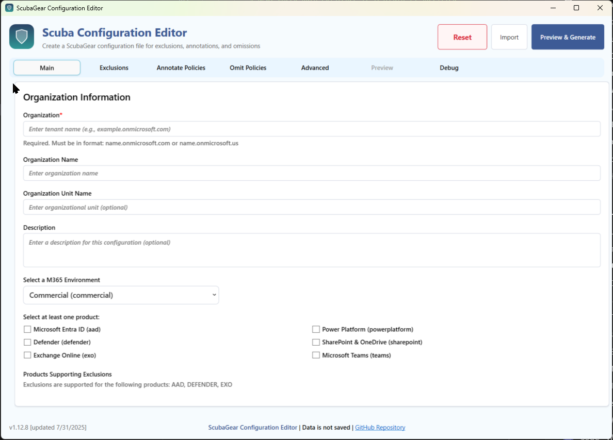
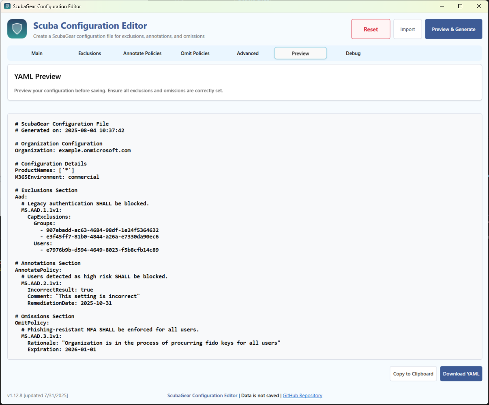

# ScubaConfig Module

The ScubaConfig module provides a graphical user interface for creating and managing ScubaGear configuration files. This module contains the PowerShell functions and resources needed to launch the configuration UI and manage ScubaGear settings.

## Overview

ScubaConfig is a PowerShell module that includes:

- **Configuration UI**: WPF-based graphical interface for creating YAML configuration files
- **Configuration Management**: Functions for loading, validating, and exporting ScubaGear configurations
- **Localization Support**: Multi-language UI text and validation messages. **Currently only supported locale is: _en-US_**
- **Connected Support**: Simplify selection screen to pull in graph users and groups
- **Debug Capabilities**: Comprehensive debugging features



## Main Function

### Start-ScubaConfigAppUI

Opens the ScubaGear Configuration UI for creating and managing configuration files.

#### Syntax

```powershell
Start-ScubaConfigAppUI [[-ConfigFilePath] <String>] [[-Language] <String>] [-Online] [[-M365Environment] <String>] [-Passthru]
```

#### Parameters

| Parameter | Type | Description | Default |
|-----------|------|-------------|---------|
| ConfigFilePath | String | Path to existing YAML configuration file to import | None |
| Language | String | UI language (localization) | "en-US" |
| Online | Switch | Enable Microsoft Graph connectivity | False |
| M365Environment | String | Target M365 environment (commercial, gcc, gcchigh, dod) | "commercial" |
| Passthru | Switch | Return the configuration objects | False |

#### Examples

```powershell
# Basic usage - Launch the configuration UI
Start-ScubaConfigAppUI

# Launch with Graph connectivity for commercial environment (Interactive)
Start-ScubaConfigAppUI -Online -M365Environment commercial

# Import existing configuration
Start-ScubaConfigAppUI -ConfigFilePath "C:\configs\myconfig.yaml"

# Launch and connect to graph for GCC High environment
Start-ScubaConfigAppUI -Online -M365Environment gcchigh

#Use Passthru with a variable to save all configurations in hashtables
$ScubaUI = Start-ScubaConfigAppUI -Passthru
#retrieving data
$ScubaUI.GeneralSettings | ConvertTo-Json
$ScubaUI.AdvancedSettings | ConvertTo-Json
$ScubaUI.Exclusions | ConvertTo-Json -Depth 4
$ScubaUI.Annotations | ConvertTo-Json -Depth 4
$ScubaUI.Omissions | ConvertTo-Json -Depth 4
```

## Features

### Configuration Management

- **Organization Settings**: Tenant information, display names, descriptions
- **Product Selection**: Choose which M365 services to assess
- **Exclusions**: Configure policy exclusions for product-specific configurations outline in the [Configuration File](docs/configuration/configuration.md)
- **Annotations**: Add contextual information to policies
- **Omissions**: Skip specific policies with rationale and expiration dates
- **Advanced Settings**: Output paths, authentication, and technical parameters

### User Interface

- **Tabbed Navigation**: Organized sections for different configuration areas
- **Real-time Validation**: Input validation with immediate feedback
- **Preview Generation**: Live YAML preview before export
- **Import/Export**: Load existing configurations and save new ones (See [Known UI Issues](#Known UI Issues))
- **Graph Integration**: Browse users and groups via Microsoft Graph API

### File Operations

- **YAML Import**: Load existing ScubaGear configuration files
- **YAML Export**: Save configurations in ScubaGear-compatible format
- **Clipboard Support**: Copy configurations for use elsewhere
- **Auto-naming**: Intelligent file naming based on organization settings

## Usage Workflow

1. **Launch**: Start the UI with `Start-ScubaConfigAppUI`
2. **Configure**: Set organization information and select products
3. **Customize**: Add exclusions, annotations, and omissions as needed
4. **Advanced**: Configure authentication and output settings
5. **Preview**: Generate and review the YAML configuration
6. **Export**: Save or copy the configuration for use with ScubaGear



## Integration with ScubaGear

The configurations created by this UI are fully compatible with the main ScubaGear assessment tool:

```powershell
# Use the generated configuration
Invoke-SCuBA -ConfigFilePath "path\to\generated\example.onmicrosoft.com.yaml"
```

## Module Files

### Core Files

- **ScubaConfig.psm1**: Main module file containing all functions and UI logic
- **ScubaConfig.psd1**: Module manifest with metadata and dependencies
- **ScubaConfigAppUI.xaml**: WPF UI definition file

### Configuration Files

- **ScubaConfig_en-US.json**: English localization and configuration settings
- Additional language files can be added following the same naming pattern

### Resource Files

- UI templates, styles, and other resources as needed

## Configuration File Structure

The `ScubaConfig_en-US.json` file contains:

```json
{
  "Version": "1.8.4 [updated 8/4/2025]",
  "DebugMode": false,
  "EnableSearchAndFilter": false,
  "localeContext": {
    // UI text elements
  },
  "localePlaceholder": {
    // Input field placeholder text
  },
  "defaultAdvancedSettings": {
    // Default values for advanced settings
  },
  "localeInfoMessages": {
    // Success and information messages
  },
  "localeErrorMessages": {
    // Error and validation messages
  },
  "products": {
    // defines supported product for scubagear
  },
  "advancedSections": {
    //defined advanced settings toggle. 
  },
  "M365Environment": {
    //supported tenant environments for config file
  },
  "baselineControls": {
    // defines the types of baseline controls to display
  },
  "baselines": [
    "aad": {
      // defines scubagear baselines for Entra Admin Center
    },
    "defender": {
      // defines scubagear baselines for Defender Admin Center
    },
    "exo": {
      // defines scubagear baselines for M365 Exchange Admin Center
    },
    "sharepoint": {
      // defines scubagear baselines for SharePoint Admin Center
    },
    "teams": {
      // defines scubagear baselines for Teams Admin Center
    },
    "powerbi": {
      // defines scubagear baselines for Powrbi
    },
    "powerplatform": {
      // defines scubagear baselines for PowerPlatform
    }
  ],
  "inputTypes": {
    // defines fields and value types for all baseline cards
  },
  "valueValidations":{
      // defines field value validation checks
  },
   "graphQueries": {
    // defines graph queries used in UI (when online)
  }
}
```

## Requirements

- **PowerShell 5.1** or later
- **.NET Framework 4.5** or later
- **Windows OS** with WPF support
- **ScubaGear Module** (parent module)

## Troubleshooting

### Debug Configuration

#### Debug Modes

The UI supports multiple debug modes configured in the JSON file:

- **`None`**: No debug output (default)
- **`Info`**: Normal information shown such as user actions and inputs
- **`Verbose`**: Includes normal information plus control handler events
- **`Debug`**: All details will be included in output [Very Noisy, Not Recommended unless debugging]

#### Enabling Debug Mode

1. Edit `ScubaConfig_en-US.json` in the module directory
2. Change `"DebugMode": "None"` to desired mode
3. Restart the UI application

Example:
```json
{
  "DebugMode": "Info",
  ...
}
```

### Common Issues

- **UI won't launch**: Check PowerShell execution policy and .NET Framework version. Use `-Passthru` parameter to output error:

  ```powershell
  # Basic usage - Launch the configuration UI
  $ScubaUI = Start-ScubaConfigAppUI -Passthru
  $ScubaUI.error
  ```

- **Graph connectivity fails**: Verify the `Microsoft.Graph.Authentication` module is installed and your authentication credentials has graph permissions. You must have these graph permissions.
  
  ```
  User.Read.All
  Group.Read.All
  Policy.Read.All
  Organization.Read.All
  ```

- **Configuration validation errors**: Review required fields and format requirements. Be sure to click `Save ` for each configurations and then the click `Review & Generate` button

### Debug Information

Enable debug mode to get detailed information about:

- UI events and user interactions
- Configuration validation results
- Import/export operations
- Graph API calls and responses

## Known UI Issues

- When importing a configuration file, the Exclusions, Annotations, and Omissions tabs do not refresh, though the data is successfully imported and visible in the Preview. Adding new items to an existing policy may overwrite the imported data. A fix is planned for a future update.
- Clicking between `New Session` and `Import` multiple times may cause UI issues. Close UI and relaunch is the recommended
- The UI does not support YAML anchors or aliases at this time.
- THe UI does not support JSON export at this time
- The `-Online` parameter does not support using a service principal at this time. It must be interactive
- Enabling "Search and Filter" may cause baseline policies to disapper under each sub tab. To resolve, press the clear filter button for each tab. 

## Development

### Extending the UI

The UI is built using WPF and follows MVVM-like patterns:

- **View**: Defined in `ScubaConfigAppUI.xaml`
- **Logic**: Contained in `ScubaConfigAppUI.psm1`
- **Data**: Managed through PowerShell hashtables and objects

### Adding Localization

1. Create new JSON file following naming pattern: `ScubaConfig_<locale>.json`
2. Translate all text elements in the localeContext section
3. Update module to load appropriate locale file

### Contributing

Follow the main ScubaGear contribution guidelines when making changes to this module.

## Version History

- **1.12.0**: Current version with full configuration functionality
- Previous versions: See [ScubaGearAppUI changelog](../../PowerShell/ScubaGear/Modules/ScubaConfig/SCUBACONFIGAPPUI_CHANGELOG.md)

## License

Same license as the parent ScubaGear project.

## Support

For issues and questions:

- **ScubaGear Issues**: [GitHub Issues](https://github.com/cisagov/ScubaGear/issues)
- **Documentation**: [ScubaGear Docs](https://github.com/cisagov/ScubaGear/docs)
- **Discussions**: [GitHub Discussions](https://github.com/cisagov/ScubaGear/discussions)