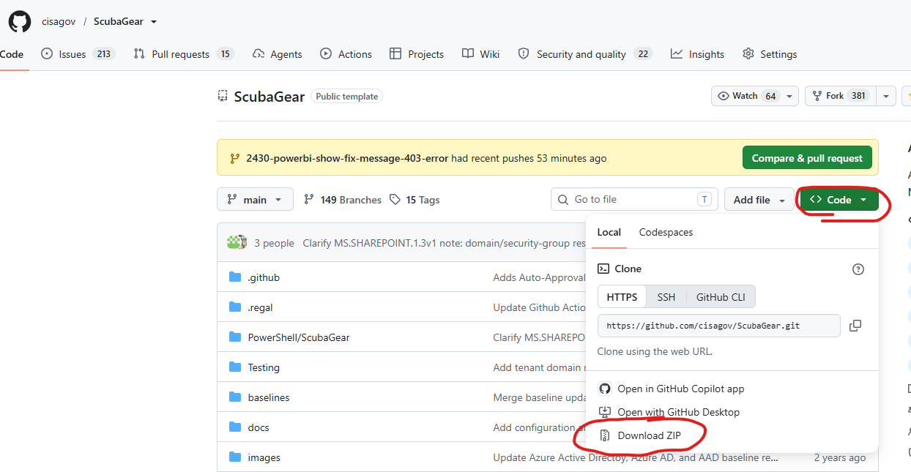

# Download and Execute ScubaGear Active Development Branch 
Sometimes you need to run the latest and greatest ScubaGear before waiting for the next official release. You can do that by following these instructions. A common reason to do this is for access to specific bug fixes or enhancements that haven't officially been released yet.

1. Open a new PowerShell window (this is important to ensure that you don't have any other ScubaGear modules loaded into memory)

2. Browse to https://github.com/cisagov/ScubaGear

3. Download the zip file of the main branch  
    1. Confirm the selected branch is "main"  
	2. Click the green "Code" button  
	3. Select "Download ZIP"   


4. Unzip the file to create a folder with the ScubaGear code 
	```powershell
	cd c:\folder_containing_code
	Import-Module .\PowerShell\ScubaGear
	```
	If you see any execution warning when trying to import the module or run cmdlets type 
	```powershell
	Get-ChildItem . -recurse | unblock-file
	```

5. Execute ScubaGear 
	```powershell
	Invoke-Scuba -ProductNames * 
	```