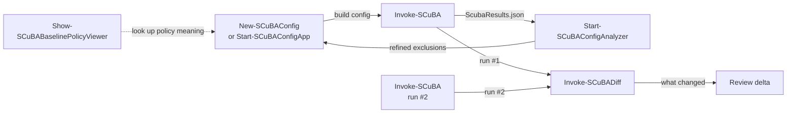

# ScubaGear Command Selection Matrix

## BLUF

ScubaGear ships more than one command, and the list keeps growing. This page is a
one-screen cheat sheet: **which tool to reach for, when to use it, and why it
matters.** Skim the tables, pick the row that matches your situation, and follow
the link for the deep dive.

Two matrices are below:

1. **[Configuration & analysis tools](#matrix-1-configuration--analysis-tools)** -
   the interactive "workbench" tools that help you build, inspect, and compare
   configurations and results.
2. **[Core assessment commands](#matrix-2-core-assessment-commands)** - the
   command-line tools that actually run an assessment and manage its
   dependencies.

---

## Matrix 1: Configuration & analysis tools

These are the tools that help you **build a config, understand the baselines, and
make sense of results** - the work that happens before and after the actual scan.

| Tool | BLUF (one line) | Use it when… | Why it matters | Needs Graph / online? |
|---|---|---|---|---|
| **`New-SCuBAConfig`** | Generates a blank/pre-seeded config YAML from the command line. | You want a template fast, or you are scripting config creation in a pipeline. | Zero UI, fully automatable - the quickest way to a valid starting config. | No |
| **`Start-SCuBAConfigApp`** | WPF UI to build, validate, and export a config YAML (and optionally run ScubaGear). | You are authoring or editing a config by hand and want validation, pickers, and live YAML preview. | Catches bad policy IDs / product names before they cost you a failed run; friendliest on-ramp for new users. | Optional (`-Online` pulls users/groups from Graph) |
| **`Start-SCuBAConfigAnalyzer`** | WPF companion that runs (or reads) an assessment, then tells you *which exclusions your config needs and why*. | A control failed and you need to know the root cause + the exact users/groups to exclude. | Turns raw failures into a ready-to-use exclusion config - closes the loop between "it failed" and "here's the fix." | Optional (interactive or app-only Graph auth) |
| **`Show-SCuBABaselinePolicyViewer`** | Read-only UI to browse every baseline policy and its rationale. | You need to look up what a policy ID means or read the baseline intent without opening markdown. | Fast reference while you configure or triage - no scanning, no auth, just the baselines. | No (can pull baselines from GitHub if asked) |
| **`Invoke-SCuBADiff`** | Offline compare of two `ScubaResults.json` files → JSON + CSV + HTML delta. | You want to prove what changed between two runs (before/after a fix, or tenant vs. tenant). | Evidence of progress/regression without re-scanning; fully offline, no tenant contact. | No |

### How they fit together

---

## Matrix 2: Core assessment commands

These are the command-line tools that **run the assessment and keep it runnable.**
Start at the top; the setup commands are one-time (or occasional) chores.

| Command | BLUF (one line) | Use it when… | Why it matters |
|---|---|---|---|
| **`Invoke-SCuBA`** | The main event - assesses your tenant against the baselines and writes JSON + HTML reports. | Any time you want a fresh, full assessment. | This *is* ScubaGear; everything else supports this command. |
| **`Invoke-SCuBACached`** | Re-runs the Rego/report step against already-exported provider data (flat output folder). | You are iterating on config/rego and don't want to re-hit the tenant each time. | Fast dev/test loop; export provider data once, re-evaluate many times. |
| **`Disconnect-SCuBATenant`** | Tears down the Graph/EXO/etc. sessions ScubaGear opened. | You are done, or need a clean auth state before switching tenants. | Prevents stale/leaked sessions from bleeding into the next run. |
| **`Install-ScubaDependencies`** | Installs the required PowerShell modules. | First-time setup, or after a version bump changes requirements. | Nothing runs until dependencies are present; this is step one. |
| **`Install-OPAforSCuBA`** | Downloads the OPA/Rego executable ScubaGear evaluates policies with. | First-time setup, or OPA is missing/outdated. | No OPA, no policy evaluation - required for any assessment. |
| **`Get-ScubaGearDependencyStatus`** | Reports which modules/OPA are present and at what version. | A run failed and you suspect a missing or mismatched dependency. | Diagnose environment problems before blaming the config. |
| **`Update-ScubaGear`** | Updates the ScubaGear module to the latest published version. | You want the newest baselines, fixes, and tooling. | Keeps you current with evolving M365 baselines. |

---

## Quick "which one?" guide

- **"I need a config."** → [`Start-SCuBAConfigApp`](../configuration/scubaconfigapp.md) (UI) or [`New-SCuBAConfig`](../configuration/configuration.md#method-2-command-line-generation) (CLI).
- **"What does this policy even check?"** → `Show-SCuBABaselinePolicyViewer`.
- **"Run the assessment."** → [`Invoke-SCuBA`](../execution/execution.md).
- **"I'm iterating and don't want to re-scan."** → [`Invoke-SCuBACached`](../execution/scubacached.md).
- **"It failed - what exclusion do I need?"** → [`Start-SCuBAConfigAnalyzer`](../configuration/scubaconfiganalyzer.md).
- **"What changed since last time?"** → `Invoke-SCuBADiff`.

## See also

- [Configuration overview](../configuration/configuration.md)
- [Configuration UI guide](../configuration/scubaconfigapp.md) and [walkthrough](../configuration/scubaconfigapp-walkthrough.md)
- [Config Analyzer](../configuration/scubaconfiganalyzer.md)
- [Execution](../execution/execution.md) · [Cached execution](../execution/scubacached.md)
- [Parameters reference](../configuration/parameters.md)
