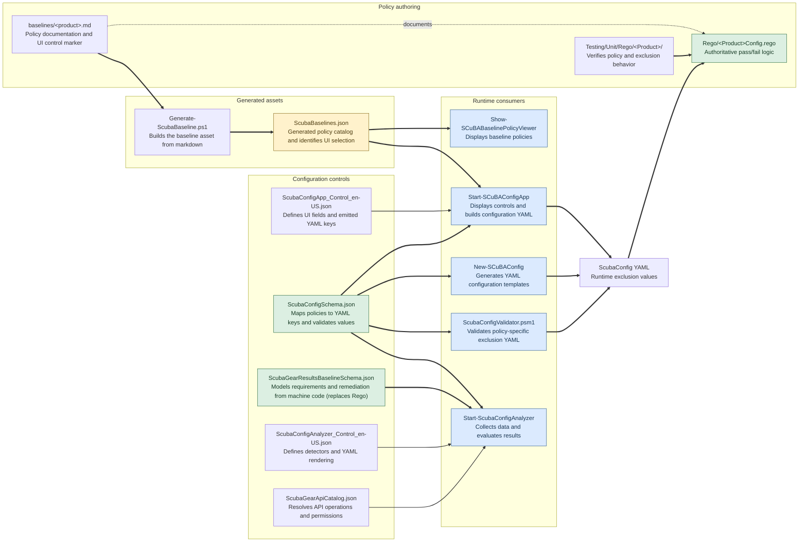

# ScubaGear Exclusion Schema Guide

## Purpose

This guide explains where ScubaGear exclusion metadata is stored, why similar data appears in
multiple files, and what developers must update when adding or changing a policy that supports
configuration exclusions.

The current design has several related schemas and generated assets. They are not all duplicates:
some describe the accepted ScubaGear YAML configuration, some select Config App controls, some drive
the Config Analyzer, and some describe the policy evaluation itself. However, the similar names
make accidental drift easy. Use the ownership rules and checklists below instead of assuming that
an `exclusionField` has the same meaning everywhere.

## Source-of-truth rules

The following rules summarize which file owns each decision. Paths are relative to the repository
root.

| Decision | Source of truth | Repository location |
| --- | --- | --- |
| Policy documentation and Config App control selection | Product baseline markdown `ExclusionType` marker | `PowerShell/ScubaGear/baselines/<product>.md` |
| Whether a policy passes or fails | Product Rego | `PowerShell/ScubaGear/Rego/<Product>Config.rego` |
| Shared Rego exclusion behavior | Product Rego utility | `PowerShell/ScubaGear/Rego/Utils/<Product>.rego` |
| Actual exclusion key accepted for a policy | `policyExclusionMappings` | `PowerShell/ScubaGear/Modules/ScubaConfig/ScubaConfigSchema.json` |
| Product namespaces that permit an exclusion key | Product `properties` schema | `PowerShell/ScubaGear/Modules/ScubaConfig/ScubaConfigSchema.json` |
| Shape and validation of exclusion values | `definitions.exclusionTypes` | `PowerShell/ScubaGear/Modules/ScubaConfig/ScubaConfigSchema.json` |
| Product-level exclusion capabilities | `schemaMetadata.productCapabilities` | `PowerShell/ScubaGear/Modules/ScubaConfig/ScubaConfigSchema.json` |
| Generated policy catalog and Config App control selector | `ScubaBaselines.json` generated from baseline markdown | `PowerShell/ScubaGear/schemas/ScubaBaselines.json` |
| Config App fields and YAML key emitted by a control | Config App control definition and its `value` | `PowerShell/ScubaGear/Modules/ScubaConfigApp/ScubaConfigApp_Control_en-US.json` |
| Analyzer model of policy requirements | Results baseline schema | `PowerShell/ScubaGear/schemas/ScubaGearResultsBaselineSchema.json` |
| Analyzer exclusion detection and YAML rendering | Analyzer control metadata plus the config-schema mapping | `PowerShell/ScubaGear/Modules/ScubaConfigApp/ScubaConfigAnalyzer_Control_en-US.json` and `PowerShell/ScubaGear/Modules/ScubaConfig/ScubaConfigSchema.json` |
| Analyzer API operations and permissions | API catalog | `PowerShell/ScubaGear/schemas/ScubaGearApiCatalog.json` |

### Exclusion metadata flow



Solid arrows show data used directly at generation or runtime. Dotted arrows show maintenance
relationships only. `Start-SCuBAConfigAnalyzer` never invokes Rego or OPA. Offline analysis reads
the verdict already stored in a ScubaResults file by a prior ScubaGear run. Live analysis evaluates
the JSON requirements directly against collected tenant data, so those requirements must remain
behaviorally aligned with Rego even though there is no runtime connection between them.

`Show-SCuBABaselinePolicyViewer` directly reads `ScubaBaselines.json`. Both the Config App and the
Config Analyzer can open the viewer on demand, but the analyzer does not use that file for analysis.

When values conflict, do not silently copy one value over another. First determine whether the
value is a UI control name, a YAML key, or analyzer metadata.

## Location index

### Exclusion schema and metadata files

| File | Generated? | Exclusion responsibility |
| --- | --- | --- |
| `PowerShell/ScubaGear/Modules/ScubaConfig/ScubaConfigSchema.json` | No | Canonical configuration: policy mappings, product properties, capabilities, and exclusion value definitions. |
| `PowerShell/ScubaGear/schemas/ScubaBaselines.json` | Yes | Generated policy catalog and Config App control selector. Do not edit directly. |
| `PowerShell/ScubaGear/schemas/ScubaGearResultsBaselineSchema.json` | No | Analyzer-specific policy requirements, remediation, and exclusion-type context. |
| `PowerShell/ScubaGear/Modules/ScubaConfigApp/ScubaConfigApp_Control_en-US.json` | No | Config App control aliases, visible fields, validation hints, and emitted YAML key. |
| `PowerShell/ScubaGear/Modules/ScubaConfigApp/ScubaConfigAnalyzer_Control_en-US.json` | No | Analyzer exclusion shapes, provider analysis, Conditional Access detectors, and API operation names. |

### Authoring and generation files

| Purpose | Repository location |
| --- | --- |
| Baseline policy authoring and `ExclusionType` markers | `PowerShell/ScubaGear/baselines/<product>.md` |
| Generate `ScubaBaselines.json` from markdown | `PowerShell/ScubaGear/Modules/Support/ScubaBaselineSchemaHelper.psm1` |
| Workflow entry point for baseline generation | `utils/workflow/Generate-ScubaBaseline.ps1` |
| Baseline asset documentation | `docs/misc/scubabaselineschema.md` |
| Schema directory overview | `PowerShell/ScubaGear/schemas/README.md` |

### Runtime consumers

| Consumer | Repository location | Data consumed |
| --- | --- | --- |
| ScubaConfig validator | `PowerShell/ScubaGear/Modules/ScubaConfig/ScubaConfigValidator.psm1` | `ScubaConfigSchema.json`, including `policyExclusionMappings` and exclusion definitions. |
| Config template generation and argument completion | `PowerShell/ScubaGear/Modules/Support/Support.psm1` | Config-schema policy mappings and generated baseline policy IDs. |
| Config App | `PowerShell/ScubaGear/Modules/ScubaConfigApp/ScubaConfigApp.psm1` and `PowerShell/ScubaGear/Modules/ScubaConfigApp/ScubaConfigAppHelpers/` | Generated baselines, Config App control definitions, and imported configuration data. |
| Config Analyzer schema loader | `PowerShell/ScubaGear/Modules/ScubaConfigApp/ScubaConfigAnalyzerHelpers/ScubaConfigAnalyzerSchemaHelper.psm1` | Config schema, analyzer controls, results baseline schema, and API catalog. |
| Config Analyzer exclusion handling | `PowerShell/ScubaGear/Modules/ScubaConfigApp/ScubaConfigAnalyzerHelpers/ScubaConfigAnalyzerExclusionHelper.psm1` | Policy mapping and analyzer exclusion definitions. |
| Conditional Access exclusion detection | `PowerShell/ScubaGear/Modules/ScubaConfigApp/ScubaConfigAnalyzerHelpers/ScubaConfigAnalyzerCaHelper.psm1` | Results-schema requirements and analyzer Conditional Access detectors. |
| Non-Conditional-Access exclusion detection | `PowerShell/ScubaGear/Modules/ScubaConfigApp/ScubaConfigAnalyzerHelpers/ScubaConfigAnalyzerProviderHelper.psm1` | Analyzer provider analysis selected by exclusion type. |
| Rego assessment | `PowerShell/ScubaGear/Rego/` | ScubaConfig YAML and provider output; authoritative pass/fail evaluation. |

### Related files that are not exclusion sources of truth

| File | Purpose | Why it is not authoritative for exclusions |
| --- | --- | --- |
| `PowerShell/ScubaGear/schemas/ScubaGearApiCatalog.json` | Cmdlets, API resources, environments, and permissions. | It tells the analyzer how to collect data, not which exclusions a policy accepts. |
| `PowerShell/ScubaGear/schemas/RiskyAppPermissions.json` | Risk classifications for application permissions. | It is provider/reference data, not configuration exclusion metadata. |
| `PowerShell/ScubaGear/Modules/ScubaConfig/ScubaConfigDefaults.json` | Default ScubaGear configuration values. | Defaults do not define policy-specific exclusion support. |
| `PowerShell/ScubaGear/schemas/ScubaBaselines.json` | Generated baseline asset. | It is authoritative for neither YAML validation nor pass/fail logic; its exclusion value can be a UI alias. |

### Focused tests

| Configuration checked | Repository location |
| --- | --- |
| Config schema structure | `PowerShell/ScubaGear/Testing/Unit/PowerShell/ScubaConfig/ScubaConfig.JsonSchema.Tests.ps1` |
| Config validator behavior | `PowerShell/ScubaGear/Testing/Unit/PowerShell/ScubaConfig/ScubaConfigValidator.Tests.ps1` |
| Config template generation | `PowerShell/ScubaGear/Testing/Unit/PowerShell/Support/New-SCuBAConfig.Tests.ps1` |
| Analyzer control IDs versus Rego | `PowerShell/ScubaGear/Testing/Unit/PowerShell/ScubaConfigApp/ScubaConfigAnalyzerSchemaSync.Tests.ps1` |
| Config App schema/control behavior | `PowerShell/ScubaGear/Testing/Unit/PowerShell/ScubaConfigApp/ScubaConfigApp.Tests.ps1` |
| Product policy exclusion behavior | `PowerShell/ScubaGear/Testing/Unit/Rego/<Product>/` |

## Files and responsibilities

### Baseline markdown

Location:

```text
PowerShell/ScubaGear/baselines/<product>.md
```

The baseline markdown is the authoritative policy documentation. A configurable policy can have
a hidden marker such as:

```html
<!--ExclusionType: CapExclusions-->
```

The marker selects a Config App exclusion control. It does not necessarily name the final YAML
key. The baseline schema generator reads these markers and writes them to
`ScubaBaselines.json` as `exclusionField`.

### ScubaBaselines.json

Location:

```text
PowerShell/ScubaGear/schemas/ScubaBaselines.json
```

This is a generated asset package derived from baseline markdown. The Config App and Baseline
Policy Viewer use it for policy names, descriptions, badges, and control selection.

For exclusions, each policy has one `exclusionField` value. Despite its name, this value can be a
Config App control variant rather than an actual YAML property name. Do not use it directly to
validate ScubaGear configuration files.

Example:

```json
{
  "id": "MS.AAD.3.8v1",
  "exclusionField": "CapExclusionsWithoutApps"
}
```

`CapExclusionsWithoutApps` is a UI control variant. It deliberately hides the Applications field
because application exclusions do not apply to that policy.

### ScubaConfigApp_Control_en-US.json

Location:

```text
PowerShell/ScubaGear/Modules/ScubaConfigApp/ScubaConfigApp_Control_en-US.json
```

The Config App control definitions translate a baseline `exclusionField` control name into UI
fields and the actual YAML key. For example:

```json
"CapExclusionsWithoutApps": {
  "value": "CapExclusions",
  "fields": [
    { "value": "Groups" },
    { "value": "Users" },
    { "value": "GuestUserTypes" }
  ]
}
```

The control name is `CapExclusionsWithoutApps`, but its `value` causes the Config App to emit the
real `CapExclusions` YAML key.

### ScubaConfigSchema.json

Location:

```text
PowerShell/ScubaGear/Modules/ScubaConfig/ScubaConfigSchema.json
```

This schema owns the accepted ScubaGear configuration. Its exclusion metadata has four
separate responsibilities.

#### `policyExclusionMappings`

Maps a concrete policy ID to the actual exclusion key or keys accepted under that policy:

```json
"MS.AAD.3.8v1": ["CapExclusions"]
```

The mapping is consumed by:

- `ScubaConfigValidator.psm1` to reject exclusion types that are invalid for a policy.
- `New-SCuBAConfig` to generate exclusion templates and complete policy IDs.
- The Config Analyzer to determine whether configuration can make a control pass.

The value is an array because the configuration can support more than one exclusion type
for a policy even though `ScubaBaselines.json` currently has one UI-control selector.

#### Product properties

Each product schema lists the exclusion keys that may appear beneath one of its policy IDs. For
example, the `Aad` property permits `CapExclusions` and `RoleExclusions`. This controls the JSON
Schema object shape independently of the policy-specific mapping.

#### `definitions.exclusionTypes`

Defines the data shape and validation rules for each actual YAML exclusion key. Examples include
GUID validation for users and groups, accepted cloud application values, and guest user type
enumerations.

#### `productCapabilities`

Describes broad product-level support. This is useful for enabling product features in clients,
but it does not prove that a specific policy supports every listed exclusion type. Use
`policyExclusionMappings` for policy-level decisions.

### ScubaGearResultsBaselineSchema.json

Location:

```text
PowerShell/ScubaGear/schemas/ScubaGearResultsBaselineSchema.json
```

This file contains the Config Analyzer's machine-readable model of selected baseline controls. It
describes policy requirements, remediation, and optional build instructions. Its `exclusionField`
should name the actual ScubaGear YAML exclusion key, such as `CapExclusions`, rather than a Config
App-only control variant.

The analyzer treats `ScubaConfigSchema.json` policy mappings as authoritative when both sources
are present. The results schema value is retained as a compatibility fallback and as context for
Conditional Access exclusion detection.

[!NOTE]
The nested `buildInstructions.exclusionHandling` arrays are not currently consumed by the Config
Analyzer. They appear to describe Graph payload paths for a future policy-building workflow. Do
not rely on them for current exclusion validation or YAML generation.

### ScubaConfigAnalyzer_Control_en-US.json

Location:

```text
PowerShell/ScubaGear/Modules/ScubaConfigApp/ScubaConfigAnalyzer_Control_en-US.json
```

The analyzer control file contains two kinds of exclusion behavior:

- `exclusionDefinitions` describes YAML rendering shape and non-Conditional-Access provider
  analysis.
- `conditionalAccessAnalysis.exclusionDetectors` describes where exclusions are found in
  Conditional Access policy data and whether each exclusion can be waived through configuration.

The analyzer combines this behavior with `policyExclusionMappings`. The mapping selects the
exclusion type; the analyzer control file explains how to detect and render that type.

### Rego policy implementation

Locations:

```text
PowerShell/ScubaGear/Rego/<Product>Config.rego
PowerShell/ScubaGear/Rego/Utils/<Product>.rego
```

Rego remains authoritative for assessment results. The policy must read the same actual YAML key
defined by `ScubaConfigSchema.json` and apply the intended exclusions when deciding pass or fail.
UI and analyzer metadata must not imply exclusion behavior that Rego does not implement.

## Why the mapping appears more than once

The similar values exist because the files answer different questions:

| File/property | Question answered |
| --- | --- |
| Baseline markdown `ExclusionType` | Which Config App control should be shown? |
| `ScubaBaselines.json.exclusionField` | Which generated UI-control selector belongs to this policy? |
| Config App control `value` | Which YAML key should that control emit? |
| `policyExclusionMappings` | Which YAML keys are valid for this exact policy? |
| Results schema `exclusionField` | Which YAML exclusion type should the analyzer associate with this control? |
| Analyzer `exclusionDefinitions` | How should that type be detected and rendered? |

Most policies use the same string throughout, which makes the layers look redundant. Policies
with specialized UI needs demonstrate why they are not identical.

### Worked example: MS.AAD.3.8v1

Managed-device registration demonstrates the distinction:

1. `aad.md` declares `CapExclusionsWithoutApps` because the Config App must not offer application
   exclusions for this policy.
2. `ScubaBaselines.json` carries that UI selector as its `exclusionField`.
3. `ScubaConfigApp_Control_en-US.json` maps the selector to `value: CapExclusions` and omits the
   Applications input.
4. `ScubaConfigSchema.json` maps the policy to `CapExclusions`, the actual YAML key.
5. Rego reads `Aad.MS.AAD.3.8v1.CapExclusions` and evaluates only the supported subfields.

Deriving `policyExclusionMappings` by copying `ScubaBaselines.json.exclusionField` would therefore
produce the invalid YAML key `CapExclusionsWithoutApps`.

## Adding a policy that uses an existing exclusion type

Use this procedure when a new policy uses an already-supported type such as `CapExclusions`,
`RoleExclusions`, `SensitiveUsers`, `PartnerDomains`, or `AllowedForwardingDomains`.

1. Implement the policy in the appropriate Rego file. Confirm that it reads the intended
   ScubaConfig exclusion key and that tests cover allowed and disallowed exclusions.
2. Add the policy to the product baseline markdown.
3. Add the appropriate `<!--ExclusionType: ...-->` marker. Choose a Config App control name, not
   automatically the YAML key. Use a restricted control variant when some fields must not appear.
4. Regenerate `ScubaBaselines.json` through the repository workflow or
   `Update-ScubaConfigBaselineWithMarkdown`.
5. Add the policy ID and actual YAML exclusion key to `policyExclusionMappings` in
   `ScubaConfigSchema.json`.
6. Confirm that the product's schema properties already permit the exclusion key and that
   `definitions.exclusionTypes` defines its value shape.
7. If the Config Analyzer will model the policy, add or update its object in
   `ScubaGearResultsBaselineSchema.json`. Set `exclusionField` to the actual YAML key and keep its
   requirements synchronized with Rego.
8. Confirm that `ScubaConfigAnalyzer_Control_en-US.json` already has an appropriate
   `exclusionDefinitions` entry and detector behavior.
9. Update samples, policy migrations, or documentation when a policy version replaces an older
   policy ID.
10. Run the validation checks listed below.

## Adding a new exclusion type

Adding a new exclusion type changes more configurations and requires broader testing.

1. Define the real YAML key and its data shape under
   `ScubaConfigSchema.json/definitions/exclusionTypes`.
2. Add that key to the applicable product's policy properties.
3. Add it to the applicable `productCapabilities.supportedExclusionTypes` list.
4. Add policy IDs that support it to `policyExclusionMappings`.
5. Implement Rego logic that consumes the new key and add Rego tests.
6. Add a Config App control definition whose `value` is the real YAML key. The control name may be
   different when a restricted UI variant is needed.
7. Add the baseline markdown marker and regenerate `ScubaBaselines.json`.
8. Add an analyzer `exclusionDefinitions` entry:
   - Define `valueShape`, `fields`, or `fieldName` for YAML generation.
   - For non-Conditional-Access data, define its provider `analysis`, fetch operation, detectors,
     and value extraction.
   - For Conditional Access data, add or adjust `conditionalAccessAnalysis.exclusionDetectors`.
9. Set the actual YAML key in modeled controls in `ScubaGearResultsBaselineSchema.json`.
10. Add unit tests for schema validation, Config App import/export, analyzer detection, analyzer YAML
    generation, and Rego behavior.

## Changing or versioning an existing policy

When a policy ID changes, treat the new ID as a new mapping and review every consumer.

- Add the new ID to baseline markdown, Rego, analyzer results schema, and
  `policyExclusionMappings`.
- Remove the old ID only when the old policy is no longer accepted.
- Add an entry to `mappings/scuba-baseline-policy-migrations.csv` when existing configurations
  should be guided from the old ID to the new ID.
- Regenerate `ScubaBaselines.json`.
- Verify sample configurations and tests do not continue to use the old ID unintentionally.

When only supported exclusion fields change, review both layers:

- Change the Config App control selector or fields to control what users can enter.
- Change the configuration schema and Rego when the actual accepted YAML configuration changes.

Changing only the Config App control does not prevent hand-authored YAML from containing a field.
Changing only the schema does not ensure Rego evaluates that field correctly.

## Validation checklist

At minimum, validate JSON parsing and run the focused PowerShell tests:

```powershell
$root = 'PowerShell/ScubaGear'

Get-Content "$root/Modules/ScubaConfig/ScubaConfigSchema.json" -Raw |
    ConvertFrom-Json | Out-Null
Get-Content "$root/schemas/ScubaBaselines.json" -Raw |
    ConvertFrom-Json | Out-Null
Get-Content "$root/schemas/ScubaGearResultsBaselineSchema.json" -Raw |
    ConvertFrom-Json | Out-Null
Get-Content "$root/Modules/ScubaConfigApp/ScubaConfigAnalyzer_Control_en-US.json" -Raw |
    ConvertFrom-Json | Out-Null

Invoke-Pester "$root/Testing/Unit/PowerShell/ScubaConfig/ScubaConfigValidator.Tests.ps1"
Invoke-Pester "$root/Testing/Unit/PowerShell/ScubaConfigApp/ScubaConfigAnalyzerSchemaSync.Tests.ps1"
Invoke-Pester "$root/Testing/Unit/PowerShell/ScubaConfigApp/ScubaConfigApp.Tests.ps1"
```

Also run the affected product's Rego unit tests. For analyzer changes, test both paths:

- Offline analysis of an existing `ScubaResults_*.json` file.
- Live tenant analysis when Graph or provider collection behavior changed.

Review the generated YAML and confirm that it uses the actual schema key, not a UI-only control
name.

## Known risks and cleanup opportunities

### Similar names hide different semantics

`exclusionField` currently means a UI selector in `ScubaBaselines.json` and an analyzer/config type
in `ScubaGearResultsBaselineSchema.json`. A future breaking schema revision should use clearer
names such as `exclusionControlType` and `configExclusionType`.

### Manually synchronized policy mappings can drift

The baseline marker and `policyExclusionMappings` are maintained separately. A CI test should
resolve each Config App control through its `value` property and compare that result with the
config-schema mapping. The comparison must resolve aliases such as
`CapExclusionsWithoutApps -> CapExclusions`; a direct string comparison is incorrect.

### Analyzer fallback can hide stale metadata

The analyzer prefers `policyExclusionMappings` but can fall back to a results-schema
`exclusionField`. This keeps older assets working but can conceal drift. CI should flag conflicting
actual YAML types even if runtime behavior remains functional.

### Generated metadata is preferable to runtime cross-file dependencies

A future consolidation should preserve a small, self-contained runtime schema while generating
repeated mappings during the build. A safe direction is:

1. Define structured policy exclusion metadata with separate UI control and configuration type.
2. Generate `ScubaBaselines.json` and `policyExclusionMappings` from that metadata.
3. Package the generated mapping with `ScubaConfigSchema.json` so standalone validation does not
   require the Config App or baseline documentation assets at runtime.
4. Add drift tests before removing any existing fallback.

Do not remove `policyExclusionMappings` until its validator, template-generation, argument
completion, and analyzer consumers have been migrated and covered by tests.

## Sample: add exclusions to MS.AAD.9.1v1

This example shows how to make the existing `MS.AAD.9.1v1` policy configurable.

### First confirm the supported fields

The current policy checks only application exclusions:

```rego
AppExclusionsFullyExempt(CAPolicy, "MS.AAD.9.1v1") == true
```

Therefore, this example keeps the YAML key `CapExclusions` but exposes only its `Applications`
field. Do not offer Users, Groups, or GuestUserTypes unless the Rego policy is also changed to
evaluate them.

The intended YAML is:

```yaml
Aad:
   MS.AAD.9.1v1:
      CapExclusions:
         Applications:
            - 00000000-0000-0000-0000-000000000000
```

### Required changes

| Step | File | Change |
| --- | --- | --- |
| 1 | `PowerShell/ScubaGear/baselines/aad.md` | Mark the policy configurable and select an applications-only Config App control. |
| 2 | `PowerShell/ScubaGear/Modules/ScubaConfigApp/ScubaConfigApp_Control_en-US.json` | Define that applications-only control and map it to the real `CapExclusions` YAML key. |
| 3 | `PowerShell/ScubaGear/Modules/ScubaConfig/ScubaConfigSchema.json` | Map `MS.AAD.9.1v1` to `CapExclusions`. |
| 4 | `PowerShell/ScubaGear/schemas/ScubaBaselines.json` | Regenerate this file from markdown; do not edit it manually. |
| 5 | Rego tests | Confirm an approved application exclusion passes and an unapproved one fails. |

#### 1. Update the baseline markdown

Add the Configurable badge and a restricted control marker near the existing policy metadata in
`PowerShell/ScubaGear/baselines/aad.md`:

```markdown
[](../../../docs/configuration/configuration.md#conditional-access-policy-exclusions)

<!--Policy: MS.AAD.9.1v1; Criticality: SHALL -->
<!--ExclusionType: CapExclusionsApplicationsOnly-->
```

`CapExclusionsApplicationsOnly` is a Config App control name, not a YAML key.

#### 2. Add the restricted Config App control

Add this sibling of `CapExclusions` in
`PowerShell/ScubaGear/Modules/ScubaConfigApp/ScubaConfigApp_Control_en-US.json`:

```json
"CapExclusionsApplicationsOnly": {
   "name": "Conditional Access Policy Excluded Applications",
   "value": "CapExclusions",
   "description": "Exclude specific applications from this conditional access policy",
   "fields": [
      {
         "type": "array",
         "name": "Cloud Applications",
         "value": "Applications",
         "description": "Cloud applications to exclude from this policy",
         "valueType": "guidOrName",
         "required": false
      }
   ]
}
```

The control name limits the UI, while `"value": "CapExclusions"` emits the real YAML key.

#### 3. Add the policy mapping

Add one entry under `schemaMetadata.policyExclusionMappings` in
`PowerShell/ScubaGear/Modules/ScubaConfig/ScubaConfigSchema.json`:

```json
"MS.AAD.9.1v1": ["CapExclusions"]
```

No change is required in `ScubaConfigValidator.psm1`. The validator reads this map generically.
After the entry is added, it recognizes `CapExclusions` as an allowed exclusion type for 9.1.

No new exclusion definition is required either. The existing Aad schema already permits
`CapExclusions`, and `definitions.exclusionTypes.CapExclusions` already validates Applications.

#### 4. Regenerate ScubaBaselines.json

Run the same generator used by CI from the repository root:

```powershell
./utils/workflow/Generate-ScubaBaseline.ps1 `
      -OutputPath "PowerShell/ScubaGear/schemas/ScubaBaselines.json" `
      -Validate
```

The generated 9.1 object should then contain:

```json
"id": "MS.AAD.9.1v1",
"exclusionField": "CapExclusionsApplicationsOnly"
```

Do not replace that generated value with `CapExclusions`. It selects the restricted UI control;
the control's `value` property performs the translation to the YAML key.

#### 5. Confirm Rego behavior

`AADConfig.rego` already calls `AppExclusionsFullyExempt` for 9.1, and
`AADConfig_09_test.rego` already has an approved application-exclusion test. For a newly created
policy, both the helper call and tests would need to be added.

At minimum, test these cases:

- The policy has no application exclusions and otherwise meets the baseline.
- An excluded application appears in `CapExclusions.Applications` and passes.
- An excluded application is absent from `CapExclusions.Applications` and fails.

### Optional: add Config Analyzer coverage

The changes above make ScubaGear configuration, validation, Config App generation, and Rego
evaluation work. They do not automatically add 9.1 to the Config Analyzer's modeled controls.

To add analyzer coverage:

1. Add an `MS.AAD.9.1v1` control to
    `PowerShell/ScubaGear/schemas/ScubaGearResultsBaselineSchema.json`.
2. Set its `exclusionField` to the actual YAML key, `CapExclusions`.
3. Model all current Rego requirements, including applications, client app types, agent risk,
    included agent service principals, grant controls, license behavior, and unsupported M365
    environments.
4. Confirm the generic Applications detector in
    `ScubaConfigAnalyzer_Control_en-US.json` recognizes `conditions.applications.excludeApplications`.
5. Add analyzer tests for live and imported-results behavior.

This analyzer step is conditional because the analyzer intentionally models only a subset of
baseline policies. Do not add a partial requirements object merely to expose exclusions; in live
mode that object becomes an independent implementation of the pass/fail rule.

### What does not change

For this example, these implementations remain unchanged:

- `ScubaConfigValidator.psm1`: already interprets `policyExclusionMappings`.
- `ScubaConfigAnalyzerExclusionHelper.psm1`: already renders `CapExclusions`.
- `ScubaConfigAnalyzer_Control_en-US.json`: already defines the analyzer's `CapExclusions`
   shape and application detector.
- `definitions.exclusionTypes.CapExclusions`: already defines the Applications value shape.

### Important current limitation

`policyExclusionMappings` validates exclusion types at the policy level, not individual subfields.
Mapping 9.1 to `CapExclusions` means hand-authored YAML containing Users or Groups still satisfies
the schema shape even though current 9.1 Rego only uses Applications. The restricted Config App
control prevents the UI from generating those fields, but it does not make the base schema
policy-field-aware. Solving that requires a larger schema change and should be covered by tests
before altering the current contract.
