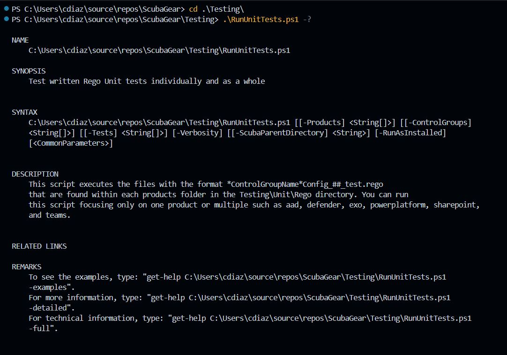
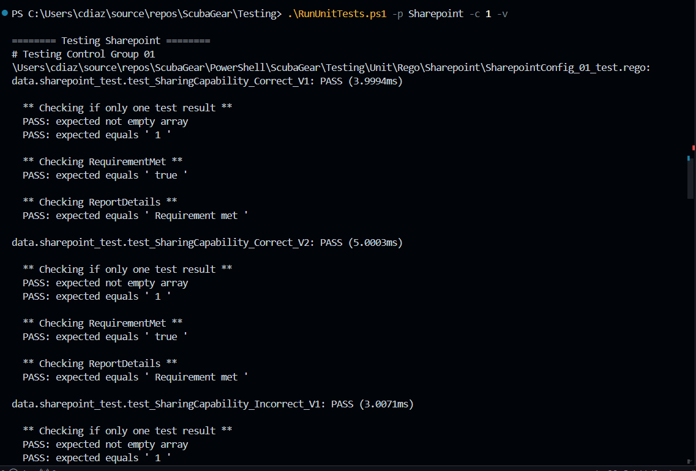
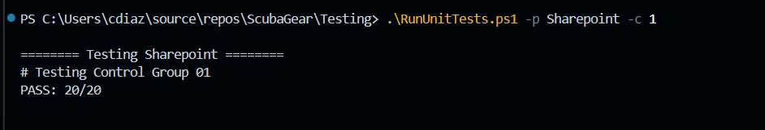

# SCuBA Folder Structure

## .github

Contains github templates and workflows (auto testing on commits & PRs). These will never need to be updated outside of a github issue that addresses it directly.

## .regal

Contains the OPA Rego linter config file. This will almost never need to be updated & should not be updated to get around rules like line length. If there are linter error you cannot fix, you can add an ignore line. If the issue is constant, a github issue can be opened to reevaluate the rule.

## baselines

Used to contain the actual baselines for each product, now contains the links to their new storage location.

## docs

Has numerous folder that contain additional markdowns & resources for the README.md. The markdowns linked in the TRAINING_README.md are stored in docs/training.

## Functional

Empty set of folders. TODO

## images

Additional images. TODO

## PowerShell/ScubaGear

The main folder that contains most of SCuba.

## sample-report

Contains a sample output of SCuBA. This is for our users and is updated when there are major changes.

### baselines

### Modules

TODO

### Rego

Contains the util & product Rego files. This is the main folder the training ground exists. For each product you want to try, visit the corresponding config file to start. There will not be any challenges in the utils file, but I recommend looking at them to understand the code. You may add code or adjust the utils files if you deem necessary.

### Sample-Config-Files

TODO

### Sample-Reports

TODO

### Testing

Contains the unit tests for Rego & PowerShell.

#### PowerShell

TODO

#### Rego

Contains all the unit tests for the Rego code. Each product has their own folder & each policy group has their own file. For example, if the policy is MS.AAD.2.3v1, it will be under folder AAD in the file ending with _02_test. Ctrl+f for # Policy MS.AAD.2.3v1.

## Testing

Contains additional scripts for testing. For the training ground, RunUnitTests.pst will be used most often.

## utils

TODO

## _config.yml

TODO

## .gitattributes

TODO

## .gitignore

TODO

## CONTENTSTYLEGUIDE.md

Covers key style choices made when OPA Rego didn't have a style guide yet. Now it is divergent from Rego's current style, but is used for SCuBA. PLEASE read!

## CONTRIBUTING.md

TODO

## LICENSE

TODO

## README.md

Discusses everything you need to know about running & using SCuBA.

## RELEASES.md

TODO
